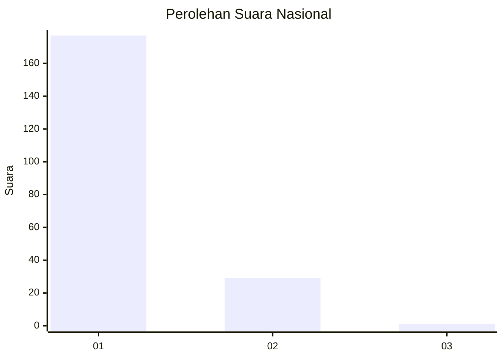
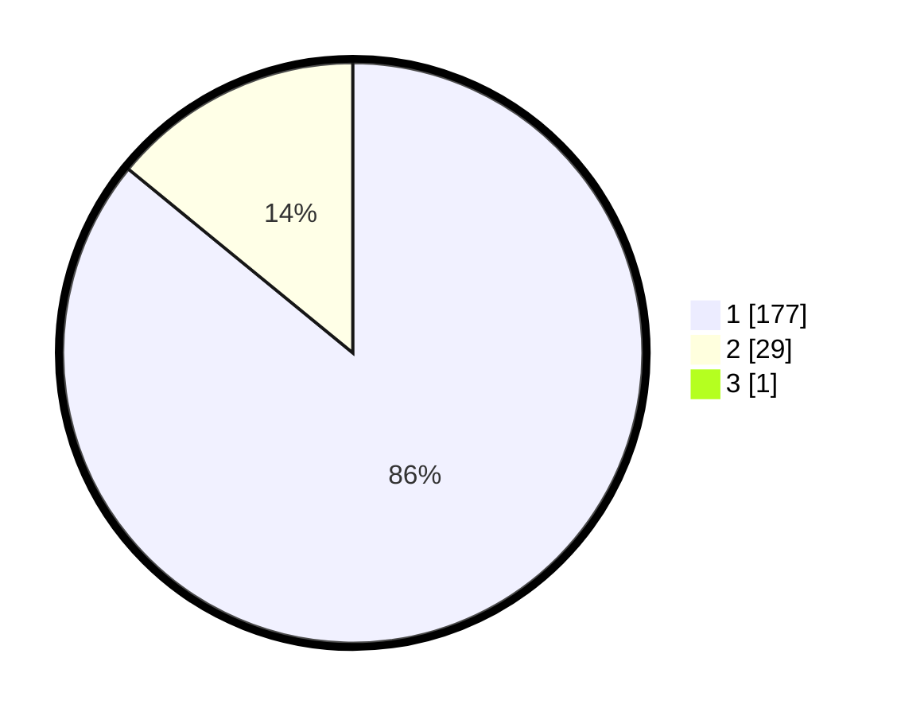

# Hasil

## Grafik

## Tabel

| No. | Nama Paslon    | Suara | Suara (raw) | Persentase |
|:--- |:-------------- | -----:| -----------:| ----------:|
| 1   | ANIES MUHAIMIN | 177   | [177][p-1]  | 85,51      |
| 2   | PRABOWO GIBRAN | 29    | [29][p-2]   | 14,01      |
| 3   | GANJAR MAHFUD  | 1     | [1][p-3]    | 0,48       |

[p-1]: https://github.com/gigit-pemilu/pemilu-2024/blob/main/pilpres/hitung-suara/sub/11-aceh/sub/03-aceh-timur/sub/03-idi-rayeuk/sub/2003-tanoh-anoe/sub/009-tps/sub/paslon-1.txt
[p-2]: https://github.com/gigit-pemilu/pemilu-2024/blob/main/pilpres/hitung-suara/sub/11-aceh/sub/03-aceh-timur/sub/03-idi-rayeuk/sub/2003-tanoh-anoe/sub/009-tps/sub/paslon-2.txt
[p-3]: https://github.com/gigit-pemilu/pemilu-2024/blob/main/pilpres/hitung-suara/sub/11-aceh/sub/03-aceh-timur/sub/03-idi-rayeuk/sub/2003-tanoh-anoe/sub/009-tps/sub/paslon-3.txt

## Foto C Plano

https://sirekap-obj-formc.kpu.go.id/2fa2/pemilu/ppwp/11/03/03/20/03/1103032003009-20240219-150647--0c63a6c4-f498-4443-83cd-eeb0d2b75a42.jpg

https://sirekap-obj-formc.kpu.go.id/2fa2/pemilu/ppwp/11/03/03/20/03/1103032003009-20240219-150731--d266a5dd-073c-4059-8846-f55ac64576ee.jpg

https://sirekap-obj-formc.kpu.go.id/2fa2/pemilu/ppwp/11/03/03/20/03/1103032003009-20240219-150820--caba8407-a09c-4d0d-a5da-f8d3ef85081e.jpg

## Metadata

| Key        | Value               |
| ---------- | ------------------- |
| Time Stamp | 2024-02-24 22:31:28 |

