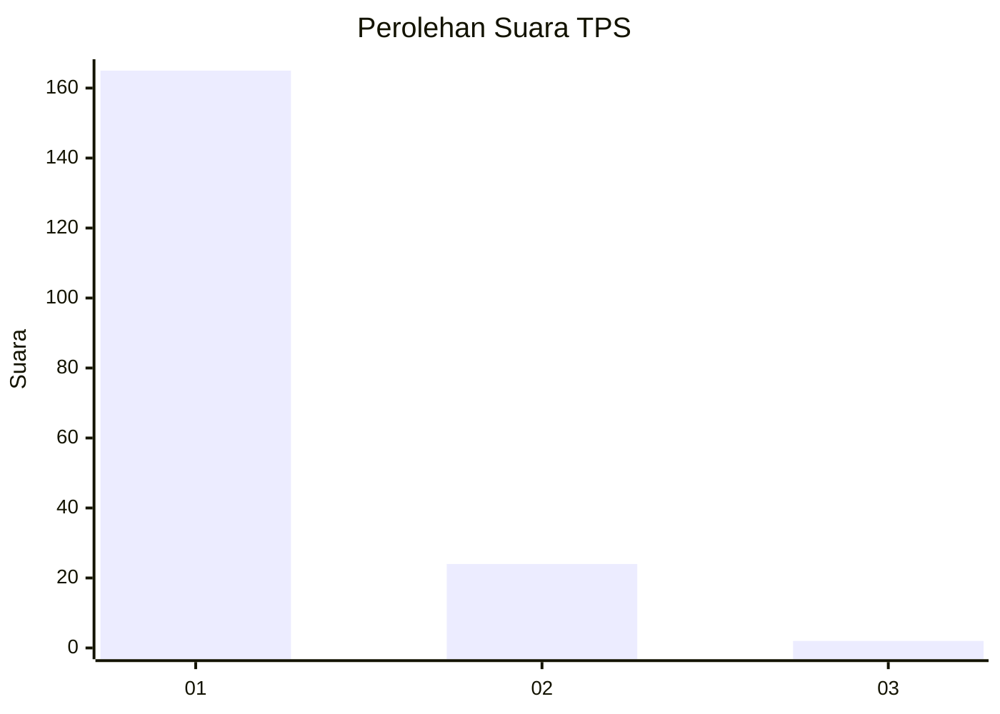
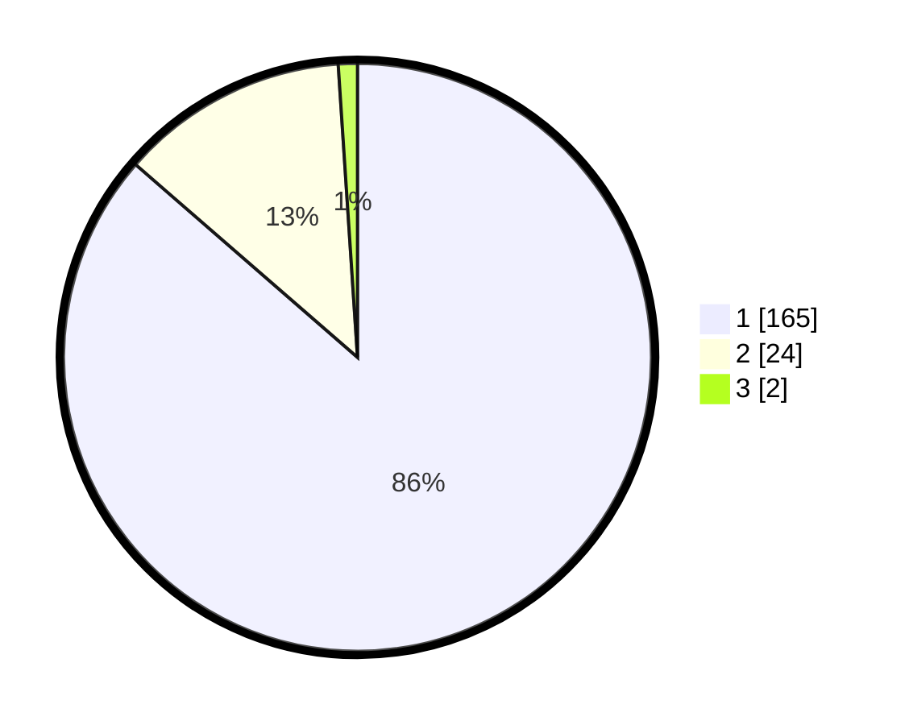

# Hasil

## Grafik

## Tabel

| No. | Nama Paslon    | Suara | Suara (raw) | Persentase |
|:--- |:-------------- | -----:| -----------:| ----------:|
| 1   | ANIES MUHAIMIN | 165   | [165][p-1]  | 86,39      |
| 2   | PRABOWO GIBRAN | 24    | [24][p-2]   | 12,57      |
| 3   | GANJAR MAHFUD  | 2     | [2][p-3]    | 1,05       |

[p-1]: https://github.com/gigit-pemilu/pemilu-2024-11-aceh/blob/main/pilpres/hitung-suara/sub/11-aceh/sub/03-aceh-timur/sub/03-idi-rayeuk/sub/2003-tanoh-anoe/sub/010-tps/sub/paslon-1.txt
[p-2]: https://github.com/gigit-pemilu/pemilu-2024-11-aceh/blob/main/pilpres/hitung-suara/sub/11-aceh/sub/03-aceh-timur/sub/03-idi-rayeuk/sub/2003-tanoh-anoe/sub/010-tps/sub/paslon-2.txt
[p-3]: https://github.com/gigit-pemilu/pemilu-2024-11-aceh/blob/main/pilpres/hitung-suara/sub/11-aceh/sub/03-aceh-timur/sub/03-idi-rayeuk/sub/2003-tanoh-anoe/sub/010-tps/sub/paslon-3.txt

## Foto C Plano

https://sirekap-obj-formc.kpu.go.id/ff05/pemilu/ppwp/11/03/03/20/03/1103032003010-20240219-161140--6c1cea68-8f06-41d8-a989-06fda2ab0058.jpg

https://sirekap-obj-formc.kpu.go.id/ff05/pemilu/ppwp/11/03/03/20/03/1103032003010-20240219-161212--868a50f8-b570-4fe5-b6e1-a8839651a712.jpg

https://sirekap-obj-formc.kpu.go.id/ff05/pemilu/ppwp/11/03/03/20/03/1103032003010-20240219-161244--43b6cc6d-c9d9-4aa5-b302-0dddbda65706.jpg

## Metadata

| Key        | Value               |
| ---------- | ------------------- |
| Time Stamp | 2024-02-24 22:31:28 |

