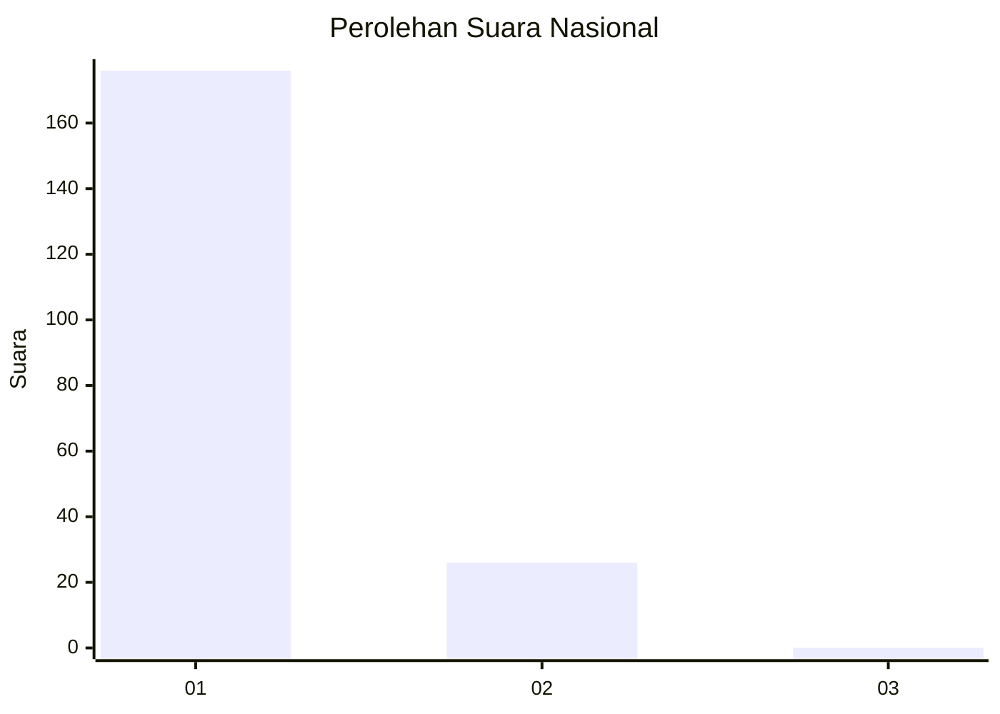
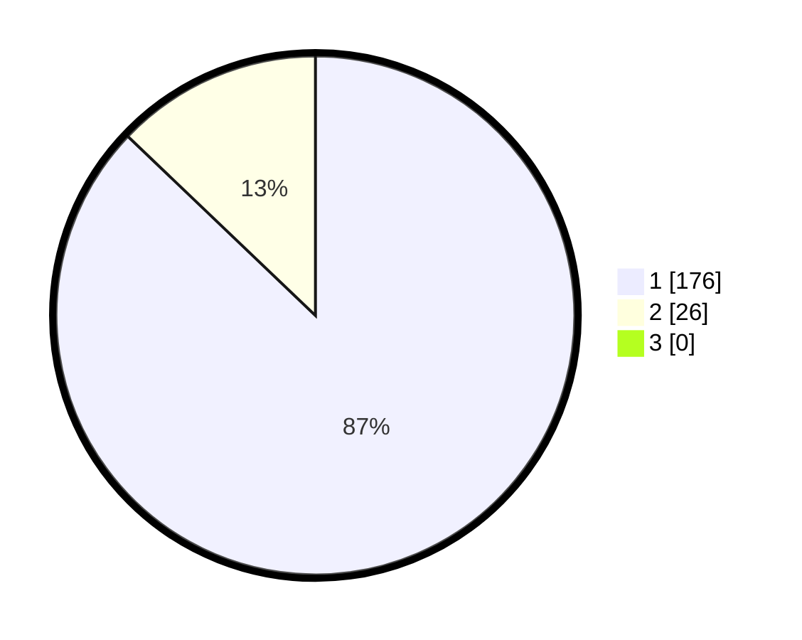

# Hasil

## Grafik

## Tabel

| No. | Nama Paslon    | Suara | Suara (raw) | Persentase |
|:--- |:-------------- | -----:| -----------:| ----------:|
| 1   | ANIES MUHAIMIN | 176   | [176][p-1]  | 87,13      |
| 2   | PRABOWO GIBRAN | 26    | [26][p-2]   | 12,87      |
| 3   | GANJAR MAHFUD  | 0     | [0][p-3]    | 0,00       |

[p-1]: https://github.com/gigit-pemilu/pemilu-2024/blob/main/pilpres/hitung-suara/sub/11-aceh/sub/03-aceh-timur/sub/03-idi-rayeuk/sub/2003-tanoh-anoe/sub/011-tps/sub/paslon-1.txt
[p-2]: https://github.com/gigit-pemilu/pemilu-2024/blob/main/pilpres/hitung-suara/sub/11-aceh/sub/03-aceh-timur/sub/03-idi-rayeuk/sub/2003-tanoh-anoe/sub/011-tps/sub/paslon-2.txt
[p-3]: https://github.com/gigit-pemilu/pemilu-2024/blob/main/pilpres/hitung-suara/sub/11-aceh/sub/03-aceh-timur/sub/03-idi-rayeuk/sub/2003-tanoh-anoe/sub/011-tps/sub/paslon-3.txt

## Foto C Plano

https://sirekap-obj-formc.kpu.go.id/097c/pemilu/ppwp/11/03/03/20/03/1103032003011-20240219-114254--c75c92e4-a31e-4cd7-a24a-85f0980f9945.jpg

https://sirekap-obj-formc.kpu.go.id/097c/pemilu/ppwp/11/03/03/20/03/1103032003011-20240219-114344--c862910d-c3cd-4a7b-ab5a-2538ff822715.jpg

https://sirekap-obj-formc.kpu.go.id/097c/pemilu/ppwp/11/03/03/20/03/1103032003011-20240219-114435--0406b23a-1ac2-4032-9068-bd60d621d4b1.jpg

## Metadata

| Key        | Value               |
| ---------- | ------------------- |
| Time Stamp | 2024-02-24 22:31:28 |

