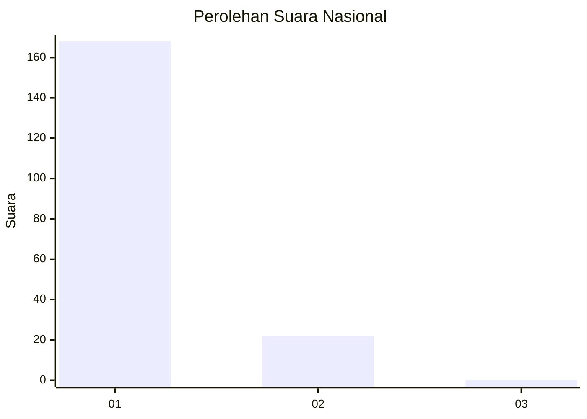
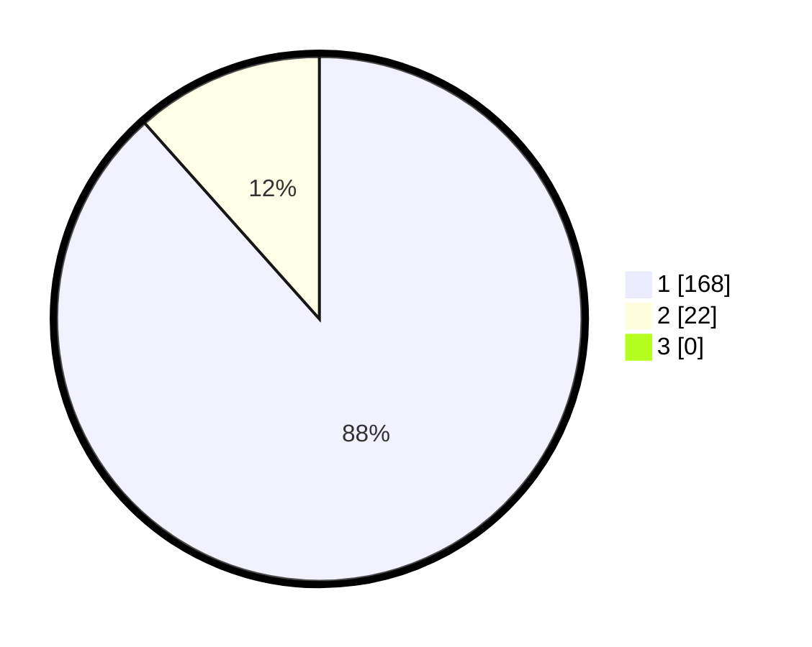

# Hasil

## Grafik

## Tabel

| No. | Nama Paslon    | Suara | Suara (raw) | Persentase |
|:--- |:-------------- | -----:| -----------:| ----------:|
| 1   | ANIES MUHAIMIN | 168   | [168][p-1]  | 88,42      |
| 2   | PRABOWO GIBRAN | 22    | [22][p-2]   | 11,58      |
| 3   | GANJAR MAHFUD  | 0     | [0][p-3]    | 0,00       |

[p-1]: https://github.com/gigit-pemilu/pemilu-2024/blob/main/pilpres/hitung-suara/sub/11-aceh/sub/03-aceh-timur/sub/03-idi-rayeuk/sub/2003-tanoh-anoe/sub/012-tps/sub/paslon-1.txt
[p-2]: https://github.com/gigit-pemilu/pemilu-2024/blob/main/pilpres/hitung-suara/sub/11-aceh/sub/03-aceh-timur/sub/03-idi-rayeuk/sub/2003-tanoh-anoe/sub/012-tps/sub/paslon-2.txt
[p-3]: https://github.com/gigit-pemilu/pemilu-2024/blob/main/pilpres/hitung-suara/sub/11-aceh/sub/03-aceh-timur/sub/03-idi-rayeuk/sub/2003-tanoh-anoe/sub/012-tps/sub/paslon-3.txt

## Foto C Plano

https://sirekap-obj-formc.kpu.go.id/8e97/pemilu/ppwp/11/03/03/20/03/1103032003012-20240219-171554--540e91ca-b932-4b70-bdb0-62b653bcf48d.jpg

https://sirekap-obj-formc.kpu.go.id/8e97/pemilu/ppwp/11/03/03/20/03/1103032003012-20240219-171641--fedab6da-e88c-445c-b686-2e20b87e1c9a.jpg

https://sirekap-obj-formc.kpu.go.id/8e97/pemilu/ppwp/11/03/03/20/03/1103032003012-20240219-171729--f5b209cb-1809-4baa-8fcb-e5f9ef210e4e.jpg

## Metadata

| Key        | Value               |
| ---------- | ------------------- |
| Time Stamp | 2024-02-24 22:31:28 |

