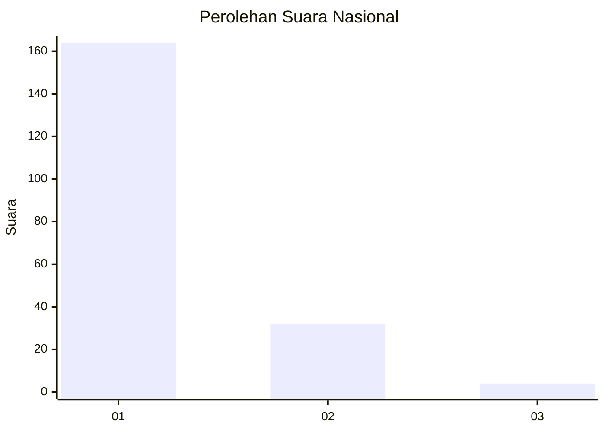
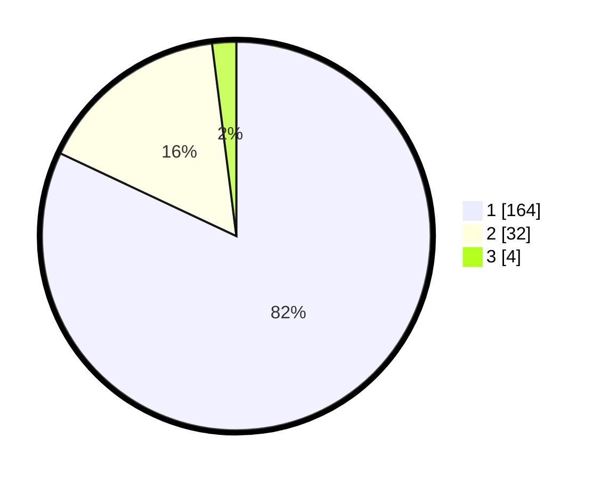

# Hasil

## Grafik

## Tabel

| No. | Nama Paslon    | Suara | Suara (raw) | Persentase |
|:--- |:-------------- | -----:| -----------:| ----------:|
| 1   | ANIES MUHAIMIN | 164   | [164][p-1]  | 82,00      |
| 2   | PRABOWO GIBRAN | 32    | [32][p-2]   | 16,00      |
| 3   | GANJAR MAHFUD  | 4     | [4][p-3]    | 2,00       |

[p-1]: https://github.com/gigit-pemilu/pemilu-2024/blob/main/pilpres/hitung-suara/sub/11-aceh/sub/03-aceh-timur/sub/03-idi-rayeuk/sub/2003-tanoh-anoe/sub/013-tps/sub/paslon-1.txt
[p-2]: https://github.com/gigit-pemilu/pemilu-2024/blob/main/pilpres/hitung-suara/sub/11-aceh/sub/03-aceh-timur/sub/03-idi-rayeuk/sub/2003-tanoh-anoe/sub/013-tps/sub/paslon-2.txt
[p-3]: https://github.com/gigit-pemilu/pemilu-2024/blob/main/pilpres/hitung-suara/sub/11-aceh/sub/03-aceh-timur/sub/03-idi-rayeuk/sub/2003-tanoh-anoe/sub/013-tps/sub/paslon-3.txt

## Foto C Plano

https://sirekap-obj-formc.kpu.go.id/7d08/pemilu/ppwp/11/03/03/20/03/1103032003013-20240219-200926--7a69b87d-3dc4-4dcd-9411-bcaace593637.jpg

https://sirekap-obj-formc.kpu.go.id/7d08/pemilu/ppwp/11/03/03/20/03/1103032003013-20240219-201056--0c835fa0-c66b-4518-b2d3-323c97a0bf86.jpg

https://sirekap-obj-formc.kpu.go.id/7d08/pemilu/ppwp/11/03/03/20/03/1103032003013-20240219-201201--05b9261e-89bd-4491-bb5f-8715469231d2.jpg

## Metadata

| Key        | Value               |
| ---------- | ------------------- |
| Time Stamp | 2024-02-24 22:31:28 |

