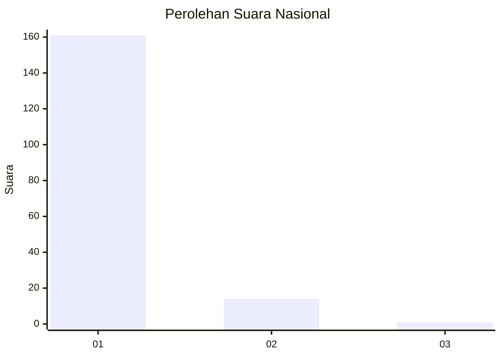
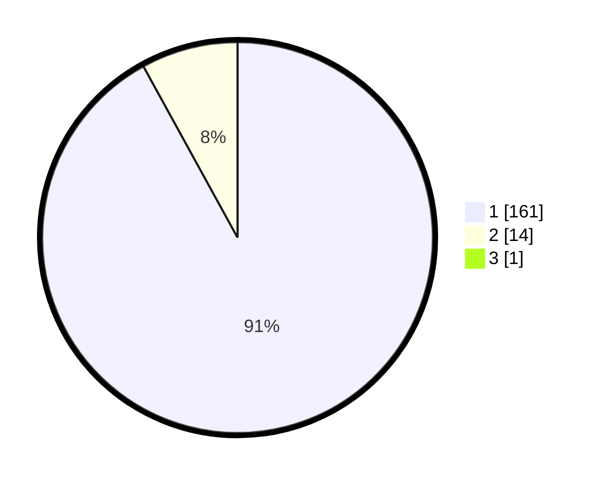

# Hasil

## Grafik

## Tabel

| No. | Nama Paslon    | Suara | Suara (raw) | Persentase |
|:--- |:-------------- | -----:| -----------:| ----------:|
| 1   | ANIES MUHAIMIN | 161   | [161][p-1]  | 91,48      |
| 2   | PRABOWO GIBRAN | 14    | [14][p-2]   | 7,95       |
| 3   | GANJAR MAHFUD  | 1     | [1][p-3]    | 0,57       |

[p-1]: https://github.com/gigit-pemilu/pemilu-2024/blob/main/pilpres/hitung-suara/sub/11-aceh/sub/03-aceh-timur/sub/03-idi-rayeuk/sub/2004-kuala-peudawa-puntong/sub/001-tps/sub/paslon-1.txt
[p-2]: https://github.com/gigit-pemilu/pemilu-2024/blob/main/pilpres/hitung-suara/sub/11-aceh/sub/03-aceh-timur/sub/03-idi-rayeuk/sub/2004-kuala-peudawa-puntong/sub/001-tps/sub/paslon-2.txt
[p-3]: https://github.com/gigit-pemilu/pemilu-2024/blob/main/pilpres/hitung-suara/sub/11-aceh/sub/03-aceh-timur/sub/03-idi-rayeuk/sub/2004-kuala-peudawa-puntong/sub/001-tps/sub/paslon-3.txt

## Foto C Plano

https://sirekap-obj-formc.kpu.go.id/25dc/pemilu/ppwp/11/03/03/20/04/1103032004001-20240215-094217--dd113045-3dcf-465c-b229-baeafdb297c6.jpg

https://sirekap-obj-formc.kpu.go.id/25dc/pemilu/ppwp/11/03/03/20/04/1103032004001-20240215-094325--81eda709-4d93-42b0-ba07-b1c756189f5f.jpg

https://sirekap-obj-formc.kpu.go.id/25dc/pemilu/ppwp/11/03/03/20/04/1103032004001-20240215-094028--cfa02ebc-fe64-4e29-b9f8-4a5dedb1fe71.jpg

## Metadata

| Key        | Value               |
| ---------- | ------------------- |
| Time Stamp | 2024-02-24 22:31:28 |

