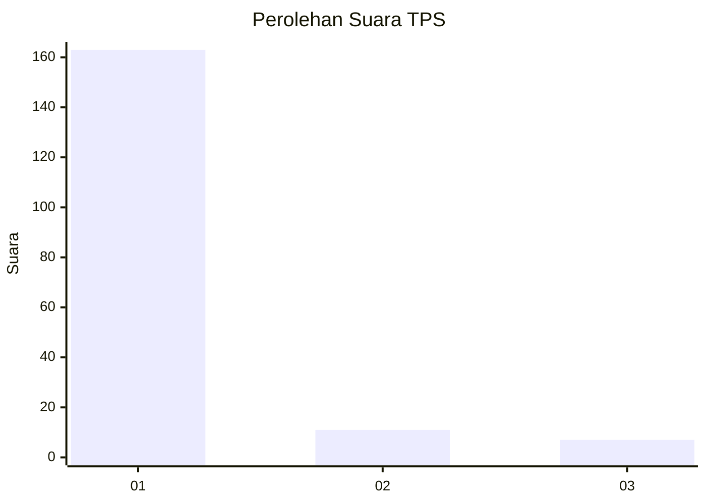
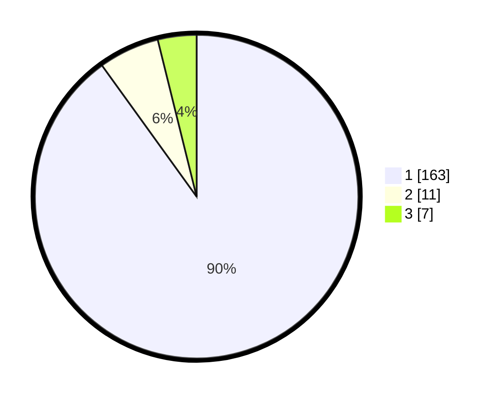

# Hasil

## Grafik

## Tabel

| No. | Nama Paslon    | Suara | Suara (raw) | Persentase |
|:--- |:-------------- | -----:| -----------:| ----------:|
| 1   | ANIES MUHAIMIN | 163   | [163][p-1]  | 90,06      |
| 2   | PRABOWO GIBRAN | 11    | [11][p-2]   | 6,08       |
| 3   | GANJAR MAHFUD  | 7     | [7][p-3]    | 3,87       |

[p-1]: https://github.com/gigit-pemilu/pemilu-2024-11-aceh/blob/main/pilpres/hitung-suara/sub/11-aceh/sub/03-aceh-timur/sub/03-idi-rayeuk/sub/2004-kuala-peudawa-puntong/sub/002-tps/sub/paslon-1.txt
[p-2]: https://github.com/gigit-pemilu/pemilu-2024-11-aceh/blob/main/pilpres/hitung-suara/sub/11-aceh/sub/03-aceh-timur/sub/03-idi-rayeuk/sub/2004-kuala-peudawa-puntong/sub/002-tps/sub/paslon-2.txt
[p-3]: https://github.com/gigit-pemilu/pemilu-2024-11-aceh/blob/main/pilpres/hitung-suara/sub/11-aceh/sub/03-aceh-timur/sub/03-idi-rayeuk/sub/2004-kuala-peudawa-puntong/sub/002-tps/sub/paslon-3.txt

## Foto C Plano

https://sirekap-obj-formc.kpu.go.id/9fc3/pemilu/ppwp/11/03/03/20/04/1103032004002-20240224-115556--42bc7fe2-f260-4185-aaf3-be0528f473f6.jpg

https://sirekap-obj-formc.kpu.go.id/9fc3/pemilu/ppwp/11/03/03/20/04/1103032004002-20240224-115644--3c82d9ee-4097-46c7-908c-436dcb50506c.jpg

https://sirekap-obj-formc.kpu.go.id/9fc3/pemilu/ppwp/11/03/03/20/04/1103032004002-20240224-115731--59f8223c-c9be-4cdb-94d4-8171764732d5.jpg

## Metadata

| Key        | Value               |
| ---------- | ------------------- |
| Time Stamp | 2024-02-24 22:31:28 |

