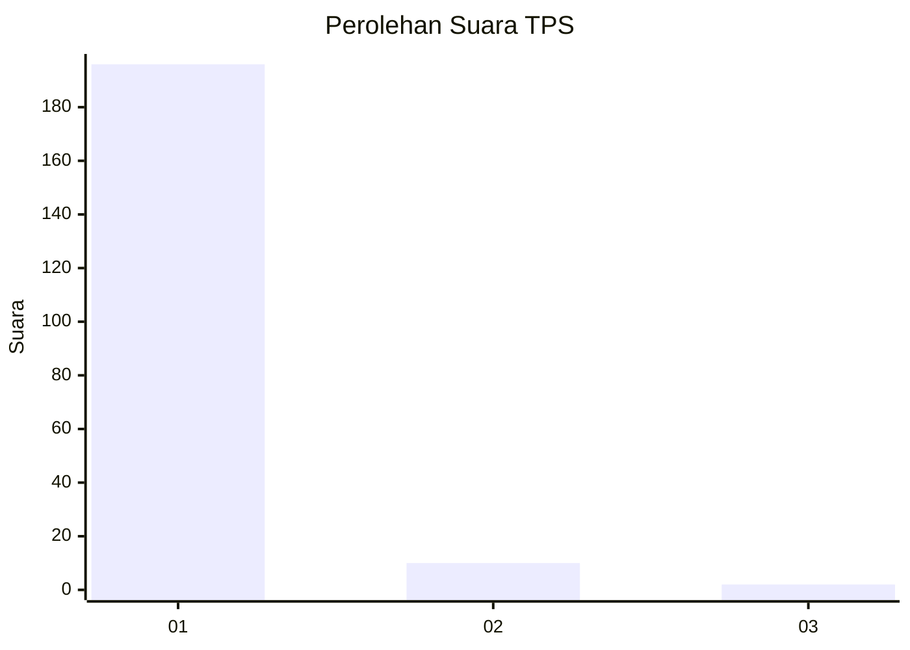
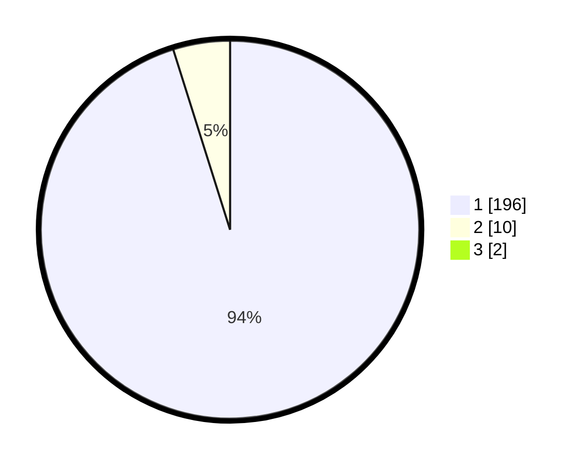

# Hasil

## Grafik

## Tabel

| No. | Nama Paslon    | Suara | Suara (raw) | Persentase |
|:--- |:-------------- | -----:| -----------:| ----------:|
| 1   | ANIES MUHAIMIN | 196   | [196][p-1]  | 94,23      |
| 2   | PRABOWO GIBRAN | 10    | [10][p-2]   | 4,81       |
| 3   | GANJAR MAHFUD  | 2     | [2][p-3]    | 0,96       |

[p-1]: https://github.com/gigit-pemilu/pemilu-2024-11-aceh/blob/main/pilpres/hitung-suara/sub/11-aceh/sub/03-aceh-timur/sub/03-idi-rayeuk/sub/2004-kuala-peudawa-puntong/sub/003-tps/sub/paslon-1.txt
[p-2]: https://github.com/gigit-pemilu/pemilu-2024-11-aceh/blob/main/pilpres/hitung-suara/sub/11-aceh/sub/03-aceh-timur/sub/03-idi-rayeuk/sub/2004-kuala-peudawa-puntong/sub/003-tps/sub/paslon-2.txt
[p-3]: https://github.com/gigit-pemilu/pemilu-2024-11-aceh/blob/main/pilpres/hitung-suara/sub/11-aceh/sub/03-aceh-timur/sub/03-idi-rayeuk/sub/2004-kuala-peudawa-puntong/sub/003-tps/sub/paslon-3.txt

## Foto C Plano

https://sirekap-obj-formc.kpu.go.id/1a8b/pemilu/ppwp/11/03/03/20/04/1103032004003-20240215-065440--cba67f00-16d6-4f57-a85f-ae140929c670.jpg

https://sirekap-obj-formc.kpu.go.id/1a8b/pemilu/ppwp/11/03/03/20/04/1103032004003-20240215-065607--f35544a0-8aef-4fe6-b6fa-84775551b818.jpg

https://sirekap-obj-formc.kpu.go.id/1a8b/pemilu/ppwp/11/03/03/20/04/1103032004003-20240215-065711--7d910e93-28e8-4732-9dbc-0bcd780190d7.jpg

## Metadata

| Key        | Value               |
| ---------- | ------------------- |
| Time Stamp | 2024-02-24 22:31:28 |

