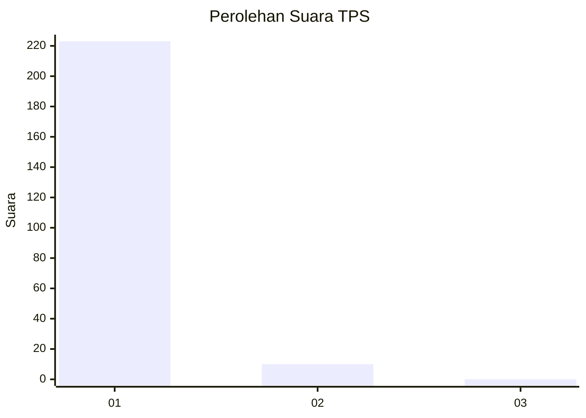
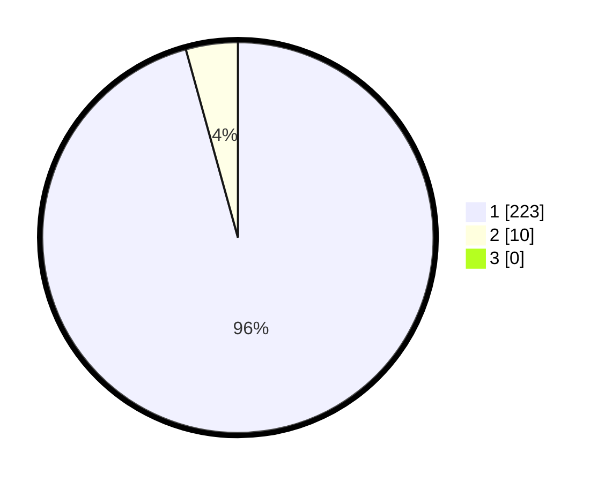

# Hasil

## Grafik

## Tabel

| No. | Nama Paslon    | Suara | Suara (raw) | Persentase |
|:--- |:-------------- | -----:| -----------:| ----------:|
| 1   | ANIES MUHAIMIN | 223   | [223][p-1]  | 95,71      |
| 2   | PRABOWO GIBRAN | 10    | [10][p-2]   | 4,29       |
| 3   | GANJAR MAHFUD  | 0     | [0][p-3]    | 0,00       |

[p-1]: https://github.com/gigit-pemilu/pemilu-2024-11-aceh/blob/main/pilpres/hitung-suara/sub/11-aceh/sub/03-aceh-timur/sub/03-idi-rayeuk/sub/2004-kuala-peudawa-puntong/sub/004-tps/sub/paslon-1.txt
[p-2]: https://github.com/gigit-pemilu/pemilu-2024-11-aceh/blob/main/pilpres/hitung-suara/sub/11-aceh/sub/03-aceh-timur/sub/03-idi-rayeuk/sub/2004-kuala-peudawa-puntong/sub/004-tps/sub/paslon-2.txt
[p-3]: https://github.com/gigit-pemilu/pemilu-2024-11-aceh/blob/main/pilpres/hitung-suara/sub/11-aceh/sub/03-aceh-timur/sub/03-idi-rayeuk/sub/2004-kuala-peudawa-puntong/sub/004-tps/sub/paslon-3.txt

## Foto C Plano

https://sirekap-obj-formc.kpu.go.id/78d8/pemilu/ppwp/11/03/03/20/04/1103032004004-20240215-081921--128f5612-ba22-4ade-bf75-fe9b70ed4966.jpg

https://sirekap-obj-formc.kpu.go.id/78d8/pemilu/ppwp/11/03/03/20/04/1103032004004-20240215-082953--0cc8b1a2-6c8b-4ee5-92e0-f04c7db9a9c2.jpg

https://sirekap-obj-formc.kpu.go.id/78d8/pemilu/ppwp/11/03/03/20/04/1103032004004-20240215-083120--26be5cea-29ca-47d3-a9d0-c878b558114b.jpg

## Metadata

| Key        | Value               |
| ---------- | ------------------- |
| Time Stamp | 2024-02-24 22:31:28 |

