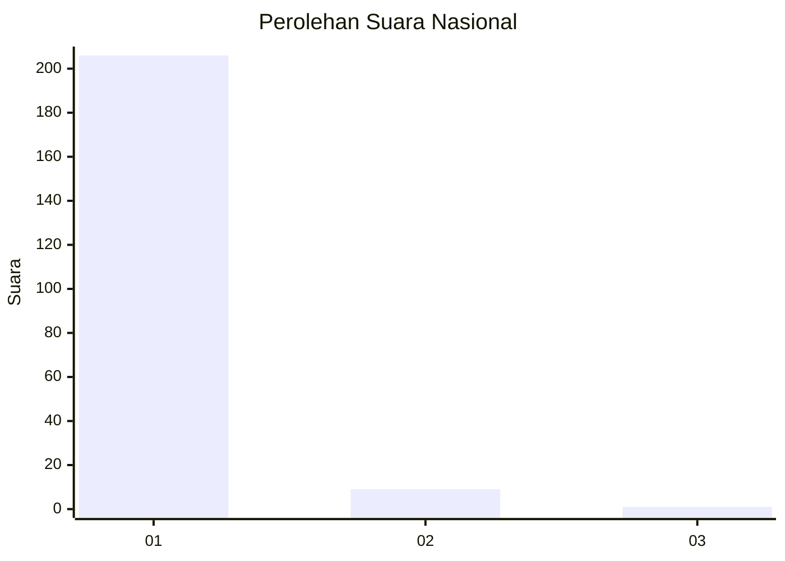
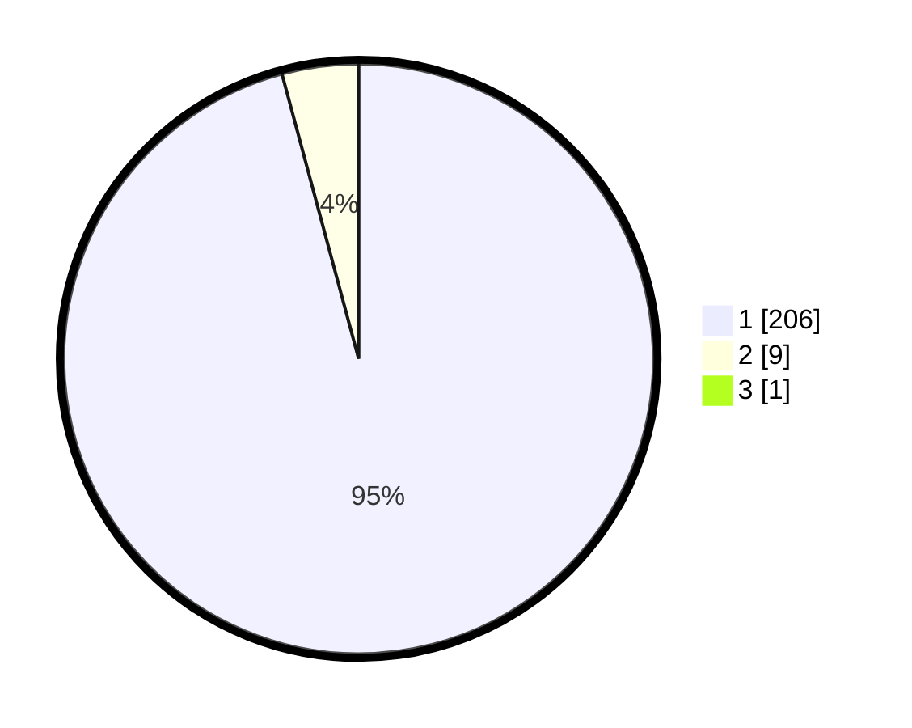

# Hasil

## Grafik

## Tabel

| No. | Nama Paslon    | Suara | Suara (raw) | Persentase |
|:--- |:-------------- | -----:| -----------:| ----------:|
| 1   | ANIES MUHAIMIN | 206   | [206][p-1]  | 95,37      |
| 2   | PRABOWO GIBRAN | 9     | [9][p-2]    | 4,17       |
| 3   | GANJAR MAHFUD  | 1     | [1][p-3]    | 0,46       |

[p-1]: https://github.com/gigit-pemilu/pemilu-2024/blob/main/pilpres/hitung-suara/sub/11-aceh/sub/03-aceh-timur/sub/03-idi-rayeuk/sub/2004-kuala-peudawa-puntong/sub/005-tps/sub/paslon-1.txt
[p-2]: https://github.com/gigit-pemilu/pemilu-2024/blob/main/pilpres/hitung-suara/sub/11-aceh/sub/03-aceh-timur/sub/03-idi-rayeuk/sub/2004-kuala-peudawa-puntong/sub/005-tps/sub/paslon-2.txt
[p-3]: https://github.com/gigit-pemilu/pemilu-2024/blob/main/pilpres/hitung-suara/sub/11-aceh/sub/03-aceh-timur/sub/03-idi-rayeuk/sub/2004-kuala-peudawa-puntong/sub/005-tps/sub/paslon-3.txt

## Foto C Plano

https://sirekap-obj-formc.kpu.go.id/b9ae/pemilu/ppwp/11/03/03/20/04/1103032004005-20240215-092815--70a7f894-6ea0-4f26-939f-2b65ac727a40.jpg

https://sirekap-obj-formc.kpu.go.id/b9ae/pemilu/ppwp/11/03/03/20/04/1103032004005-20240215-081557--714a22d1-4f3e-472d-925a-ccb034241388.jpg

https://sirekap-obj-formc.kpu.go.id/b9ae/pemilu/ppwp/11/03/03/20/04/1103032004005-20240215-081725--170cb39a-b374-4271-a8dc-569bb6680d49.jpg

## Metadata

| Key        | Value               |
| ---------- | ------------------- |
| Time Stamp | 2024-02-24 22:31:28 |

