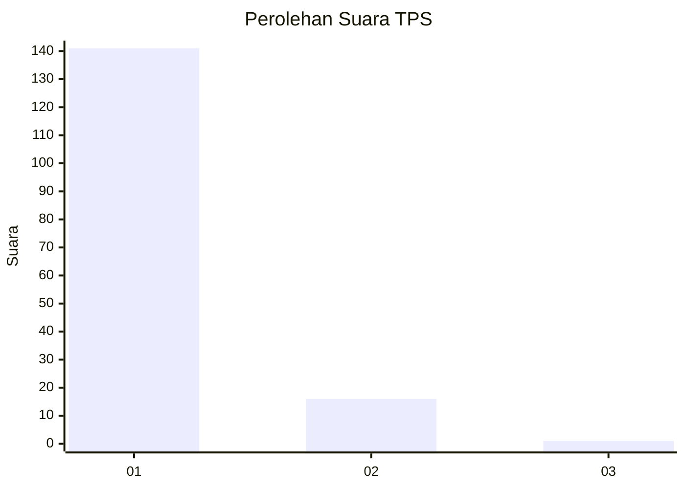
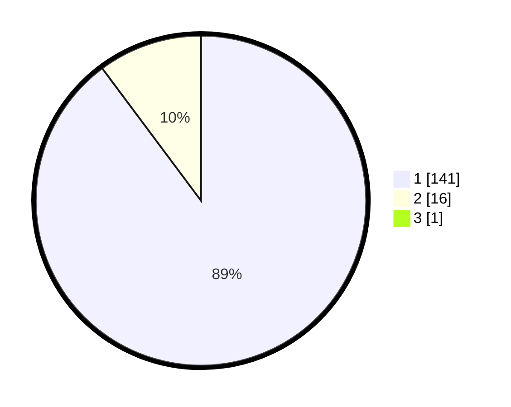

# Hasil

## Grafik

## Tabel

| No. | Nama Paslon    | Suara | Suara (raw) | Persentase |
|:--- |:-------------- | -----:| -----------:| ----------:|
| 1   | ANIES MUHAIMIN | 141   | [141][p-1]  | 89,24      |
| 2   | PRABOWO GIBRAN | 16    | [16][p-2]   | 10,13      |
| 3   | GANJAR MAHFUD  | 1     | [1][p-3]    | 0,63       |

[p-1]: https://github.com/gigit-pemilu/pemilu-2024-11-aceh/blob/main/pilpres/hitung-suara/sub/11-aceh/sub/03-aceh-timur/sub/03-idi-rayeuk/sub/2005-gampong-aceh/sub/001-tps/sub/paslon-1.txt
[p-2]: https://github.com/gigit-pemilu/pemilu-2024-11-aceh/blob/main/pilpres/hitung-suara/sub/11-aceh/sub/03-aceh-timur/sub/03-idi-rayeuk/sub/2005-gampong-aceh/sub/001-tps/sub/paslon-2.txt
[p-3]: https://github.com/gigit-pemilu/pemilu-2024-11-aceh/blob/main/pilpres/hitung-suara/sub/11-aceh/sub/03-aceh-timur/sub/03-idi-rayeuk/sub/2005-gampong-aceh/sub/001-tps/sub/paslon-3.txt

## Foto C Plano

https://sirekap-obj-formc.kpu.go.id/7e41/pemilu/ppwp/11/03/03/20/05/1103032005001-20240215-091223--4083edfb-8012-4a1d-af2b-b20a375b37eb.jpg

https://sirekap-obj-formc.kpu.go.id/7e41/pemilu/ppwp/11/03/03/20/05/1103032005001-20240215-091550--73ccc7b2-ee55-42f6-b846-8fcceac236cd.jpg

https://sirekap-obj-formc.kpu.go.id/7e41/pemilu/ppwp/11/03/03/20/05/1103032005001-20240215-091722--62ec762b-ac2d-4756-a711-3bf9cf42566d.jpg

## Metadata

| Key        | Value               |
| ---------- | ------------------- |
| Time Stamp | 2024-02-25 01:00:00 |

