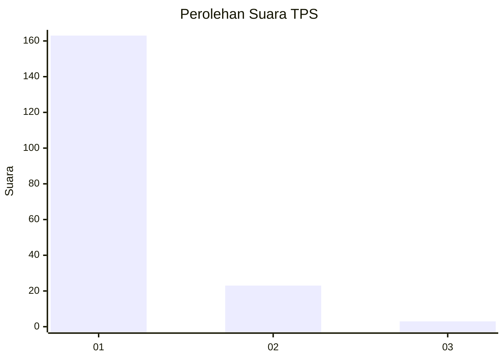
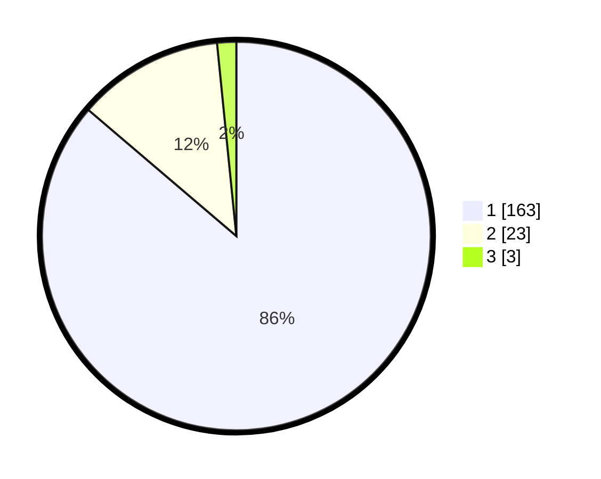

# Hasil

## Grafik

## Tabel

| No. | Nama Paslon    | Suara | Suara (raw) | Persentase |
|:--- |:-------------- | -----:| -----------:| ----------:|
| 1   | ANIES MUHAIMIN | 163   | [163][p-1]  | 86,24      |
| 2   | PRABOWO GIBRAN | 23    | [23][p-2]   | 12,17      |
| 3   | GANJAR MAHFUD  | 3     | [3][p-3]    | 1,59       |

[p-1]: https://github.com/gigit-pemilu/pemilu-2024-11-aceh/blob/main/pilpres/hitung-suara/sub/11-aceh/sub/03-aceh-timur/sub/03-idi-rayeuk/sub/2005-gampong-aceh/sub/002-tps/sub/paslon-1.txt
[p-2]: https://github.com/gigit-pemilu/pemilu-2024-11-aceh/blob/main/pilpres/hitung-suara/sub/11-aceh/sub/03-aceh-timur/sub/03-idi-rayeuk/sub/2005-gampong-aceh/sub/002-tps/sub/paslon-2.txt
[p-3]: https://github.com/gigit-pemilu/pemilu-2024-11-aceh/blob/main/pilpres/hitung-suara/sub/11-aceh/sub/03-aceh-timur/sub/03-idi-rayeuk/sub/2005-gampong-aceh/sub/002-tps/sub/paslon-3.txt

## Foto C Plano

https://sirekap-obj-formc.kpu.go.id/02b5/pemilu/ppwp/11/03/03/20/05/1103032005002-20240215-045052--ced99bdc-8282-47ae-bbfd-fc2febb05550.jpg

https://sirekap-obj-formc.kpu.go.id/02b5/pemilu/ppwp/11/03/03/20/05/1103032005002-20240215-060628--9d08373c-e771-4cc0-ac41-427f5d68fd17.jpg

https://sirekap-obj-formc.kpu.go.id/02b5/pemilu/ppwp/11/03/03/20/05/1103032005002-20240215-050334--5e472490-38fa-4d15-aca4-0898cf3ae542.jpg

## Metadata

| Key        | Value               |
| ---------- | ------------------- |
| Time Stamp | 2024-02-24 22:31:28 |

