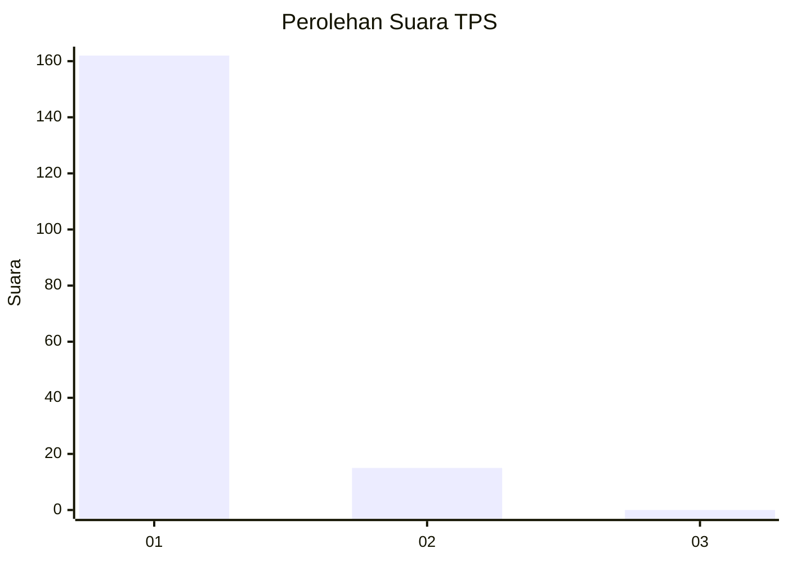
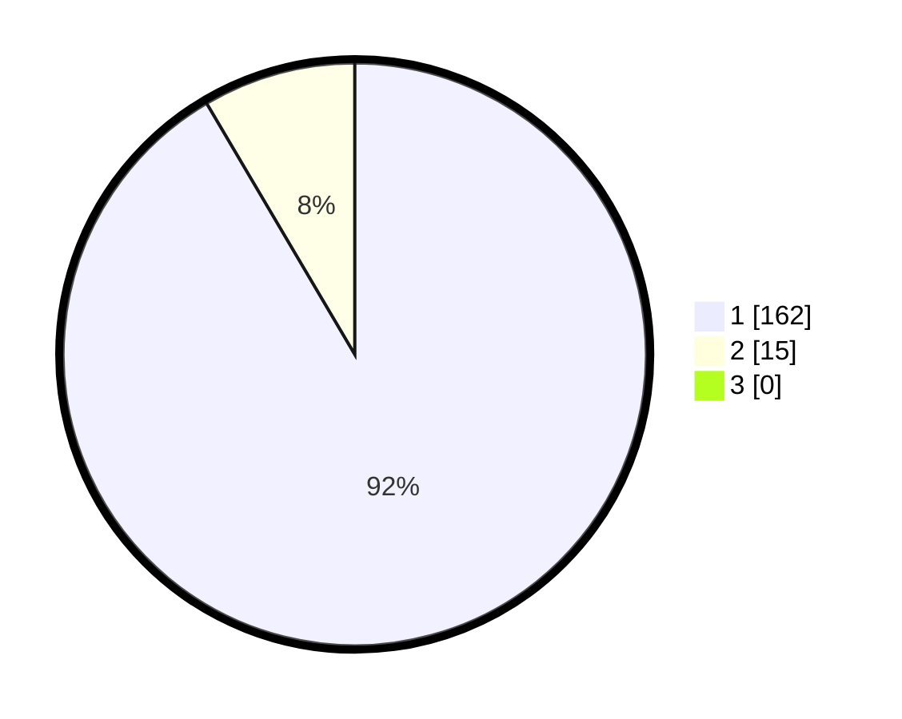

# Hasil

## Grafik

## Tabel

| No. | Nama Paslon    | Suara | Suara (raw) | Persentase |
|:--- |:-------------- | -----:| -----------:| ----------:|
| 1   | ANIES MUHAIMIN | 162   | [162][p-1]  | 91,53      |
| 2   | PRABOWO GIBRAN | 15    | [15][p-2]   | 8,47       |
| 3   | GANJAR MAHFUD  | 0     | [0][p-3]    | 0,00       |

[p-1]: https://github.com/gigit-pemilu/pemilu-2024-11-aceh/blob/main/pilpres/hitung-suara/sub/11-aceh/sub/03-aceh-timur/sub/03-idi-rayeuk/sub/2005-gampong-aceh/sub/003-tps/sub/paslon-1.txt
[p-2]: https://github.com/gigit-pemilu/pemilu-2024-11-aceh/blob/main/pilpres/hitung-suara/sub/11-aceh/sub/03-aceh-timur/sub/03-idi-rayeuk/sub/2005-gampong-aceh/sub/003-tps/sub/paslon-2.txt
[p-3]: https://github.com/gigit-pemilu/pemilu-2024-11-aceh/blob/main/pilpres/hitung-suara/sub/11-aceh/sub/03-aceh-timur/sub/03-idi-rayeuk/sub/2005-gampong-aceh/sub/003-tps/sub/paslon-3.txt

## Foto C Plano

https://sirekap-obj-formc.kpu.go.id/8af9/pemilu/ppwp/11/03/03/20/05/1103032005003-20240215-081145--11271a87-447f-49c9-a324-67316dc400d9.jpg

https://sirekap-obj-formc.kpu.go.id/8af9/pemilu/ppwp/11/03/03/20/05/1103032005003-20240215-081220--9a458333-431b-4808-8d0b-b1e0f9914ced.jpg

https://sirekap-obj-formc.kpu.go.id/8af9/pemilu/ppwp/11/03/03/20/05/1103032005003-20240215-055525--50e6a774-cb75-432a-b359-f1df72c626ce.jpg

## Metadata

| Key        | Value               |
| ---------- | ------------------- |
| Time Stamp | 2024-02-24 22:31:28 |

