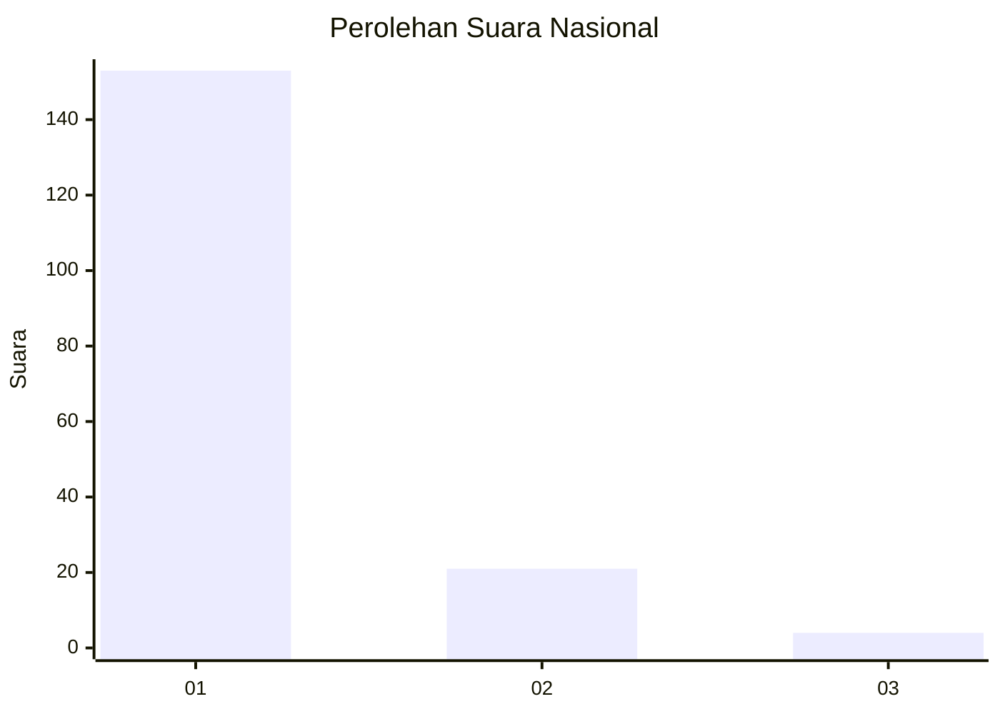
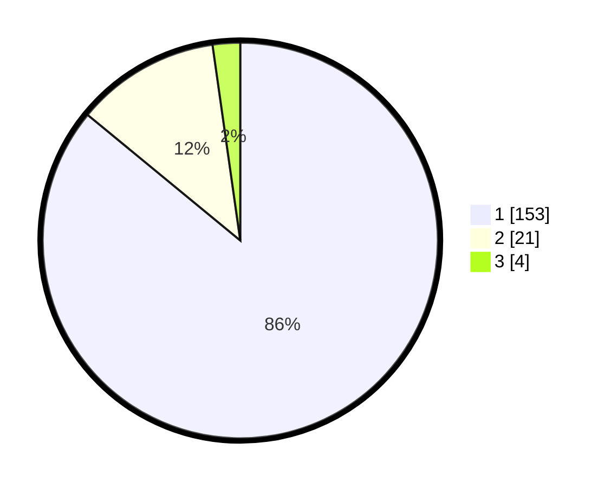

# Hasil

## Grafik

## Tabel

| No. | Nama Paslon    | Suara | Suara (raw) | Persentase |
|:--- |:-------------- | -----:| -----------:| ----------:|
| 1   | ANIES MUHAIMIN | 153   | [153][p-1]  | 85,96      |
| 2   | PRABOWO GIBRAN | 21    | [21][p-2]   | 11,80      |
| 3   | GANJAR MAHFUD  | 4     | [4][p-3]    | 2,25       |

[p-1]: https://github.com/gigit-pemilu/pemilu-2024/blob/main/pilpres/hitung-suara/sub/11-aceh/sub/03-aceh-timur/sub/03-idi-rayeuk/sub/2005-gampong-aceh/sub/004-tps/sub/paslon-1.txt
[p-2]: https://github.com/gigit-pemilu/pemilu-2024/blob/main/pilpres/hitung-suara/sub/11-aceh/sub/03-aceh-timur/sub/03-idi-rayeuk/sub/2005-gampong-aceh/sub/004-tps/sub/paslon-2.txt
[p-3]: https://github.com/gigit-pemilu/pemilu-2024/blob/main/pilpres/hitung-suara/sub/11-aceh/sub/03-aceh-timur/sub/03-idi-rayeuk/sub/2005-gampong-aceh/sub/004-tps/sub/paslon-3.txt

## Foto C Plano

https://sirekap-obj-formc.kpu.go.id/8396/pemilu/ppwp/11/03/03/20/05/1103032005004-20240221-165243--5a2d1a72-1aa7-43a3-8697-ec6281525663.jpg

https://sirekap-obj-formc.kpu.go.id/8396/pemilu/ppwp/11/03/03/20/05/1103032005004-20240221-165608--550d41c4-170f-4d6b-b978-4bc695b35bb8.jpg

https://sirekap-obj-formc.kpu.go.id/8396/pemilu/ppwp/11/03/03/20/05/1103032005004-20240221-165648--bae4e6f6-2722-4a18-a39e-2ba0adb2e533.jpg

## Metadata

| Key        | Value               |
| ---------- | ------------------- |
| Time Stamp | 2024-02-24 22:31:28 |

