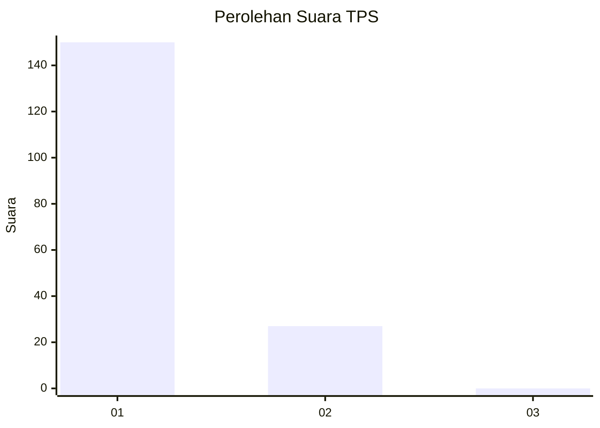
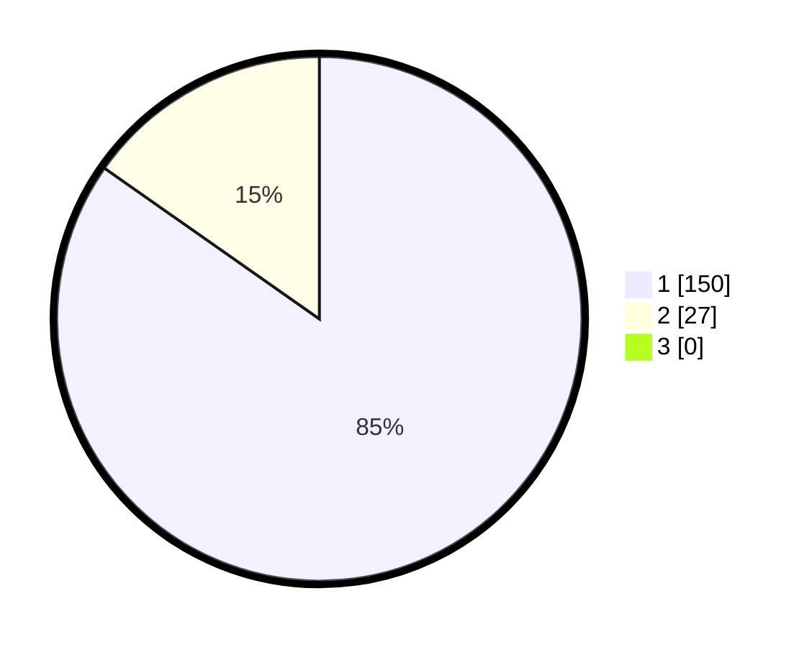

# Hasil

## Grafik

## Tabel

| No. | Nama Paslon    | Suara | Suara (raw) | Persentase |
|:--- |:-------------- | -----:| -----------:| ----------:|
| 1   | ANIES MUHAIMIN | 150   | [150][p-1]  | 84,75      |
| 2   | PRABOWO GIBRAN | 27    | [27][p-2]   | 15,25      |
| 3   | GANJAR MAHFUD  | 0     | [0][p-3]    | 0,00       |

[p-1]: https://github.com/gigit-pemilu/pemilu-2024-11-aceh/blob/main/pilpres/hitung-suara/sub/11-aceh/sub/03-aceh-timur/sub/03-idi-rayeuk/sub/2005-gampong-aceh/sub/005-tps/sub/paslon-1.txt
[p-2]: https://github.com/gigit-pemilu/pemilu-2024-11-aceh/blob/main/pilpres/hitung-suara/sub/11-aceh/sub/03-aceh-timur/sub/03-idi-rayeuk/sub/2005-gampong-aceh/sub/005-tps/sub/paslon-2.txt
[p-3]: https://github.com/gigit-pemilu/pemilu-2024-11-aceh/blob/main/pilpres/hitung-suara/sub/11-aceh/sub/03-aceh-timur/sub/03-idi-rayeuk/sub/2005-gampong-aceh/sub/005-tps/sub/paslon-3.txt

## Foto C Plano

https://sirekap-obj-formc.kpu.go.id/5c8e/pemilu/ppwp/11/03/03/20/05/1103032005005-20240215-021911--862b1eef-eb0f-44af-8fa4-307f86d19a5a.jpg

https://sirekap-obj-formc.kpu.go.id/5c8e/pemilu/ppwp/11/03/03/20/05/1103032005005-20240215-022045--8d87ba45-94ac-4901-859e-93e958c45758.jpg

https://sirekap-obj-formc.kpu.go.id/5c8e/pemilu/ppwp/11/03/03/20/05/1103032005005-20240215-022140--45e71ec0-9325-47d1-8ffd-5f9283b38eb1.jpg

## Metadata

| Key        | Value               |
| ---------- | ------------------- |
| Time Stamp | 2024-02-24 22:31:28 |

