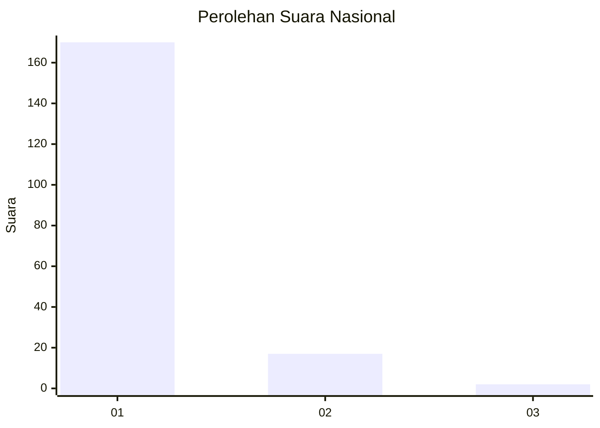
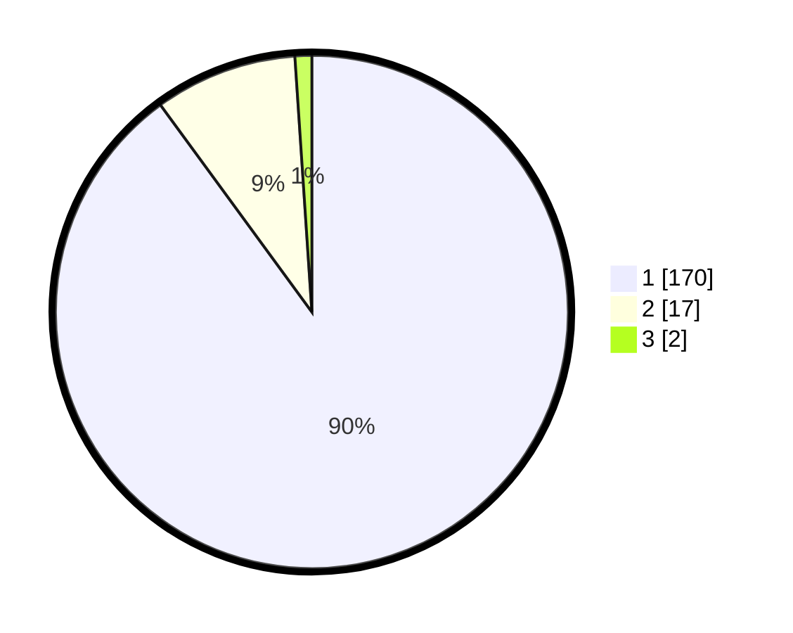

# Hasil

## Grafik

## Tabel

| No. | Nama Paslon    | Suara | Suara (raw) | Persentase |
|:--- |:-------------- | -----:| -----------:| ----------:|
| 1   | ANIES MUHAIMIN | 170   | [170][p-1]  | 89,95      |
| 2   | PRABOWO GIBRAN | 17    | [17][p-2]   | 8,99       |
| 3   | GANJAR MAHFUD  | 2     | [2][p-3]    | 1,06       |

[p-1]: https://github.com/gigit-pemilu/pemilu-2024/blob/main/pilpres/hitung-suara/sub/11-aceh/sub/03-aceh-timur/sub/03-idi-rayeuk/sub/2006-kuta-blang/sub/002-tps/sub/paslon-1.txt
[p-2]: https://github.com/gigit-pemilu/pemilu-2024/blob/main/pilpres/hitung-suara/sub/11-aceh/sub/03-aceh-timur/sub/03-idi-rayeuk/sub/2006-kuta-blang/sub/002-tps/sub/paslon-2.txt
[p-3]: https://github.com/gigit-pemilu/pemilu-2024/blob/main/pilpres/hitung-suara/sub/11-aceh/sub/03-aceh-timur/sub/03-idi-rayeuk/sub/2006-kuta-blang/sub/002-tps/sub/paslon-3.txt

## Foto C Plano

https://sirekap-obj-formc.kpu.go.id/046d/pemilu/ppwp/11/03/03/20/06/1103032006002-20240222-153728--fac5292f-d70f-4f3d-bfe8-35878175639d.jpg

https://sirekap-obj-formc.kpu.go.id/046d/pemilu/ppwp/11/03/03/20/06/1103032006002-20240215-121925--4e62c95b-63f2-48c8-aaec-d96e703a0d51.jpg

https://sirekap-obj-formc.kpu.go.id/046d/pemilu/ppwp/11/03/03/20/06/1103032006002-20240215-122057--cbe0a3b7-1967-4a41-add8-09c36ca2a8c0.jpg

## Metadata

| Key        | Value               |
| ---------- | ------------------- |
| Time Stamp | 2024-02-24 22:31:28 |

