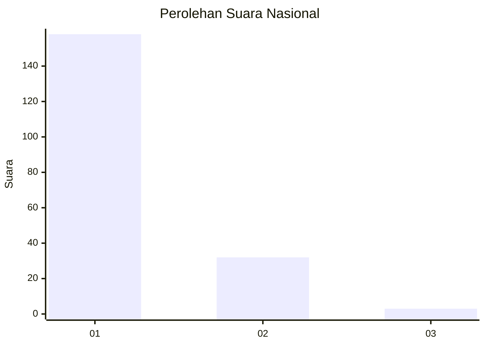
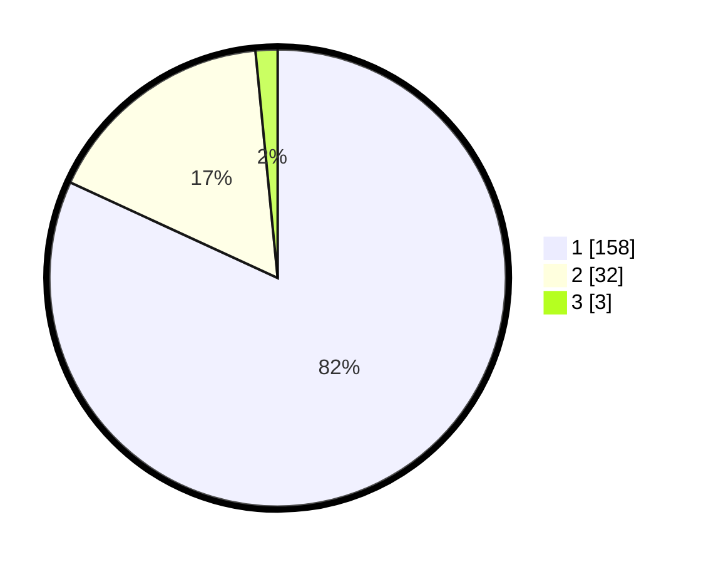

# Hasil

## Grafik

## Tabel

| No. | Nama Paslon    | Suara | Suara (raw) | Persentase |
|:--- |:-------------- | -----:| -----------:| ----------:|
| 1   | ANIES MUHAIMIN | 158   | [158][p-1]  | 81,87      |
| 2   | PRABOWO GIBRAN | 32    | [32][p-2]   | 16,58      |
| 3   | GANJAR MAHFUD  | 3     | [3][p-3]    | 1,55       |

[p-1]: https://github.com/gigit-pemilu/pemilu-2024/blob/main/pilpres/hitung-suara/sub/11-aceh/sub/03-aceh-timur/sub/03-idi-rayeuk/sub/2006-kuta-blang/sub/003-tps/sub/paslon-1.txt
[p-2]: https://github.com/gigit-pemilu/pemilu-2024/blob/main/pilpres/hitung-suara/sub/11-aceh/sub/03-aceh-timur/sub/03-idi-rayeuk/sub/2006-kuta-blang/sub/003-tps/sub/paslon-2.txt
[p-3]: https://github.com/gigit-pemilu/pemilu-2024/blob/main/pilpres/hitung-suara/sub/11-aceh/sub/03-aceh-timur/sub/03-idi-rayeuk/sub/2006-kuta-blang/sub/003-tps/sub/paslon-3.txt

## Foto C Plano

https://sirekap-obj-formc.kpu.go.id/a3a0/pemilu/ppwp/11/03/03/20/06/1103032006003-20240215-045316--837663d0-16a0-444c-b8a2-7e68c920f807.jpg

https://sirekap-obj-formc.kpu.go.id/a3a0/pemilu/ppwp/11/03/03/20/06/1103032006003-20240215-133356--7135ee7a-2512-4ee3-822f-dbc6b582fa30.jpg

https://sirekap-obj-formc.kpu.go.id/a3a0/pemilu/ppwp/11/03/03/20/06/1103032006003-20240215-045605--4258c698-e516-4f5e-99ce-352d48dd6f62.jpg

## Metadata

| Key        | Value               |
| ---------- | ------------------- |
| Time Stamp | 2024-02-24 22:31:28 |

