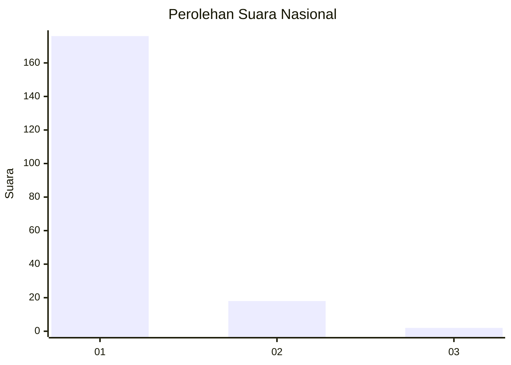
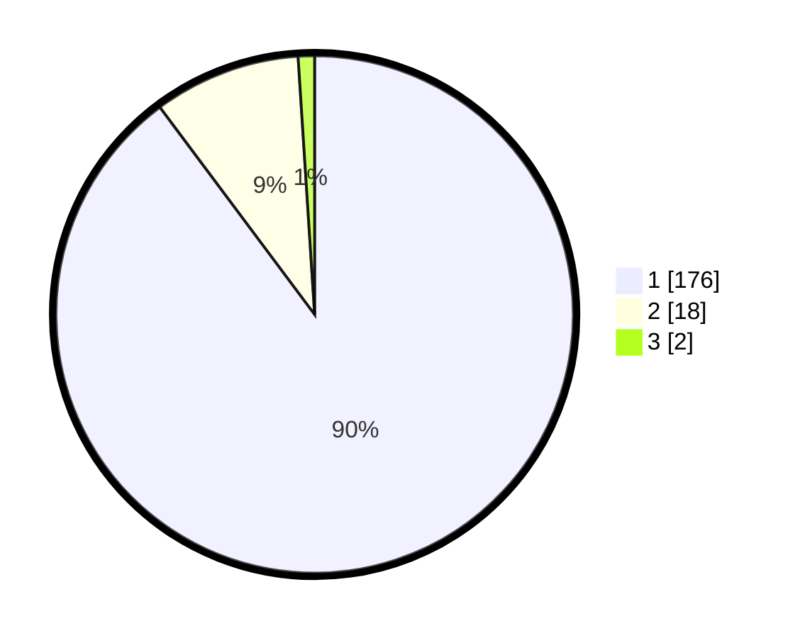

# Hasil

## Grafik

## Tabel

| No. | Nama Paslon    | Suara | Suara (raw) | Persentase |
|:--- |:-------------- | -----:| -----------:| ----------:|
| 1   | ANIES MUHAIMIN | 176   | [176][p-1]  | 89,80      |
| 2   | PRABOWO GIBRAN | 18    | [18][p-2]   | 9,18       |
| 3   | GANJAR MAHFUD  | 2     | [2][p-3]    | 1,02       |

[p-1]: https://github.com/gigit-pemilu/pemilu-2024/blob/main/pilpres/hitung-suara/sub/11-aceh/sub/03-aceh-timur/sub/03-idi-rayeuk/sub/2006-kuta-blang/sub/004-tps/sub/paslon-1.txt
[p-2]: https://github.com/gigit-pemilu/pemilu-2024/blob/main/pilpres/hitung-suara/sub/11-aceh/sub/03-aceh-timur/sub/03-idi-rayeuk/sub/2006-kuta-blang/sub/004-tps/sub/paslon-2.txt
[p-3]: https://github.com/gigit-pemilu/pemilu-2024/blob/main/pilpres/hitung-suara/sub/11-aceh/sub/03-aceh-timur/sub/03-idi-rayeuk/sub/2006-kuta-blang/sub/004-tps/sub/paslon-3.txt

## Foto C Plano

https://sirekap-obj-formc.kpu.go.id/404d/pemilu/ppwp/11/03/03/20/06/1103032006004-20240222-173448--b3374247-2d59-42a3-8b98-e72f0cd1c669.jpg

https://sirekap-obj-formc.kpu.go.id/404d/pemilu/ppwp/11/03/03/20/06/1103032006004-20240218-150828--7b8dd8fd-8b0b-46c4-8c0b-dc087b822bd4.jpg

https://sirekap-obj-formc.kpu.go.id/404d/pemilu/ppwp/11/03/03/20/06/1103032006004-20240215-083857--096590cc-bac4-4de2-8beb-fad601aaa2c4.jpg

## Metadata

| Key        | Value               |
| ---------- | ------------------- |
| Time Stamp | 2024-02-24 22:31:28 |

