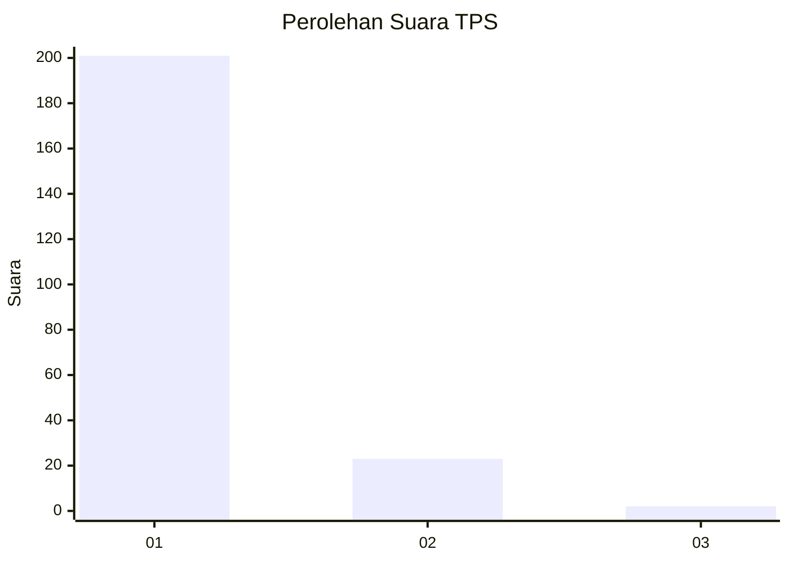
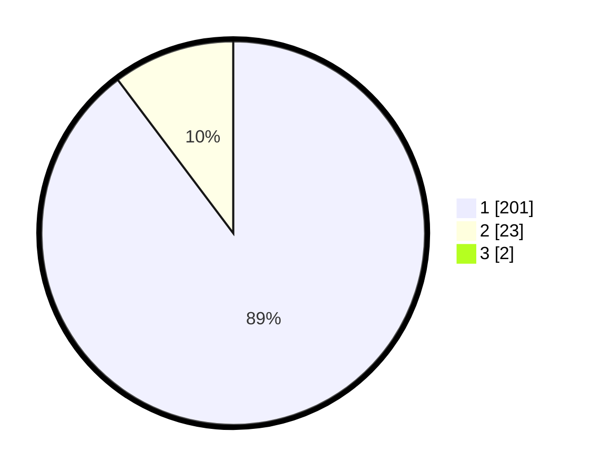

# Hasil

## Grafik

## Tabel

| No. | Nama Paslon    | Suara | Suara (raw) | Persentase |
|:--- |:-------------- | -----:| -----------:| ----------:|
| 1   | ANIES MUHAIMIN | 201   | [201][p-1]  | 88,94      |
| 2   | PRABOWO GIBRAN | 23    | [23][p-2]   | 10,18      |
| 3   | GANJAR MAHFUD  | 2     | [2][p-3]    | 0,88       |

[p-1]: https://github.com/gigit-pemilu/pemilu-2024-11-aceh/blob/main/pilpres/hitung-suara/sub/11-aceh/sub/03-aceh-timur/sub/03-idi-rayeuk/sub/2007-gampong-tanjong/sub/001-tps/sub/paslon-1.txt
[p-2]: https://github.com/gigit-pemilu/pemilu-2024-11-aceh/blob/main/pilpres/hitung-suara/sub/11-aceh/sub/03-aceh-timur/sub/03-idi-rayeuk/sub/2007-gampong-tanjong/sub/001-tps/sub/paslon-2.txt
[p-3]: https://github.com/gigit-pemilu/pemilu-2024-11-aceh/blob/main/pilpres/hitung-suara/sub/11-aceh/sub/03-aceh-timur/sub/03-idi-rayeuk/sub/2007-gampong-tanjong/sub/001-tps/sub/paslon-3.txt

## Foto C Plano

https://sirekap-obj-formc.kpu.go.id/f7ce/pemilu/ppwp/11/03/03/20/07/1103032007001-20240215-024110--87f57233-3e37-4441-80cd-f5d352a0a997.jpg

https://sirekap-obj-formc.kpu.go.id/f7ce/pemilu/ppwp/11/03/03/20/07/1103032007001-20240215-025343--72978e50-87c4-4804-92ee-323cf578a09f.jpg

https://sirekap-obj-formc.kpu.go.id/f7ce/pemilu/ppwp/11/03/03/20/07/1103032007001-20240215-025017--0ba6e0c4-2314-4c47-a048-038c312fd4fa.jpg

## Metadata

| Key        | Value               |
| ---------- | ------------------- |
| Time Stamp | 2024-02-24 22:31:28 |

