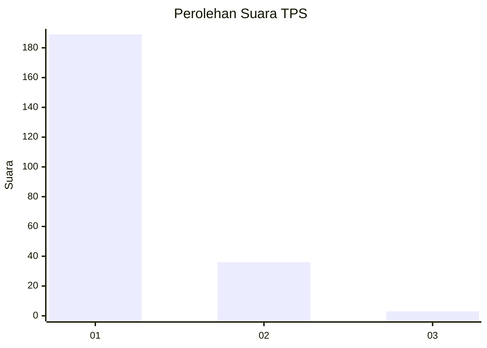
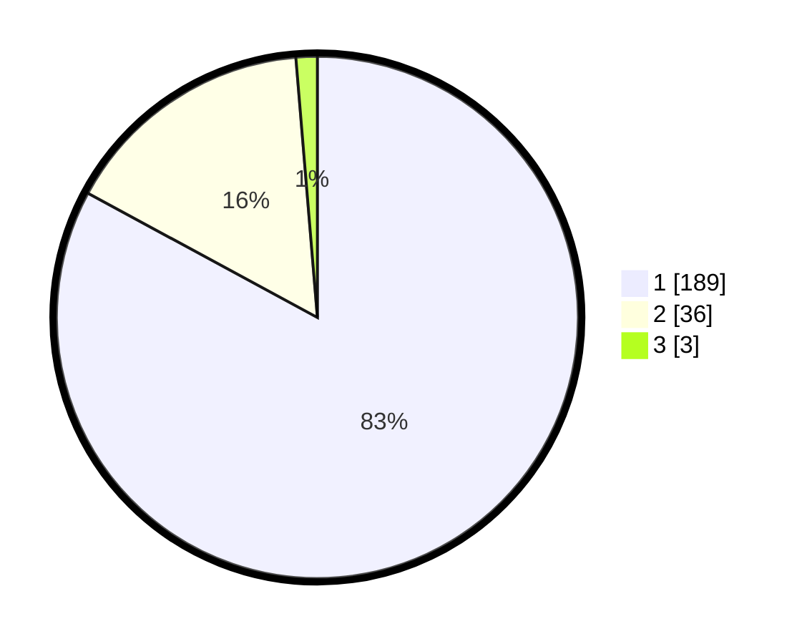

# Hasil

## Grafik

## Tabel

| No. | Nama Paslon    | Suara | Suara (raw) | Persentase |
|:--- |:-------------- | -----:| -----------:| ----------:|
| 1   | ANIES MUHAIMIN | 189   | [189][p-1]  | 82,89      |
| 2   | PRABOWO GIBRAN | 36    | [36][p-2]   | 15,79      |
| 3   | GANJAR MAHFUD  | 3     | [3][p-3]    | 1,32       |

[p-1]: https://github.com/gigit-pemilu/pemilu-2024-11-aceh/blob/main/pilpres/hitung-suara/sub/11-aceh/sub/03-aceh-timur/sub/03-idi-rayeuk/sub/2007-gampong-tanjong/sub/002-tps/sub/paslon-1.txt
[p-2]: https://github.com/gigit-pemilu/pemilu-2024-11-aceh/blob/main/pilpres/hitung-suara/sub/11-aceh/sub/03-aceh-timur/sub/03-idi-rayeuk/sub/2007-gampong-tanjong/sub/002-tps/sub/paslon-2.txt
[p-3]: https://github.com/gigit-pemilu/pemilu-2024-11-aceh/blob/main/pilpres/hitung-suara/sub/11-aceh/sub/03-aceh-timur/sub/03-idi-rayeuk/sub/2007-gampong-tanjong/sub/002-tps/sub/paslon-3.txt

## Foto C Plano

https://sirekap-obj-formc.kpu.go.id/0543/pemilu/ppwp/11/03/03/20/07/1103032007002-20240215-085259--bf18cdff-b911-4e91-9b26-e29f85e32bc8.jpg

https://sirekap-obj-formc.kpu.go.id/0543/pemilu/ppwp/11/03/03/20/07/1103032007002-20240215-030306--3bd5f58c-8bd3-4fce-b499-7e0c3367a1fb.jpg

https://sirekap-obj-formc.kpu.go.id/0543/pemilu/ppwp/11/03/03/20/07/1103032007002-20240215-131448--411b051b-a583-430d-9578-a04fa859d2a7.jpg

## Metadata

| Key        | Value               |
| ---------- | ------------------- |
| Time Stamp | 2024-02-24 22:31:28 |

