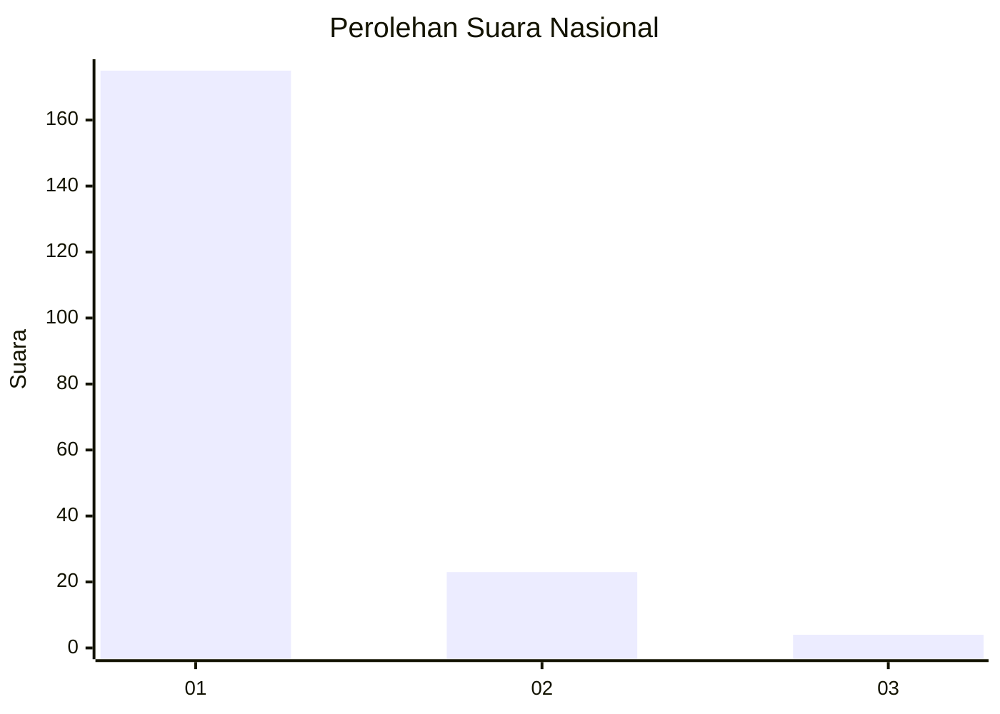
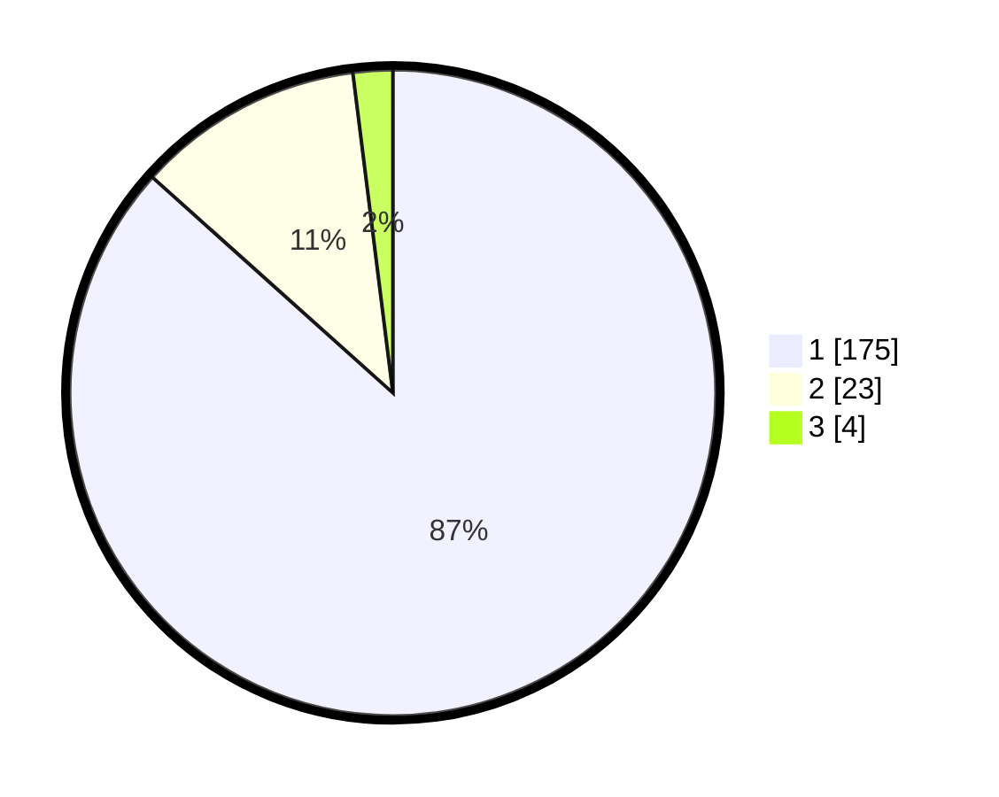

# Hasil

## Grafik

## Tabel

| No. | Nama Paslon    | Suara | Suara (raw) | Persentase |
|:--- |:-------------- | -----:| -----------:| ----------:|
| 1   | ANIES MUHAIMIN | 175   | [175][p-1]  | 86,63      |
| 2   | PRABOWO GIBRAN | 23    | [23][p-2]   | 11,39      |
| 3   | GANJAR MAHFUD  | 4     | [4][p-3]    | 1,98       |

[p-1]: https://github.com/gigit-pemilu/pemilu-2024/blob/main/pilpres/hitung-suara/sub/11-aceh/sub/03-aceh-timur/sub/03-idi-rayeuk/sub/2007-gampong-tanjong/sub/003-tps/sub/paslon-1.txt
[p-2]: https://github.com/gigit-pemilu/pemilu-2024/blob/main/pilpres/hitung-suara/sub/11-aceh/sub/03-aceh-timur/sub/03-idi-rayeuk/sub/2007-gampong-tanjong/sub/003-tps/sub/paslon-2.txt
[p-3]: https://github.com/gigit-pemilu/pemilu-2024/blob/main/pilpres/hitung-suara/sub/11-aceh/sub/03-aceh-timur/sub/03-idi-rayeuk/sub/2007-gampong-tanjong/sub/003-tps/sub/paslon-3.txt

## Foto C Plano

https://sirekap-obj-formc.kpu.go.id/ae1c/pemilu/ppwp/11/03/03/20/07/1103032007003-20240215-095303--ea570686-43ff-4deb-afc2-b17c6a22dfed.jpg

https://sirekap-obj-formc.kpu.go.id/ae1c/pemilu/ppwp/11/03/03/20/07/1103032007003-20240215-095629--cad03e67-23a1-4c4b-8145-a372b21cf049.jpg

https://sirekap-obj-formc.kpu.go.id/ae1c/pemilu/ppwp/11/03/03/20/07/1103032007003-20240215-095749--31f8d19d-202b-49c5-a16c-af64b928cd59.jpg

## Metadata

| Key        | Value               |
| ---------- | ------------------- |
| Time Stamp | 2024-02-24 23:00:00 |

