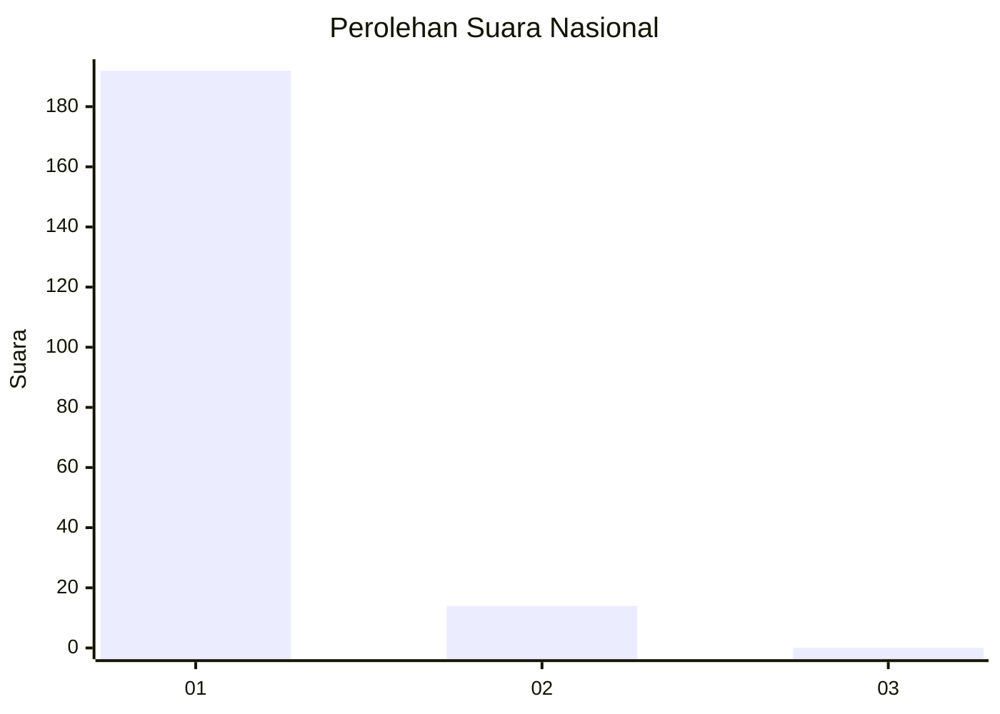
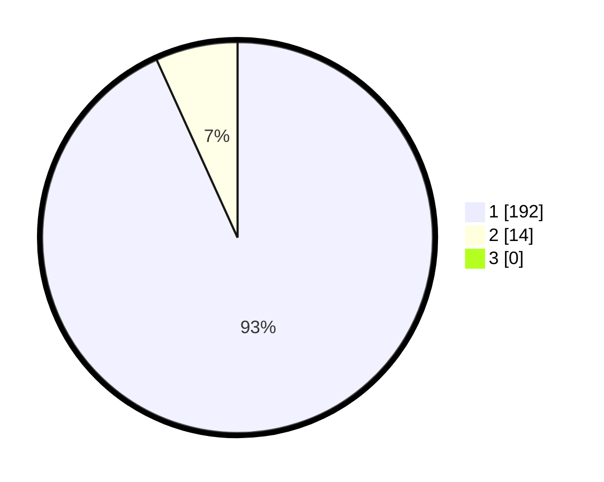

# Hasil

## Grafik

## Tabel

| No. | Nama Paslon    | Suara | Suara (raw) | Persentase |
|:--- |:-------------- | -----:| -----------:| ----------:|
| 1   | ANIES MUHAIMIN | 192   | [192][p-1]  | 93,20      |
| 2   | PRABOWO GIBRAN | 14    | [14][p-2]   | 6,80       |
| 3   | GANJAR MAHFUD  | 0     | [0][p-3]    | 0,00       |

[p-1]: https://github.com/gigit-pemilu/pemilu-2024/blob/main/pilpres/hitung-suara/sub/11-aceh/sub/03-aceh-timur/sub/03-idi-rayeuk/sub/2008-blang-geulumpang/sub/004-tps/sub/paslon-1.txt
[p-2]: https://github.com/gigit-pemilu/pemilu-2024/blob/main/pilpres/hitung-suara/sub/11-aceh/sub/03-aceh-timur/sub/03-idi-rayeuk/sub/2008-blang-geulumpang/sub/004-tps/sub/paslon-2.txt
[p-3]: https://github.com/gigit-pemilu/pemilu-2024/blob/main/pilpres/hitung-suara/sub/11-aceh/sub/03-aceh-timur/sub/03-idi-rayeuk/sub/2008-blang-geulumpang/sub/004-tps/sub/paslon-3.txt

## Foto C Plano

https://sirekap-obj-formc.kpu.go.id/8fe5/pemilu/ppwp/11/03/03/20/08/1103032008004-20240215-084326--3ac22b83-705c-4a37-b038-3a674b4a1633.jpg

https://sirekap-obj-formc.kpu.go.id/8fe5/pemilu/ppwp/11/03/03/20/08/1103032008004-20240215-084629--795384d5-36f9-478b-9584-ba4c5998eb1e.jpg

https://sirekap-obj-formc.kpu.go.id/8fe5/pemilu/ppwp/11/03/03/20/08/1103032008004-20240215-084856--bef8079f-3beb-4e72-b468-0d2e9331dd94.jpg

## Metadata

| Key        | Value               |
| ---------- | ------------------- |
| Time Stamp | 2024-02-24 22:31:28 |

