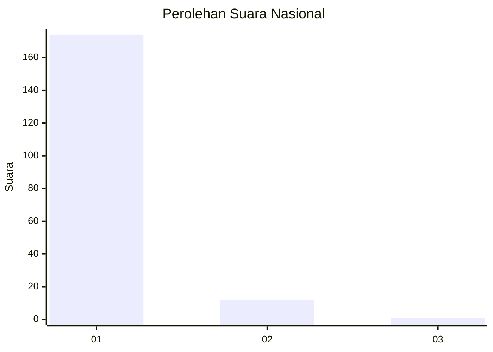
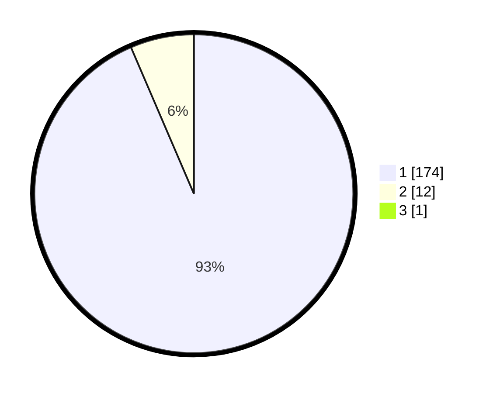

# Hasil

## Grafik

## Tabel

| No. | Nama Paslon    | Suara | Suara (raw) | Persentase |
|:--- |:-------------- | -----:| -----------:| ----------:|
| 1   | ANIES MUHAIMIN | 174   | [174][p-1]  | 93,05      |
| 2   | PRABOWO GIBRAN | 12    | [12][p-2]   | 6,42       |
| 3   | GANJAR MAHFUD  | 1     | [1][p-3]    | 0,53       |

[p-1]: https://github.com/gigit-pemilu/pemilu-2024/blob/main/pilpres/hitung-suara/sub/11-aceh/sub/03-aceh-timur/sub/03-idi-rayeuk/sub/2008-blang-geulumpang/sub/005-tps/sub/paslon-1.txt
[p-2]: https://github.com/gigit-pemilu/pemilu-2024/blob/main/pilpres/hitung-suara/sub/11-aceh/sub/03-aceh-timur/sub/03-idi-rayeuk/sub/2008-blang-geulumpang/sub/005-tps/sub/paslon-2.txt
[p-3]: https://github.com/gigit-pemilu/pemilu-2024/blob/main/pilpres/hitung-suara/sub/11-aceh/sub/03-aceh-timur/sub/03-idi-rayeuk/sub/2008-blang-geulumpang/sub/005-tps/sub/paslon-3.txt

## Foto C Plano

https://sirekap-obj-formc.kpu.go.id/cd17/pemilu/ppwp/11/03/03/20/08/1103032008005-20240214-192903--90ded8d8-be6f-4834-a686-e724236a951e.jpg

https://sirekap-obj-formc.kpu.go.id/cd17/pemilu/ppwp/11/03/03/20/08/1103032008005-20240214-193121--024b19c6-8adc-40fa-87ff-4485d8e5c536.jpg

https://sirekap-obj-formc.kpu.go.id/cd17/pemilu/ppwp/11/03/03/20/08/1103032008005-20240214-193301--f9ab0ba8-646b-4036-8547-162f11ba1e4a.jpg

## Metadata

| Key        | Value               |
| ---------- | ------------------- |
| Time Stamp | 2024-02-24 22:31:28 |

