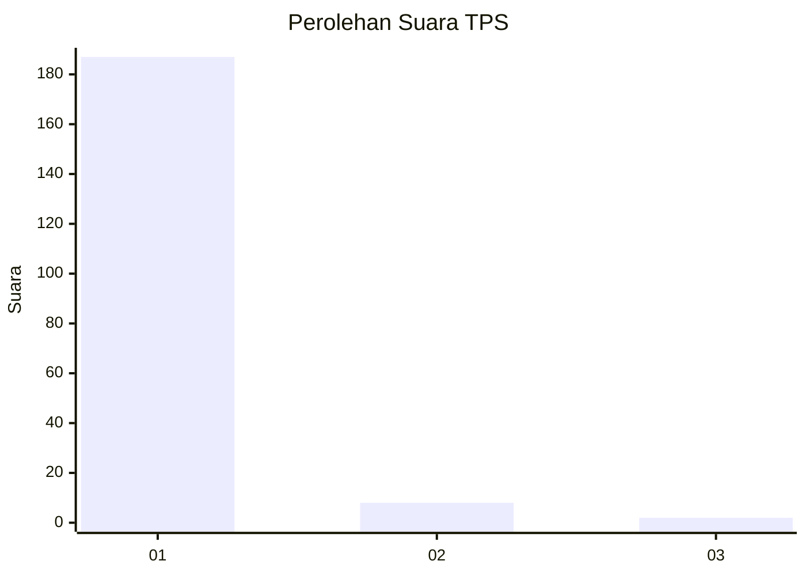
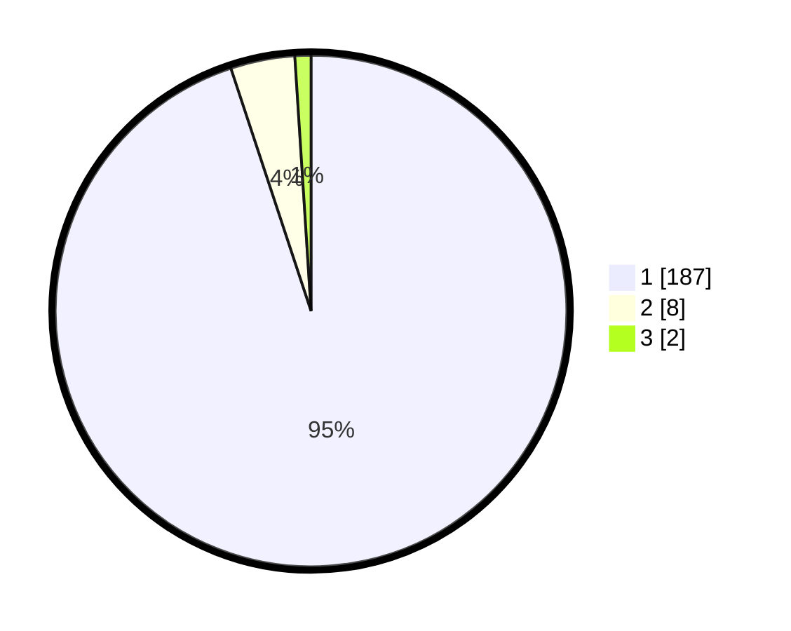

# Hasil

## Grafik

## Tabel

| No. | Nama Paslon    | Suara | Suara (raw) | Persentase |
|:--- |:-------------- | -----:| -----------:| ----------:|
| 1   | ANIES MUHAIMIN | 187   | [187][p-1]  | 94,92      |
| 2   | PRABOWO GIBRAN | 8     | [8][p-2]    | 4,06       |
| 3   | GANJAR MAHFUD  | 2     | [2][p-3]    | 1,02       |

[p-1]: https://github.com/gigit-pemilu/pemilu-2024-11-aceh/blob/main/pilpres/hitung-suara/sub/11-aceh/sub/03-aceh-timur/sub/03-idi-rayeuk/sub/2008-blang-geulumpang/sub/006-tps/sub/paslon-1.txt
[p-2]: https://github.com/gigit-pemilu/pemilu-2024-11-aceh/blob/main/pilpres/hitung-suara/sub/11-aceh/sub/03-aceh-timur/sub/03-idi-rayeuk/sub/2008-blang-geulumpang/sub/006-tps/sub/paslon-2.txt
[p-3]: https://github.com/gigit-pemilu/pemilu-2024-11-aceh/blob/main/pilpres/hitung-suara/sub/11-aceh/sub/03-aceh-timur/sub/03-idi-rayeuk/sub/2008-blang-geulumpang/sub/006-tps/sub/paslon-3.txt

## Foto C Plano

https://sirekap-obj-formc.kpu.go.id/c6c5/pemilu/ppwp/11/03/03/20/08/1103032008006-20240221-115520--d217e410-4e72-4e07-87a4-59bb8e213b9d.jpg

https://sirekap-obj-formc.kpu.go.id/c6c5/pemilu/ppwp/11/03/03/20/08/1103032008006-20240221-115607--484e32bb-1b97-41a1-9026-59c51d677b2d.jpg

https://sirekap-obj-formc.kpu.go.id/c6c5/pemilu/ppwp/11/03/03/20/08/1103032008006-20240221-115708--f314634b-ab83-4169-b837-a083fd5af7f6.jpg

## Metadata

| Key        | Value               |
| ---------- | ------------------- |
| Time Stamp | 2024-02-24 22:31:28 |

