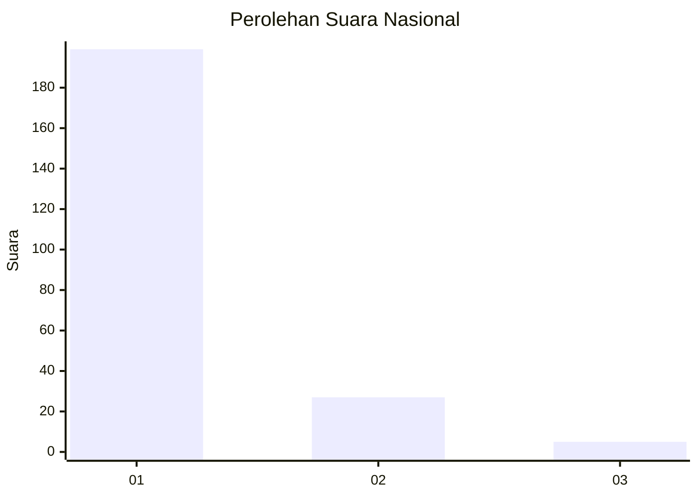
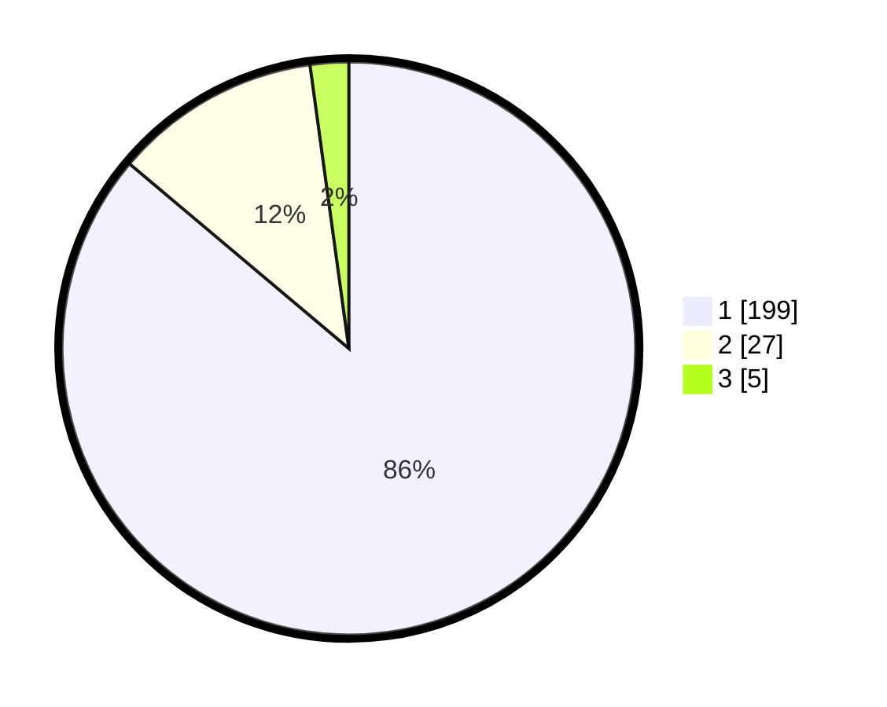

# Hasil

## Grafik

## Tabel

| No. | Nama Paslon    | Suara | Suara (raw) | Persentase |
|:--- |:-------------- | -----:| -----------:| ----------:|
| 1   | ANIES MUHAIMIN | 199   | [199][p-1]  | 86,15      |
| 2   | PRABOWO GIBRAN | 27    | [27][p-2]   | 11,69      |
| 3   | GANJAR MAHFUD  | 5     | [5][p-3]    | 2,16       |

[p-1]: https://github.com/gigit-pemilu/pemilu-2024/blob/main/pilpres/hitung-suara/sub/11-aceh/sub/03-aceh-timur/sub/03-idi-rayeuk/sub/2011-keutapang-mameh/sub/001-tps/sub/paslon-1.txt
[p-2]: https://github.com/gigit-pemilu/pemilu-2024/blob/main/pilpres/hitung-suara/sub/11-aceh/sub/03-aceh-timur/sub/03-idi-rayeuk/sub/2011-keutapang-mameh/sub/001-tps/sub/paslon-2.txt
[p-3]: https://github.com/gigit-pemilu/pemilu-2024/blob/main/pilpres/hitung-suara/sub/11-aceh/sub/03-aceh-timur/sub/03-idi-rayeuk/sub/2011-keutapang-mameh/sub/001-tps/sub/paslon-3.txt

## Foto C Plano

https://sirekap-obj-formc.kpu.go.id/2dda/pemilu/ppwp/11/03/03/20/11/1103032011001-20240215-180134--adda7ec5-f3e0-4f2b-ba65-83e4da641dc1.jpg

https://sirekap-obj-formc.kpu.go.id/2dda/pemilu/ppwp/11/03/03/20/11/1103032011001-20240215-180317--96bb218e-0a99-4eb3-ac64-0a2011a39aea.jpg

https://sirekap-obj-formc.kpu.go.id/2dda/pemilu/ppwp/11/03/03/20/11/1103032011001-20240215-114112--4f8b0389-262e-42ae-984e-ac3dc58dabfd.jpg

## Metadata

| Key        | Value               |
| ---------- | ------------------- |
| Time Stamp | 2024-02-24 22:31:28 |

