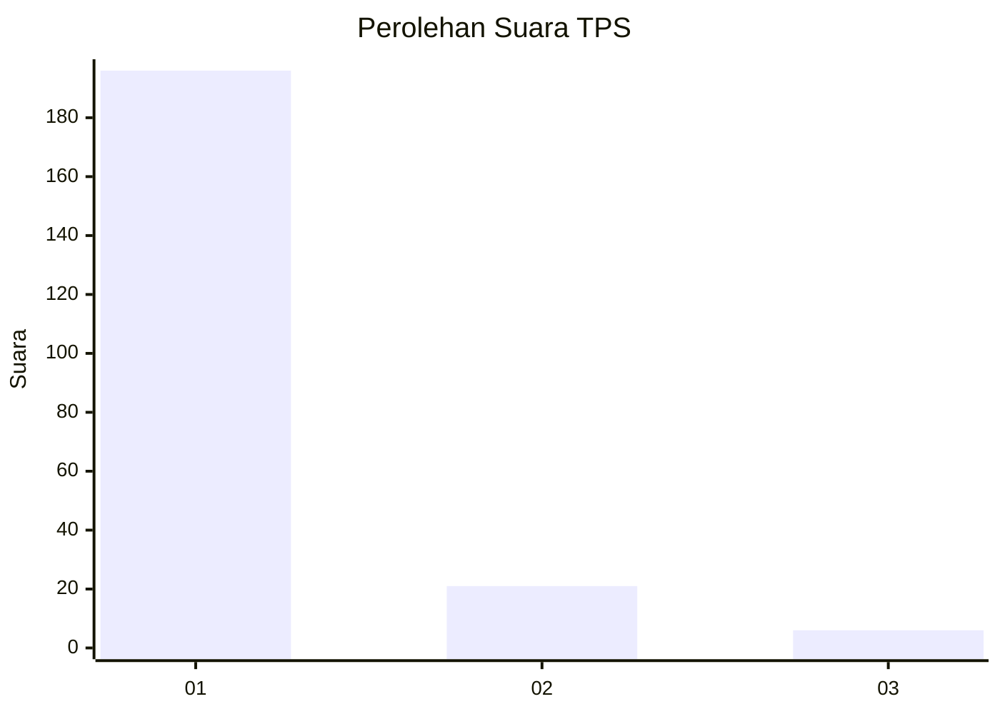
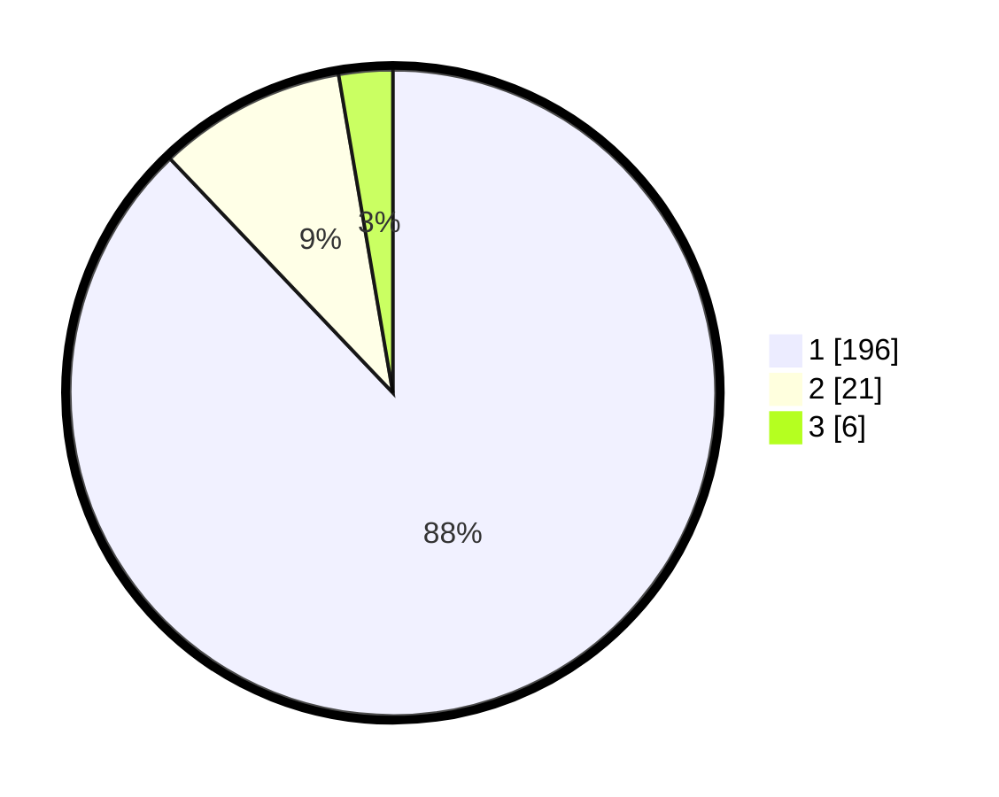

# Hasil

## Grafik

## Tabel

| No. | Nama Paslon    | Suara | Suara (raw) | Persentase |
|:--- |:-------------- | -----:| -----------:| ----------:|
| 1   | ANIES MUHAIMIN | 196   | [196][p-1]  | 87,89      |
| 2   | PRABOWO GIBRAN | 21    | [21][p-2]   | 9,42       |
| 3   | GANJAR MAHFUD  | 6     | [6][p-3]    | 2,69       |

[p-1]: https://github.com/gigit-pemilu/pemilu-2024-11-aceh/blob/main/pilpres/hitung-suara/sub/11-aceh/sub/03-aceh-timur/sub/03-idi-rayeuk/sub/2012-seuneubok-rambong/sub/001-tps/sub/paslon-1.txt
[p-2]: https://github.com/gigit-pemilu/pemilu-2024-11-aceh/blob/main/pilpres/hitung-suara/sub/11-aceh/sub/03-aceh-timur/sub/03-idi-rayeuk/sub/2012-seuneubok-rambong/sub/001-tps/sub/paslon-2.txt
[p-3]: https://github.com/gigit-pemilu/pemilu-2024-11-aceh/blob/main/pilpres/hitung-suara/sub/11-aceh/sub/03-aceh-timur/sub/03-idi-rayeuk/sub/2012-seuneubok-rambong/sub/001-tps/sub/paslon-3.txt

## Foto C Plano

https://sirekap-obj-formc.kpu.go.id/429f/pemilu/ppwp/11/03/03/20/12/1103032012001-20240215-105427--76ff3b14-96dd-4b33-8b3d-5f8ad1f0a198.jpg

https://sirekap-obj-formc.kpu.go.id/429f/pemilu/ppwp/11/03/03/20/12/1103032012001-20240215-105608--9437a3db-6c18-47ab-ba82-da1cd2979150.jpg

https://sirekap-obj-formc.kpu.go.id/429f/pemilu/ppwp/11/03/03/20/12/1103032012001-20240215-105811--48bfd7d2-fc7e-447b-b49a-982dfc5336f4.jpg

## Metadata

| Key        | Value               |
| ---------- | ------------------- |
| Time Stamp | 2024-02-24 22:31:28 |

