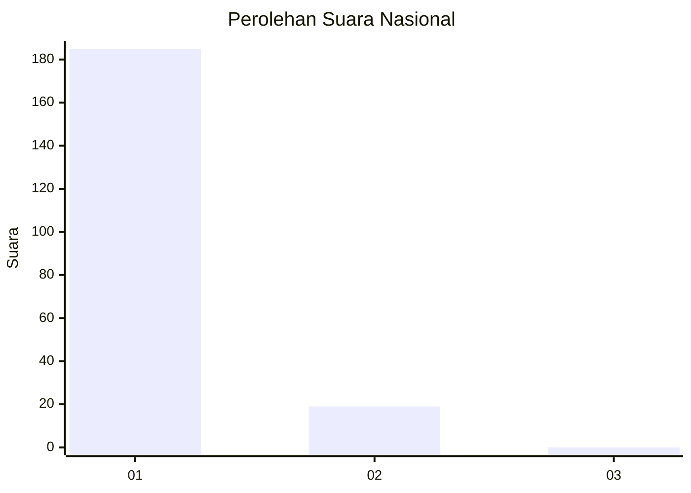
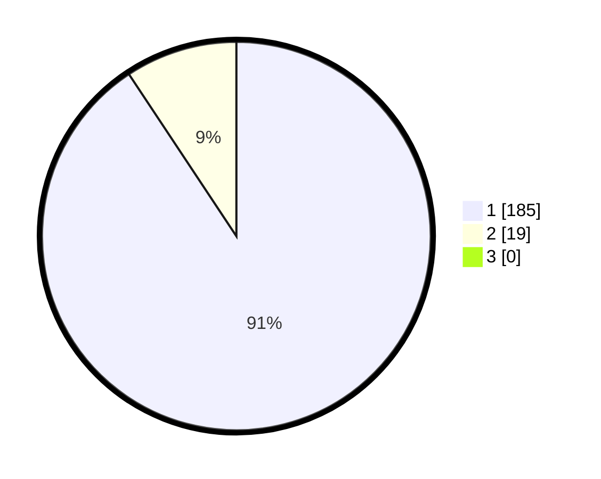

# Hasil

## Grafik

## Tabel

| No. | Nama Paslon    | Suara | Suara (raw) | Persentase |
|:--- |:-------------- | -----:| -----------:| ----------:|
| 1   | ANIES MUHAIMIN | 185   | [185][p-1]  | 90,69      |
| 2   | PRABOWO GIBRAN | 19    | [19][p-2]   | 9,31       |
| 3   | GANJAR MAHFUD  | 0     | [0][p-3]    | 0,00       |

[p-1]: https://github.com/gigit-pemilu/pemilu-2024/blob/main/pilpres/hitung-suara/sub/11-aceh/sub/03-aceh-timur/sub/03-idi-rayeuk/sub/2012-seuneubok-rambong/sub/003-tps/sub/paslon-1.txt
[p-2]: https://github.com/gigit-pemilu/pemilu-2024/blob/main/pilpres/hitung-suara/sub/11-aceh/sub/03-aceh-timur/sub/03-idi-rayeuk/sub/2012-seuneubok-rambong/sub/003-tps/sub/paslon-2.txt
[p-3]: https://github.com/gigit-pemilu/pemilu-2024/blob/main/pilpres/hitung-suara/sub/11-aceh/sub/03-aceh-timur/sub/03-idi-rayeuk/sub/2012-seuneubok-rambong/sub/003-tps/sub/paslon-3.txt

## Foto C Plano

https://sirekap-obj-formc.kpu.go.id/17d4/pemilu/ppwp/11/03/03/20/12/1103032012003-20240215-110954--124a0c4d-c7c2-456a-b446-1252b63e00ed.jpg

https://sirekap-obj-formc.kpu.go.id/17d4/pemilu/ppwp/11/03/03/20/12/1103032012003-20240215-111204--f605f1fa-96f6-4ac6-b968-25ed4059aaf3.jpg

https://sirekap-obj-formc.kpu.go.id/17d4/pemilu/ppwp/11/03/03/20/12/1103032012003-20240215-111328--36ee9121-1ef7-478c-a9c7-9ab7f7e6f943.jpg

## Metadata

| Key        | Value               |
| ---------- | ------------------- |
| Time Stamp | 2024-02-24 22:31:28 |

