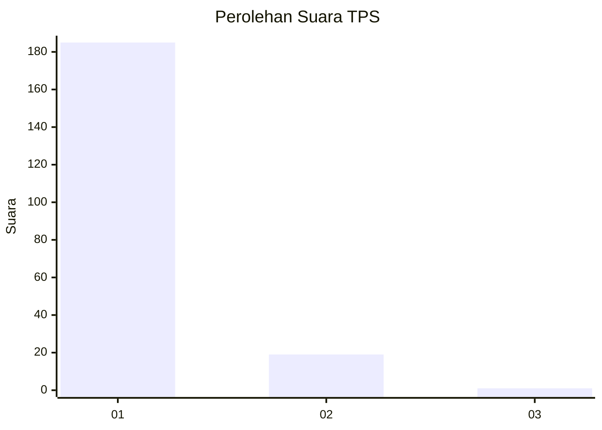
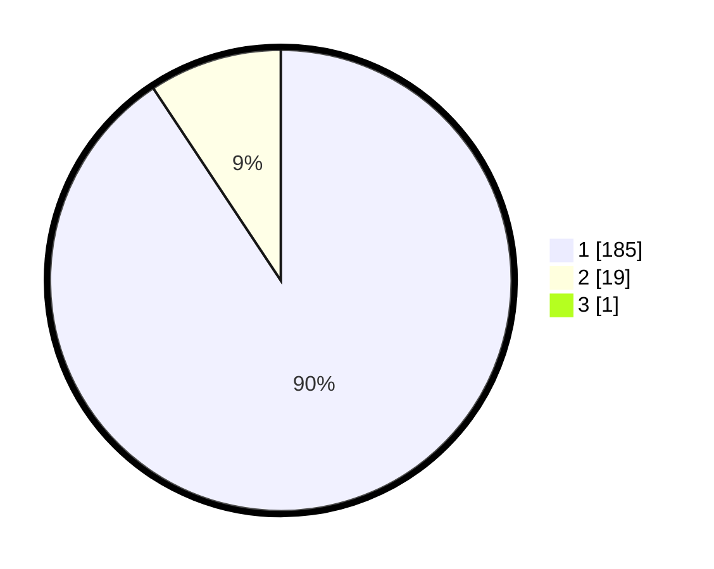

# Hasil

## Grafik

## Tabel

| No. | Nama Paslon    | Suara | Suara (raw) | Persentase |
|:--- |:-------------- | -----:| -----------:| ----------:|
| 1   | ANIES MUHAIMIN | 185   | [185][p-1]  | 90,24      |
| 2   | PRABOWO GIBRAN | 19    | [19][p-2]   | 9,27       |
| 3   | GANJAR MAHFUD  | 1     | [1][p-3]    | 0,49       |

[p-1]: https://github.com/gigit-pemilu/pemilu-2024-11-aceh/blob/main/pilpres/hitung-suara/sub/11-aceh/sub/03-aceh-timur/sub/03-idi-rayeuk/sub/2012-seuneubok-rambong/sub/004-tps/sub/paslon-1.txt
[p-2]: https://github.com/gigit-pemilu/pemilu-2024-11-aceh/blob/main/pilpres/hitung-suara/sub/11-aceh/sub/03-aceh-timur/sub/03-idi-rayeuk/sub/2012-seuneubok-rambong/sub/004-tps/sub/paslon-2.txt
[p-3]: https://github.com/gigit-pemilu/pemilu-2024-11-aceh/blob/main/pilpres/hitung-suara/sub/11-aceh/sub/03-aceh-timur/sub/03-idi-rayeuk/sub/2012-seuneubok-rambong/sub/004-tps/sub/paslon-3.txt

## Foto C Plano

https://sirekap-obj-formc.kpu.go.id/ae71/pemilu/ppwp/11/03/03/20/12/1103032012004-20240215-105716--70d35a86-fe77-4fa0-9c3b-ad4333cdc16c.jpg

https://sirekap-obj-formc.kpu.go.id/ae71/pemilu/ppwp/11/03/03/20/12/1103032012004-20240215-105832--cd9aba90-2fbd-4544-9b02-973cdfc53f1a.jpg

https://sirekap-obj-formc.kpu.go.id/ae71/pemilu/ppwp/11/03/03/20/12/1103032012004-20240215-105951--7e4b093f-6c1d-4f01-9df1-591a2223d80e.jpg

## Metadata

| Key        | Value               |
| ---------- | ------------------- |
| Time Stamp | 2024-02-24 22:31:28 |

