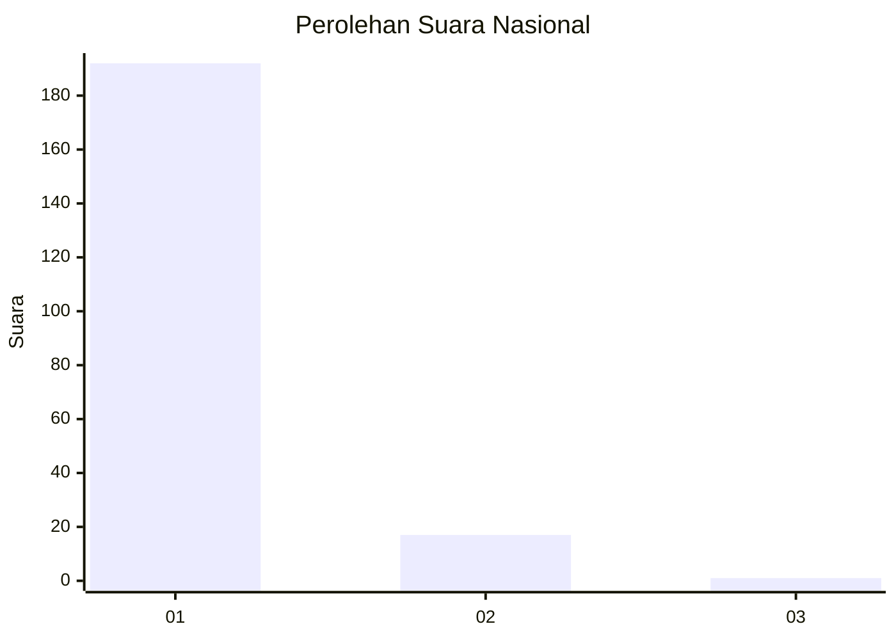
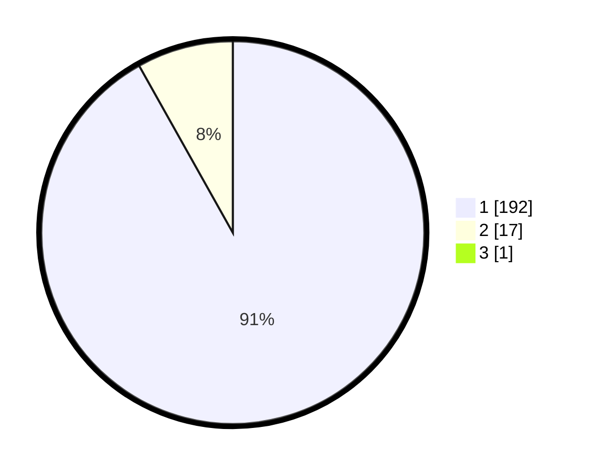

# Hasil

## Grafik

## Tabel

| No. | Nama Paslon    | Suara | Suara (raw) | Persentase |
|:--- |:-------------- | -----:| -----------:| ----------:|
| 1   | ANIES MUHAIMIN | 192   | [192][p-1]  | 91,43      |
| 2   | PRABOWO GIBRAN | 17    | [17][p-2]   | 8,10       |
| 3   | GANJAR MAHFUD  | 1     | [1][p-3]    | 0,48       |

[p-1]: https://github.com/gigit-pemilu/pemilu-2024/blob/main/pilpres/hitung-suara/sub/11-aceh/sub/03-aceh-timur/sub/03-idi-rayeuk/sub/2012-seuneubok-rambong/sub/005-tps/sub/paslon-1.txt
[p-2]: https://github.com/gigit-pemilu/pemilu-2024/blob/main/pilpres/hitung-suara/sub/11-aceh/sub/03-aceh-timur/sub/03-idi-rayeuk/sub/2012-seuneubok-rambong/sub/005-tps/sub/paslon-2.txt
[p-3]: https://github.com/gigit-pemilu/pemilu-2024/blob/main/pilpres/hitung-suara/sub/11-aceh/sub/03-aceh-timur/sub/03-idi-rayeuk/sub/2012-seuneubok-rambong/sub/005-tps/sub/paslon-3.txt

## Foto C Plano

https://sirekap-obj-formc.kpu.go.id/871f/pemilu/ppwp/11/03/03/20/12/1103032012005-20240215-110422--45751b72-ee8c-4b27-bd59-67fba99b8af0.jpg

https://sirekap-obj-formc.kpu.go.id/871f/pemilu/ppwp/11/03/03/20/12/1103032012005-20240215-110540--6de35ebf-f7ff-4717-88c3-2cd72eb15e4d.jpg

https://sirekap-obj-formc.kpu.go.id/871f/pemilu/ppwp/11/03/03/20/12/1103032012005-20240215-110813--9634b560-88fd-4a19-af68-8f1a69192f20.jpg

## Metadata

| Key        | Value               |
| ---------- | ------------------- |
| Time Stamp | 2024-02-24 22:31:28 |

