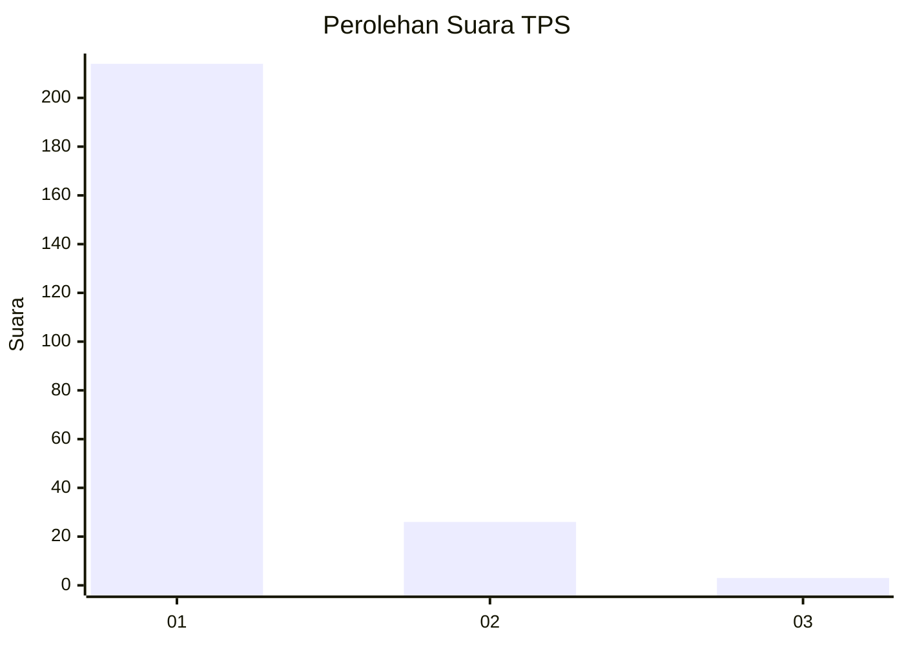
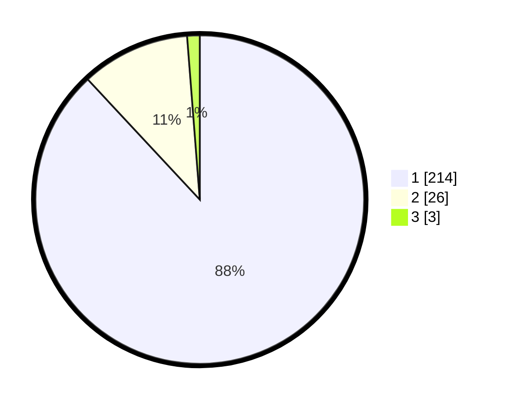

# Hasil

## Grafik

## Tabel

| No. | Nama Paslon    | Suara | Suara (raw) | Persentase |
|:--- |:-------------- | -----:| -----------:| ----------:|
| 1   | ANIES MUHAIMIN | 214   | [214][p-1]  | 88,07      |
| 2   | PRABOWO GIBRAN | 26    | [26][p-2]   | 10,70      |
| 3   | GANJAR MAHFUD  | 3     | [3][p-3]    | 1,23       |

[p-1]: https://github.com/gigit-pemilu/pemilu-2024-11-aceh/blob/main/pilpres/hitung-suara/sub/11-aceh/sub/03-aceh-timur/sub/03-idi-rayeuk/sub/2013-kuala-idi/sub/001-tps/sub/paslon-1.txt
[p-2]: https://github.com/gigit-pemilu/pemilu-2024-11-aceh/blob/main/pilpres/hitung-suara/sub/11-aceh/sub/03-aceh-timur/sub/03-idi-rayeuk/sub/2013-kuala-idi/sub/001-tps/sub/paslon-2.txt
[p-3]: https://github.com/gigit-pemilu/pemilu-2024-11-aceh/blob/main/pilpres/hitung-suara/sub/11-aceh/sub/03-aceh-timur/sub/03-idi-rayeuk/sub/2013-kuala-idi/sub/001-tps/sub/paslon-3.txt

## Foto C Plano

https://sirekap-obj-formc.kpu.go.id/c6e5/pemilu/ppwp/11/03/03/20/13/1103032013001-20240215-030043--5b3892af-4c63-4c75-8e6a-7fe765955c6c.jpg

https://sirekap-obj-formc.kpu.go.id/c6e5/pemilu/ppwp/11/03/03/20/13/1103032013001-20240215-030203--e98ffae1-9b4d-4c29-8f88-3efac244330a.jpg

https://sirekap-obj-formc.kpu.go.id/c6e5/pemilu/ppwp/11/03/03/20/13/1103032013001-20240215-030252--19ba7a46-6af9-443f-aa19-0eeb1709754f.jpg

## Metadata

| Key        | Value               |
| ---------- | ------------------- |
| Time Stamp | 2024-02-24 22:31:28 |

