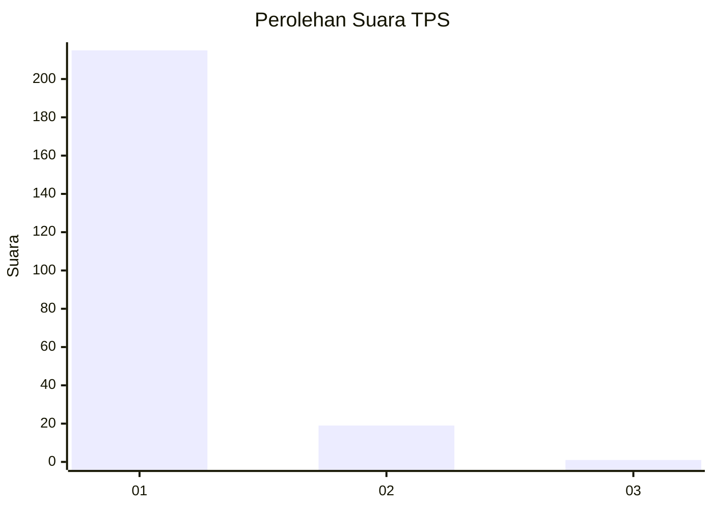
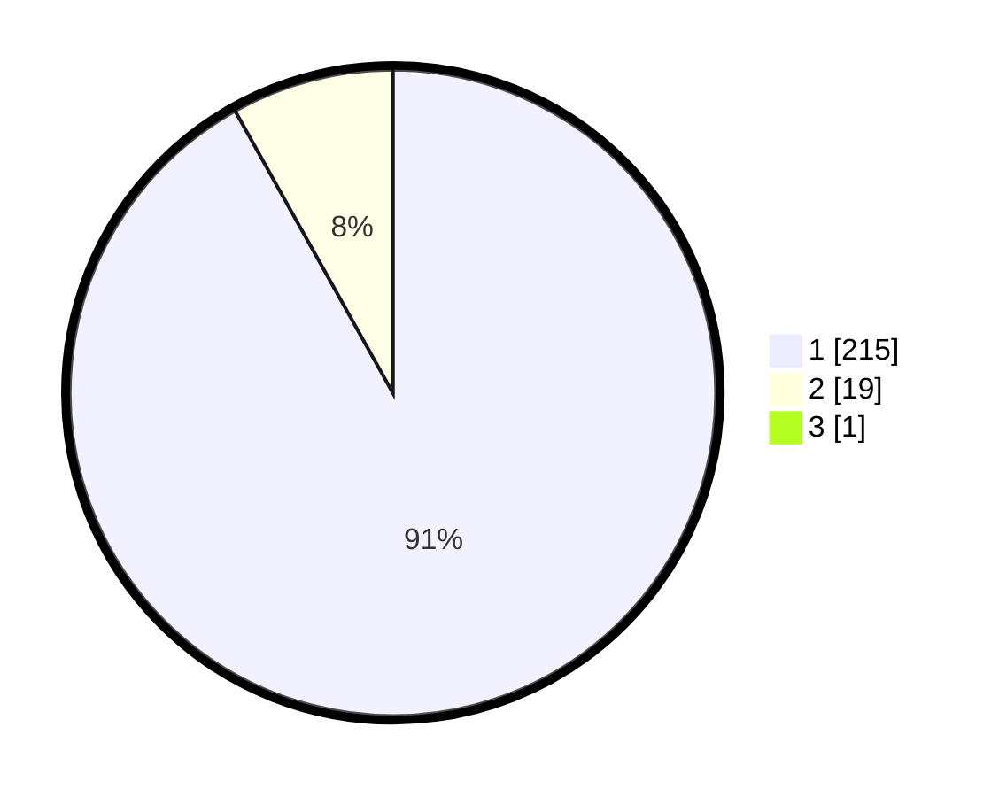

# Hasil

## Grafik

## Tabel

| No. | Nama Paslon    | Suara | Suara (raw) | Persentase |
|:--- |:-------------- | -----:| -----------:| ----------:|
| 1   | ANIES MUHAIMIN | 215   | [215][p-1]  | 91,49      |
| 2   | PRABOWO GIBRAN | 19    | [19][p-2]   | 8,09       |
| 3   | GANJAR MAHFUD  | 1     | [1][p-3]    | 0,43       |

[p-1]: https://github.com/gigit-pemilu/pemilu-2024-11-aceh/blob/main/pilpres/hitung-suara/sub/11-aceh/sub/03-aceh-timur/sub/03-idi-rayeuk/sub/2013-kuala-idi/sub/002-tps/sub/paslon-1.txt
[p-2]: https://github.com/gigit-pemilu/pemilu-2024-11-aceh/blob/main/pilpres/hitung-suara/sub/11-aceh/sub/03-aceh-timur/sub/03-idi-rayeuk/sub/2013-kuala-idi/sub/002-tps/sub/paslon-2.txt
[p-3]: https://github.com/gigit-pemilu/pemilu-2024-11-aceh/blob/main/pilpres/hitung-suara/sub/11-aceh/sub/03-aceh-timur/sub/03-idi-rayeuk/sub/2013-kuala-idi/sub/002-tps/sub/paslon-3.txt

## Foto C Plano

https://sirekap-obj-formc.kpu.go.id/315a/pemilu/ppwp/11/03/03/20/13/1103032013002-20240215-024447--f0781048-49ed-47b1-9553-0121ff739068.jpg

https://sirekap-obj-formc.kpu.go.id/315a/pemilu/ppwp/11/03/03/20/13/1103032013002-20240215-024656--baf1a431-0c0b-46dc-97db-6718d56207d2.jpg

https://sirekap-obj-formc.kpu.go.id/315a/pemilu/ppwp/11/03/03/20/13/1103032013002-20240215-024827--bf86718f-3fb8-4f87-81aa-c742bbca42b3.jpg

## Metadata

| Key        | Value               |
| ---------- | ------------------- |
| Time Stamp | 2024-02-25 14:00:00 |

