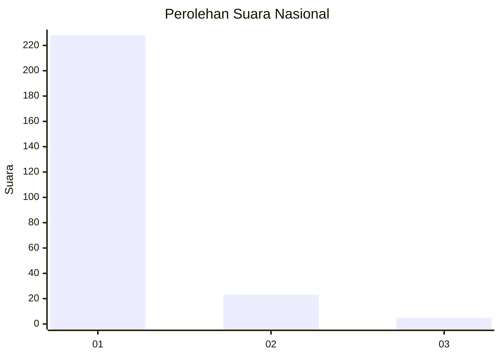
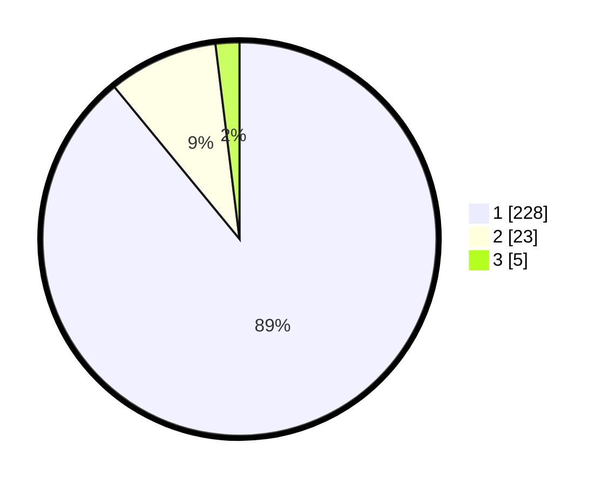

# Hasil

## Grafik

## Tabel

| No. | Nama Paslon    | Suara | Suara (raw) | Persentase |
|:--- |:-------------- | -----:| -----------:| ----------:|
| 1   | ANIES MUHAIMIN | 228   | [228][p-1]  | 89,06      |
| 2   | PRABOWO GIBRAN | 23    | [23][p-2]   | 8,98       |
| 3   | GANJAR MAHFUD  | 5     | [5][p-3]    | 1,95       |

[p-1]: https://github.com/gigit-pemilu/pemilu-2024/blob/main/pilpres/hitung-suara/sub/11-aceh/sub/03-aceh-timur/sub/03-idi-rayeuk/sub/2014-keude-aceh/sub/001-tps/sub/paslon-1.txt
[p-2]: https://github.com/gigit-pemilu/pemilu-2024/blob/main/pilpres/hitung-suara/sub/11-aceh/sub/03-aceh-timur/sub/03-idi-rayeuk/sub/2014-keude-aceh/sub/001-tps/sub/paslon-2.txt
[p-3]: https://github.com/gigit-pemilu/pemilu-2024/blob/main/pilpres/hitung-suara/sub/11-aceh/sub/03-aceh-timur/sub/03-idi-rayeuk/sub/2014-keude-aceh/sub/001-tps/sub/paslon-3.txt

## Foto C Plano

https://sirekap-obj-formc.kpu.go.id/e79c/pemilu/ppwp/11/03/03/20/14/1103032014001-20240223-221149--c96f3a5e-e9f0-4900-8d58-504f79f543a4.jpg

https://sirekap-obj-formc.kpu.go.id/e79c/pemilu/ppwp/11/03/03/20/14/1103032014001-20240215-104049--3201ca82-f90c-4260-b566-90fccde8e0c8.jpg

https://sirekap-obj-formc.kpu.go.id/e79c/pemilu/ppwp/11/03/03/20/14/1103032014001-20240215-104417--1052dc6e-ef26-4eb0-9864-c79f899cd4b8.jpg

## Metadata

| Key        | Value               |
| ---------- | ------------------- |
| Time Stamp | 2024-02-24 22:31:28 |

