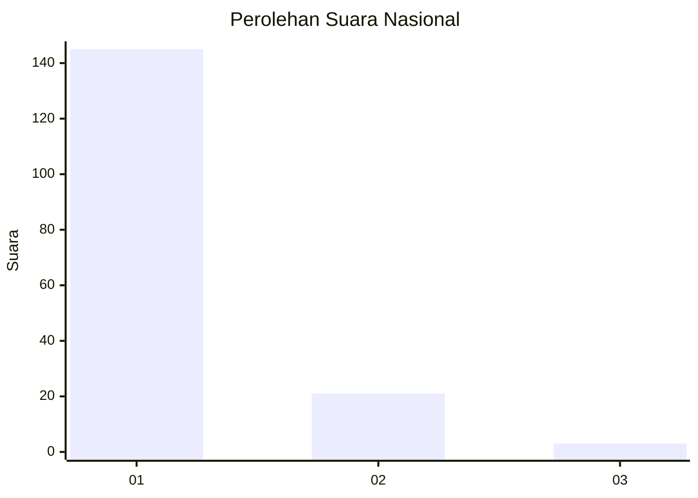
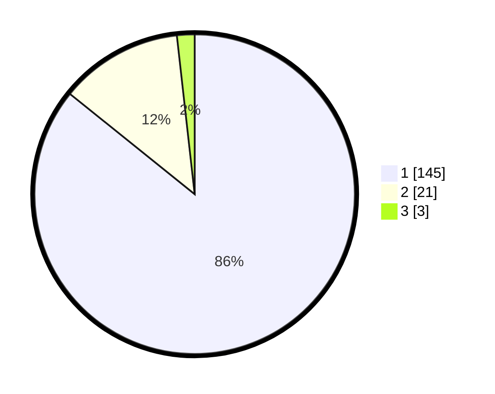

# Hasil

## Grafik

## Tabel

| No. | Nama Paslon    | Suara | Suara (raw) | Persentase |
|:--- |:-------------- | -----:| -----------:| ----------:|
| 1   | ANIES MUHAIMIN | 145   | [145][p-1]  | 85,80      |
| 2   | PRABOWO GIBRAN | 21    | [21][p-2]   | 12,43      |
| 3   | GANJAR MAHFUD  | 3     | [3][p-3]    | 1,78       |

[p-1]: https://github.com/gigit-pemilu/pemilu-2024/blob/main/pilpres/hitung-suara/sub/11-aceh/sub/03-aceh-timur/sub/03-idi-rayeuk/sub/2014-keude-aceh/sub/002-tps/sub/paslon-1.txt
[p-2]: https://github.com/gigit-pemilu/pemilu-2024/blob/main/pilpres/hitung-suara/sub/11-aceh/sub/03-aceh-timur/sub/03-idi-rayeuk/sub/2014-keude-aceh/sub/002-tps/sub/paslon-2.txt
[p-3]: https://github.com/gigit-pemilu/pemilu-2024/blob/main/pilpres/hitung-suara/sub/11-aceh/sub/03-aceh-timur/sub/03-idi-rayeuk/sub/2014-keude-aceh/sub/002-tps/sub/paslon-3.txt

## Foto C Plano

https://sirekap-obj-formc.kpu.go.id/e99e/pemilu/ppwp/11/03/03/20/14/1103032014002-20240215-040813--93df70b0-8e8b-40e9-8fc2-90b3a9c523ca.jpg

https://sirekap-obj-formc.kpu.go.id/e99e/pemilu/ppwp/11/03/03/20/14/1103032014002-20240215-042512--9b749725-7f2c-4db0-83a5-a8843d8f2808.jpg

https://sirekap-obj-formc.kpu.go.id/e99e/pemilu/ppwp/11/03/03/20/14/1103032014002-20240215-042205--35ed9d68-85d6-4545-b241-b408951ee984.jpg

## Metadata

| Key        | Value               |
| ---------- | ------------------- |
| Time Stamp | 2024-02-16 12:51:22 |

## DATA PEMILIH TETAP

Jumlah pemilih dalam DPT: **167**.
 * L: **86**.
 * P: **81**.

## DATA PENGGUNA HAK PILIH

Jumlah pengguna hak pilih dalam DPT: **131**.
 * L: **65**.
 * P: **66**.

Jumlah pengguna hak pilih dalam DPTb: **0**.
 * L: **0**.
 * P: **0**.

Jumlah pengguna hak pilih dalam DPK: **38**.
 * L: **20**.
 * P: **18**.

Jumlah pengguna hak pilih: **169**.
 * L: **85**.
 * P: **84**.

## JUMLAH SUARA SAH DAN TIDAK SAH

JUMLAH SELURUH SUARA SAH: **169**.

JUMLAH SUARA TIDAK SAH: **0**.

JUMLAH SELURUH SUARA SAH DAN SUARA TIDAK SAH: **169**.

