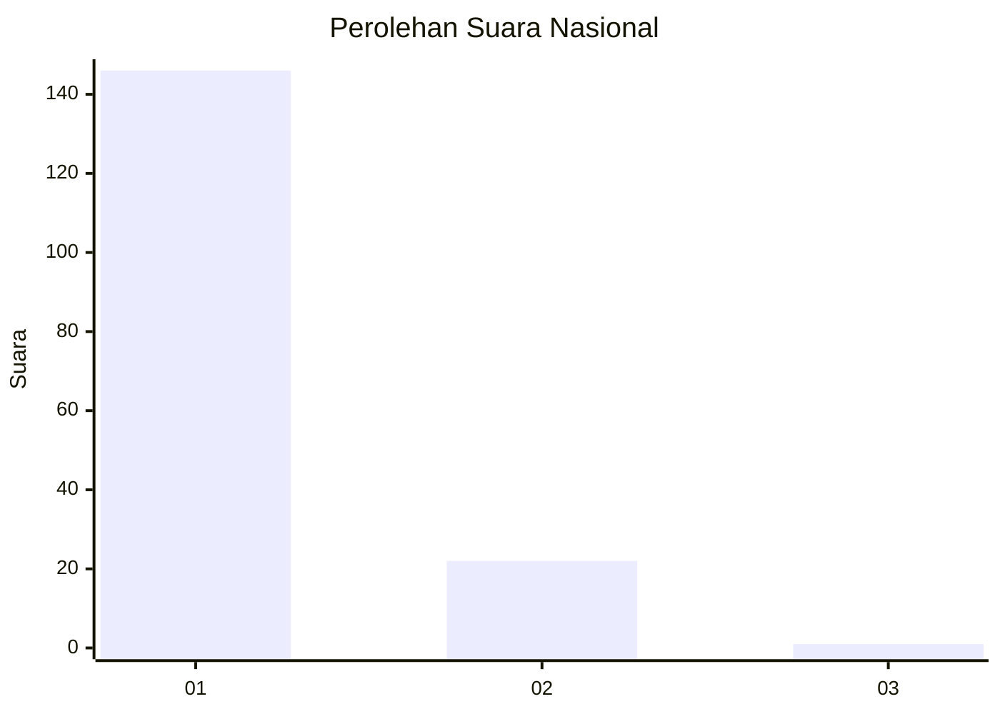
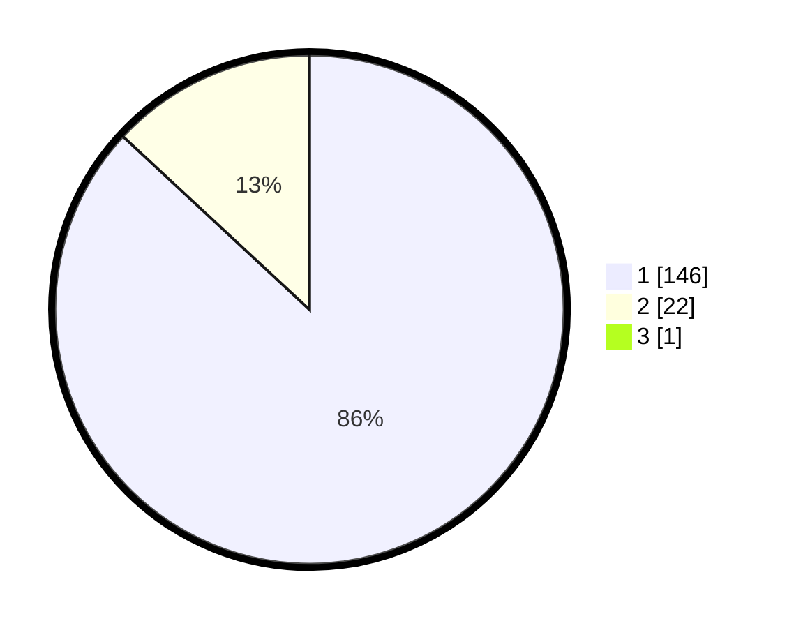

# Hasil

## Grafik

## Tabel

| No. | Nama Paslon    | Suara | Suara (raw) | Persentase |
|:--- |:-------------- | -----:| -----------:| ----------:|
| 1   | ANIES MUHAIMIN | 146   | [146][p-1]  | 86,39      |
| 2   | PRABOWO GIBRAN | 22    | [22][p-2]   | 13,02      |
| 3   | GANJAR MAHFUD  | 1     | [1][p-3]    | 0,59       |

[p-1]: https://github.com/gigit-pemilu/pemilu-2024/blob/main/pilpres/hitung-suara/sub/11-aceh/sub/03-aceh-timur/sub/03-idi-rayeuk/sub/2023-seuneubok-bacee/sub/001-tps/sub/paslon-1.txt
[p-2]: https://github.com/gigit-pemilu/pemilu-2024/blob/main/pilpres/hitung-suara/sub/11-aceh/sub/03-aceh-timur/sub/03-idi-rayeuk/sub/2023-seuneubok-bacee/sub/001-tps/sub/paslon-2.txt
[p-3]: https://github.com/gigit-pemilu/pemilu-2024/blob/main/pilpres/hitung-suara/sub/11-aceh/sub/03-aceh-timur/sub/03-idi-rayeuk/sub/2023-seuneubok-bacee/sub/001-tps/sub/paslon-3.txt

## Foto C Plano

https://sirekap-obj-formc.kpu.go.id/3999/pemilu/ppwp/11/03/03/20/23/1103032023001-20240215-082146--ecd99143-7631-4c66-b58b-bbdbd549e02a.jpg

https://sirekap-obj-formc.kpu.go.id/3999/pemilu/ppwp/11/03/03/20/23/1103032023001-20240214-214646--0651007c-35fc-4e44-952c-03e80c062fb0.jpg

https://sirekap-obj-formc.kpu.go.id/3999/pemilu/ppwp/11/03/03/20/23/1103032023001-20240214-214302--eb71e7cf-a2f0-4b7d-838b-cb843153001f.jpg

## Metadata

| Key        | Value               |
| ---------- | ------------------- |
| Time Stamp | 2024-02-24 22:31:28 |

