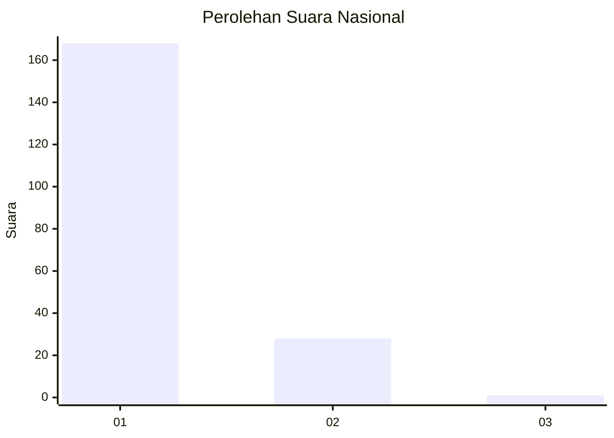
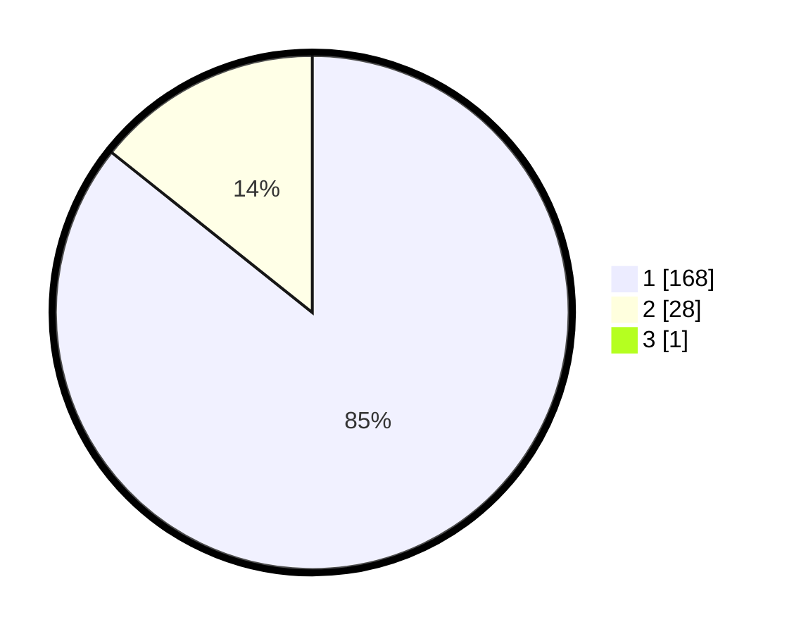

# Hasil

## Grafik

## Tabel

| No. | Nama Paslon    | Suara | Suara (raw) | Persentase |
|:--- |:-------------- | -----:| -----------:| ----------:|
| 1   | ANIES MUHAIMIN | 168   | [168][p-1]  | 85,28      |
| 2   | PRABOWO GIBRAN | 28    | [28][p-2]   | 14,21      |
| 3   | GANJAR MAHFUD  | 1     | [1][p-3]    | 0,51       |

[p-1]: https://github.com/gigit-pemilu/pemilu-2024/blob/main/pilpres/hitung-suara/sub/11-aceh/sub/03-aceh-timur/sub/03-idi-rayeuk/sub/2029-titi-baro/sub/001-tps/sub/paslon-1.txt
[p-2]: https://github.com/gigit-pemilu/pemilu-2024/blob/main/pilpres/hitung-suara/sub/11-aceh/sub/03-aceh-timur/sub/03-idi-rayeuk/sub/2029-titi-baro/sub/001-tps/sub/paslon-2.txt
[p-3]: https://github.com/gigit-pemilu/pemilu-2024/blob/main/pilpres/hitung-suara/sub/11-aceh/sub/03-aceh-timur/sub/03-idi-rayeuk/sub/2029-titi-baro/sub/001-tps/sub/paslon-3.txt

## Foto C Plano

https://sirekap-obj-formc.kpu.go.id/4833/pemilu/ppwp/11/03/03/20/29/1103032029001-20240215-010208--efada643-59d1-4d72-b9b8-80380835e097.jpg

https://sirekap-obj-formc.kpu.go.id/4833/pemilu/ppwp/11/03/03/20/29/1103032029001-20240215-010452--66b172ef-45ed-4c13-9a56-8ba729aa6cdb.jpg

https://sirekap-obj-formc.kpu.go.id/4833/pemilu/ppwp/11/03/03/20/29/1103032029001-20240215-010634--1bc1b70c-2f80-4ee1-b685-06979d55a44a.jpg

## Metadata

| Key        | Value               |
| ---------- | ------------------- |
| Time Stamp | 2024-02-24 22:31:28 |

