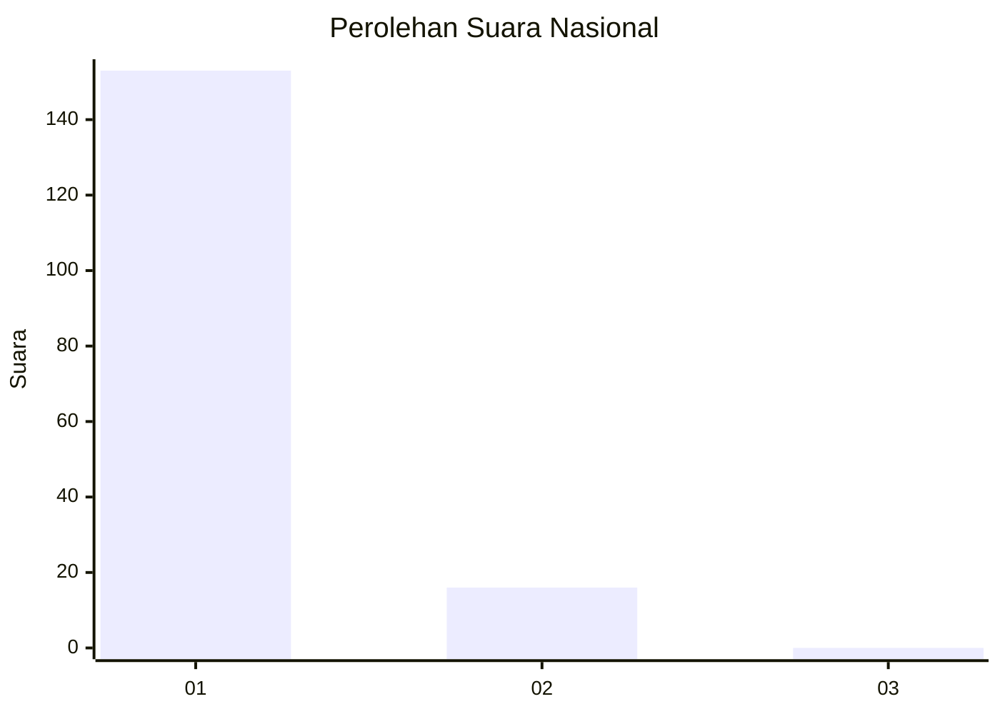
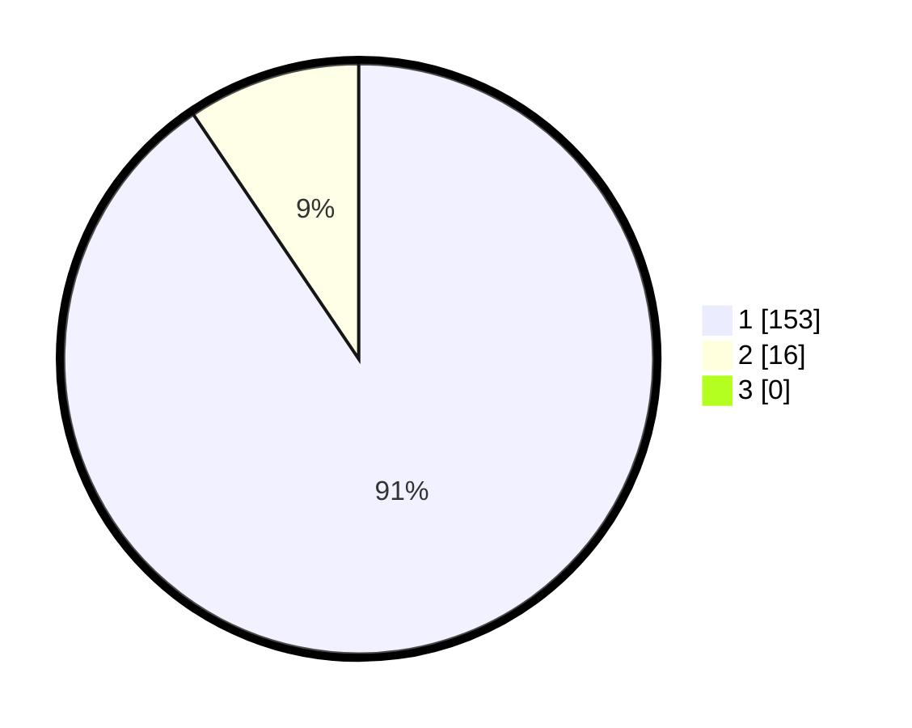

# Hasil

## Grafik

## Tabel

| No. | Nama Paslon    | Suara | Suara (raw) | Persentase |
|:--- |:-------------- | -----:| -----------:| ----------:|
| 1   | ANIES MUHAIMIN | 153   | [153][p-1]  | 90,53      |
| 2   | PRABOWO GIBRAN | 16    | [16][p-2]   | 9,47       |
| 3   | GANJAR MAHFUD  | 0     | [0][p-3]    | 0,00       |

[p-1]: https://github.com/gigit-pemilu/pemilu-2024/blob/main/pilpres/hitung-suara/sub/11-aceh/sub/03-aceh-timur/sub/03-idi-rayeuk/sub/2047-tanjong-kapai/sub/001-tps/sub/paslon-1.txt
[p-2]: https://github.com/gigit-pemilu/pemilu-2024/blob/main/pilpres/hitung-suara/sub/11-aceh/sub/03-aceh-timur/sub/03-idi-rayeuk/sub/2047-tanjong-kapai/sub/001-tps/sub/paslon-2.txt
[p-3]: https://github.com/gigit-pemilu/pemilu-2024/blob/main/pilpres/hitung-suara/sub/11-aceh/sub/03-aceh-timur/sub/03-idi-rayeuk/sub/2047-tanjong-kapai/sub/001-tps/sub/paslon-3.txt

## Foto C Plano

https://sirekap-obj-formc.kpu.go.id/088a/pemilu/ppwp/11/03/03/20/47/1103032047001-20240215-072545--ece307b2-f610-4c13-9643-b3c8f7bc9c21.jpg

https://sirekap-obj-formc.kpu.go.id/088a/pemilu/ppwp/11/03/03/20/47/1103032047001-20240215-073219--97634b73-5da7-4c8c-a571-426b87d43da7.jpg

https://sirekap-obj-formc.kpu.go.id/088a/pemilu/ppwp/11/03/03/20/47/1103032047001-20240215-073547--4b6630f4-9e63-4545-8a70-5241ac54e94f.jpg

## Metadata

| Key        | Value               |
| ---------- | ------------------- |
| Time Stamp | 2024-02-24 22:31:28 |

