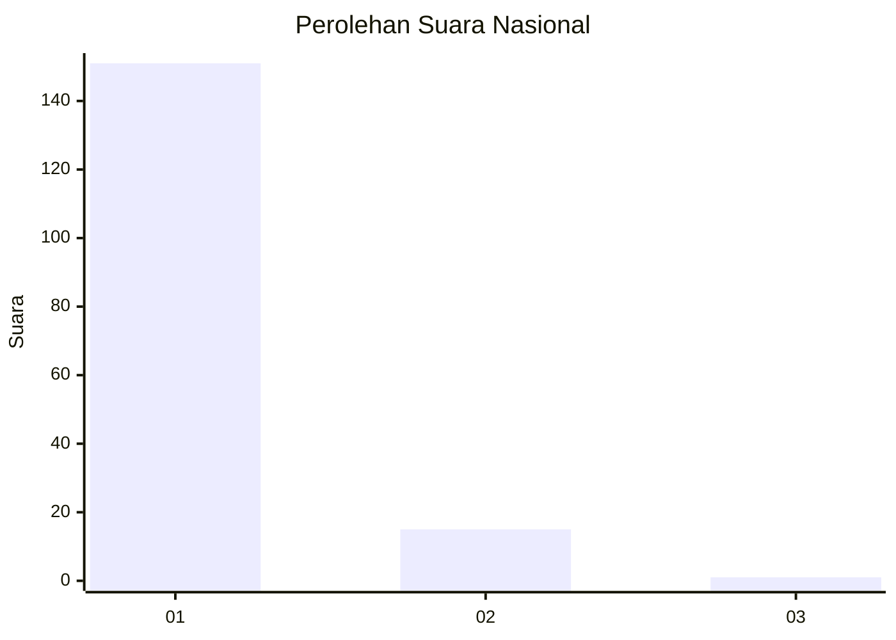
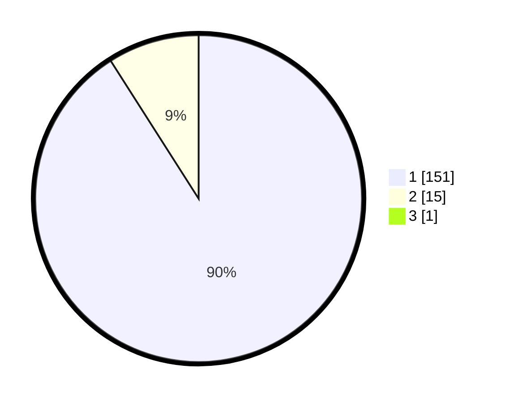

# Hasil

## Grafik

## Tabel

| No. | Nama Paslon    | Suara | Suara (raw) | Persentase |
|:--- |:-------------- | -----:| -----------:| ----------:|
| 1   | ANIES MUHAIMIN | 151   | [151][p-1]  | 90,42      |
| 2   | PRABOWO GIBRAN | 15    | [15][p-2]   | 8,98       |
| 3   | GANJAR MAHFUD  | 1     | [1][p-3]    | 0,60       |

[p-1]: https://github.com/gigit-pemilu/pemilu-2024/blob/main/pilpres/hitung-suara/sub/11-aceh/sub/03-aceh-timur/sub/03-idi-rayeuk/sub/2047-tanjong-kapai/sub/002-tps/sub/paslon-1.txt
[p-2]: https://github.com/gigit-pemilu/pemilu-2024/blob/main/pilpres/hitung-suara/sub/11-aceh/sub/03-aceh-timur/sub/03-idi-rayeuk/sub/2047-tanjong-kapai/sub/002-tps/sub/paslon-2.txt
[p-3]: https://github.com/gigit-pemilu/pemilu-2024/blob/main/pilpres/hitung-suara/sub/11-aceh/sub/03-aceh-timur/sub/03-idi-rayeuk/sub/2047-tanjong-kapai/sub/002-tps/sub/paslon-3.txt

## Foto C Plano

https://sirekap-obj-formc.kpu.go.id/1684/pemilu/ppwp/11/03/03/20/47/1103032047002-20240214-194412--39346931-3106-4463-8e69-764dec97a7c4.jpg

https://sirekap-obj-formc.kpu.go.id/1684/pemilu/ppwp/11/03/03/20/47/1103032047002-20240214-194810--9a14f410-5d84-45a7-90ec-6a13635815af.jpg

https://sirekap-obj-formc.kpu.go.id/1684/pemilu/ppwp/11/03/03/20/47/1103032047002-20240214-194947--33533a5f-5957-4940-8c19-53a72efbf617.jpg

## Metadata

| Key        | Value               |
| ---------- | ------------------- |
| Time Stamp | 2024-02-24 22:31:28 |

