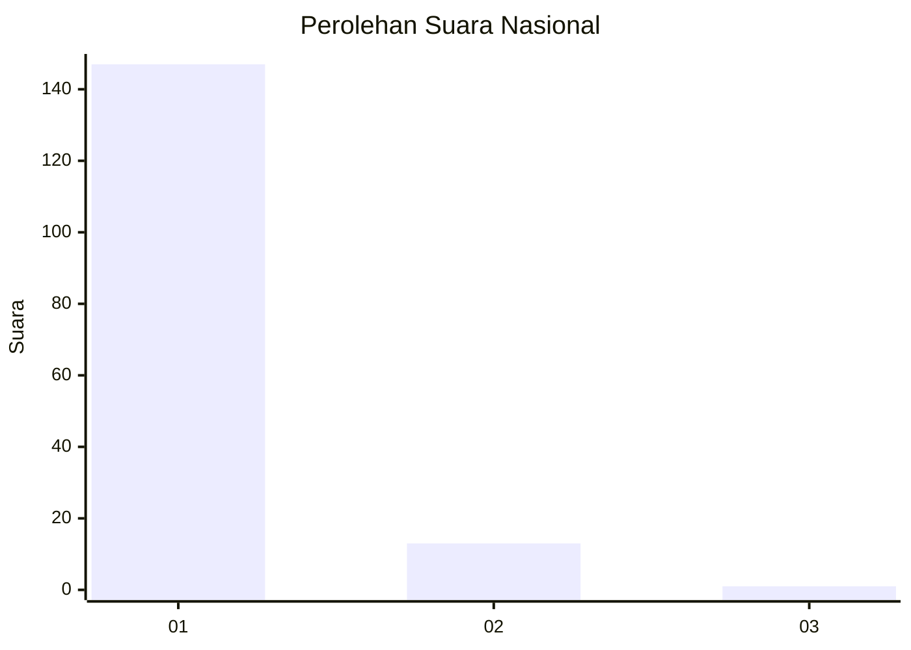
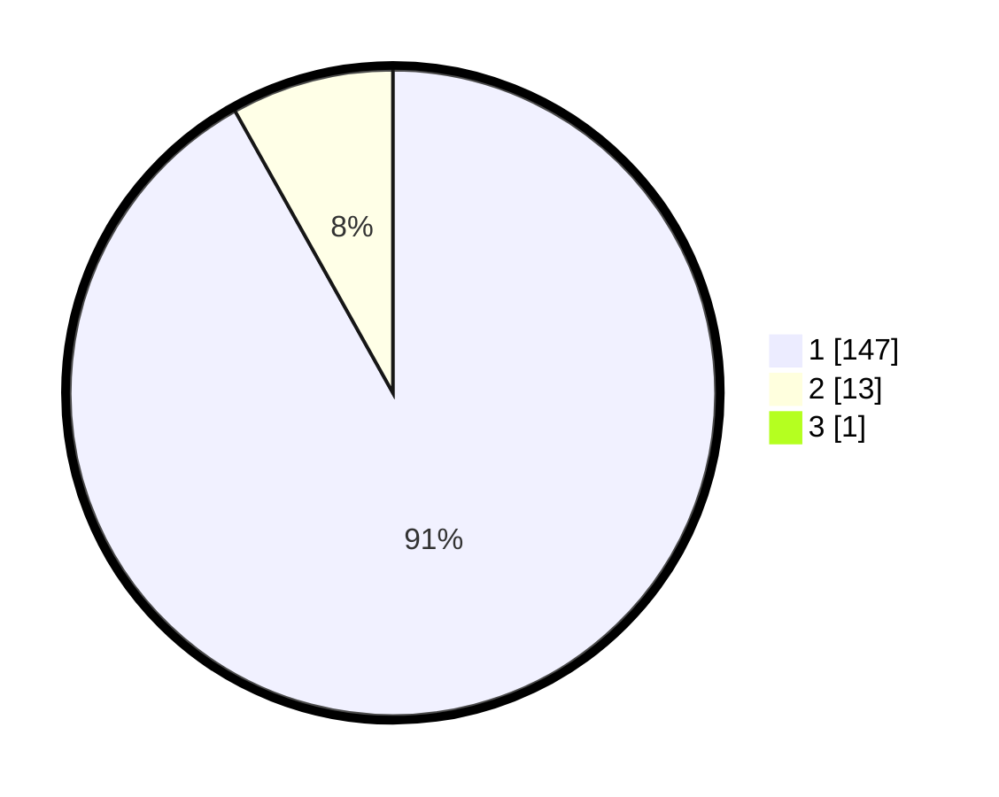

# Hasil

## Grafik

## Tabel

| No. | Nama Paslon    | Suara | Suara (raw) | Persentase |
|:--- |:-------------- | -----:| -----------:| ----------:|
| 1   | ANIES MUHAIMIN | 147   | [147][p-1]  | 91,30      |
| 2   | PRABOWO GIBRAN | 13    | [13][p-2]   | 8,07       |
| 3   | GANJAR MAHFUD  | 1     | [1][p-3]    | 0,62       |

[p-1]: https://github.com/gigit-pemilu/pemilu-2024/blob/main/pilpres/hitung-suara/sub/11-aceh/sub/03-aceh-timur/sub/03-idi-rayeuk/sub/2047-tanjong-kapai/sub/003-tps/sub/paslon-1.txt
[p-2]: https://github.com/gigit-pemilu/pemilu-2024/blob/main/pilpres/hitung-suara/sub/11-aceh/sub/03-aceh-timur/sub/03-idi-rayeuk/sub/2047-tanjong-kapai/sub/003-tps/sub/paslon-2.txt
[p-3]: https://github.com/gigit-pemilu/pemilu-2024/blob/main/pilpres/hitung-suara/sub/11-aceh/sub/03-aceh-timur/sub/03-idi-rayeuk/sub/2047-tanjong-kapai/sub/003-tps/sub/paslon-3.txt

## Foto C Plano

https://sirekap-obj-formc.kpu.go.id/bd19/pemilu/ppwp/11/03/03/20/47/1103032047003-20240214-203330--29002135-4584-4b79-a723-66af09736a77.jpg

https://sirekap-obj-formc.kpu.go.id/bd19/pemilu/ppwp/11/03/03/20/47/1103032047003-20240214-194230--0e61bb0c-4d21-4a14-ab17-97b4c13c19e4.jpg

https://sirekap-obj-formc.kpu.go.id/bd19/pemilu/ppwp/11/03/03/20/47/1103032047003-20240214-194411--12ea6c3c-f39f-4948-bd61-e55f5e53fcf5.jpg

## Metadata

| Key        | Value               |
| ---------- | ------------------- |
| Time Stamp | 2024-02-25 22:00:00 |

