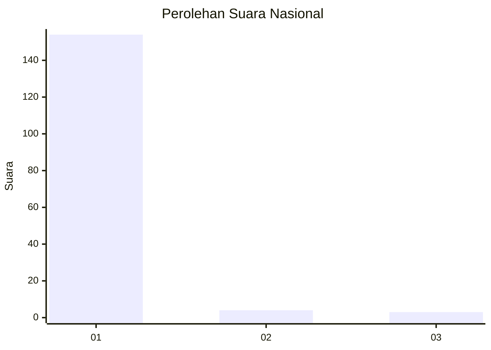
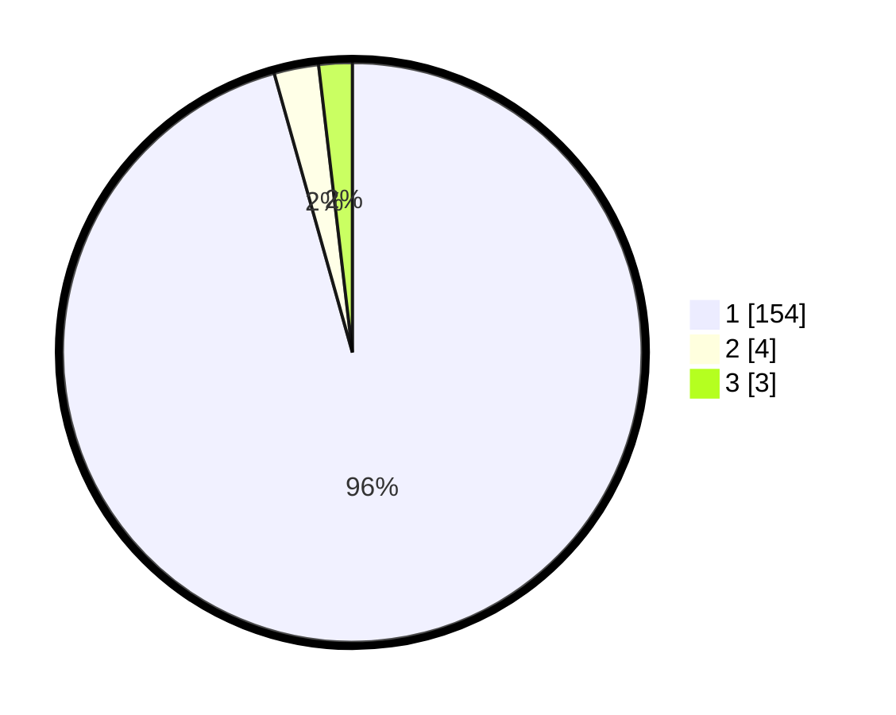

# Hasil

## Grafik

## Tabel

| No. | Nama Paslon    | Suara | Suara (raw) | Persentase |
|:--- |:-------------- | -----:| -----------:| ----------:|
| 1   | ANIES MUHAIMIN | 154   | [154][p-1]  | 95,65      |
| 2   | PRABOWO GIBRAN | 4     | [4][p-2]    | 2,48       |
| 3   | GANJAR MAHFUD  | 3     | [3][p-3]    | 1,86       |

[p-1]: https://github.com/gigit-pemilu/pemilu-2024/blob/main/pilpres/hitung-suara/sub/11-aceh/sub/03-aceh-timur/sub/03-idi-rayeuk/sub/2048-alue-dua-muka-o/sub/001-tps/sub/paslon-1.txt
[p-2]: https://github.com/gigit-pemilu/pemilu-2024/blob/main/pilpres/hitung-suara/sub/11-aceh/sub/03-aceh-timur/sub/03-idi-rayeuk/sub/2048-alue-dua-muka-o/sub/001-tps/sub/paslon-2.txt
[p-3]: https://github.com/gigit-pemilu/pemilu-2024/blob/main/pilpres/hitung-suara/sub/11-aceh/sub/03-aceh-timur/sub/03-idi-rayeuk/sub/2048-alue-dua-muka-o/sub/001-tps/sub/paslon-3.txt

## Foto C Plano

https://sirekap-obj-formc.kpu.go.id/ba95/pemilu/ppwp/11/03/03/20/48/1103032048001-20240223-153118--614d598c-b537-4860-b065-32a7890e0ce3.jpg

https://sirekap-obj-formc.kpu.go.id/ba95/pemilu/ppwp/11/03/03/20/48/1103032048001-20240215-070337--abb8180b-2255-49fa-90f1-25d87dc15269.jpg

https://sirekap-obj-formc.kpu.go.id/ba95/pemilu/ppwp/11/03/03/20/48/1103032048001-20240214-222443--add43862-5f08-43b0-b3c8-3229154966bc.jpg

## Metadata

| Key        | Value               |
| ---------- | ------------------- |
| Time Stamp | 2024-02-24 22:31:28 |

