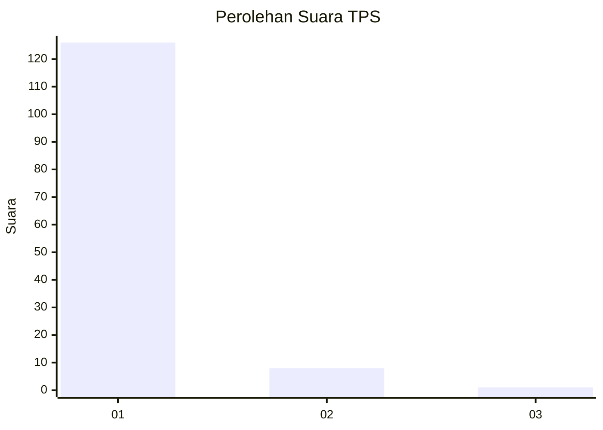
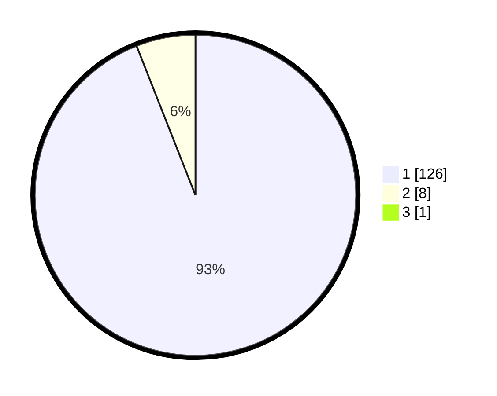

# Hasil

## Grafik

## Tabel

| No. | Nama Paslon    | Suara | Suara (raw) | Persentase |
|:--- |:-------------- | -----:| -----------:| ----------:|
| 1   | ANIES MUHAIMIN | 126   | [126][p-1]  | 93,33      |
| 2   | PRABOWO GIBRAN | 8     | [8][p-2]    | 5,93       |
| 3   | GANJAR MAHFUD  | 1     | [1][p-3]    | 0,74       |

[p-1]: https://github.com/gigit-pemilu/pemilu-2024-11-aceh/blob/main/pilpres/hitung-suara/sub/11-aceh/sub/03-aceh-timur/sub/03-idi-rayeuk/sub/2049-alue-dua-muka-s/sub/002-tps/sub/paslon-1.txt
[p-2]: https://github.com/gigit-pemilu/pemilu-2024-11-aceh/blob/main/pilpres/hitung-suara/sub/11-aceh/sub/03-aceh-timur/sub/03-idi-rayeuk/sub/2049-alue-dua-muka-s/sub/002-tps/sub/paslon-2.txt
[p-3]: https://github.com/gigit-pemilu/pemilu-2024-11-aceh/blob/main/pilpres/hitung-suara/sub/11-aceh/sub/03-aceh-timur/sub/03-idi-rayeuk/sub/2049-alue-dua-muka-s/sub/002-tps/sub/paslon-3.txt

## Foto C Plano

https://sirekap-obj-formc.kpu.go.id/4e56/pemilu/ppwp/11/03/03/20/49/1103032049002-20240214-210151--d499f054-a133-41ba-b998-6f82f4c54baa.jpg

https://sirekap-obj-formc.kpu.go.id/4e56/pemilu/ppwp/11/03/03/20/49/1103032049002-20240214-210431--092a086c-8750-420d-9d87-406d078076ca.jpg

https://sirekap-obj-formc.kpu.go.id/4e56/pemilu/ppwp/11/03/03/20/49/1103032049002-20240214-210551--783b5133-d314-48de-87d8-45f8ca93c285.jpg

## Metadata

| Key        | Value               |
| ---------- | ------------------- |
| Time Stamp | 2024-02-15 06:00:23 |

## DATA PEMILIH TETAP

Jumlah pemilih dalam DPT: **163**.
 * L: **74**.
 * P: **89**.

## DATA PENGGUNA HAK PILIH

Jumlah pengguna hak pilih dalam DPT: **132**.
 * L: **56**.
 * P: **76**.

Jumlah pengguna hak pilih dalam DPTb: **3**.
 * L: **2**.
 * P: **1**.

Jumlah pengguna hak pilih dalam DPK: **1**.
 * L: **1**.
 * P: **0**.

Jumlah pengguna hak pilih: **136**.
 * L: **59**.
 * P: **77**.

## JUMLAH SUARA SAH DAN TIDAK SAH

JUMLAH SELURUH SUARA SAH: **135**.

JUMLAH SUARA TIDAK SAH: **1**.

JUMLAH SELURUH SUARA SAH DAN SUARA TIDAK SAH: **136**.

