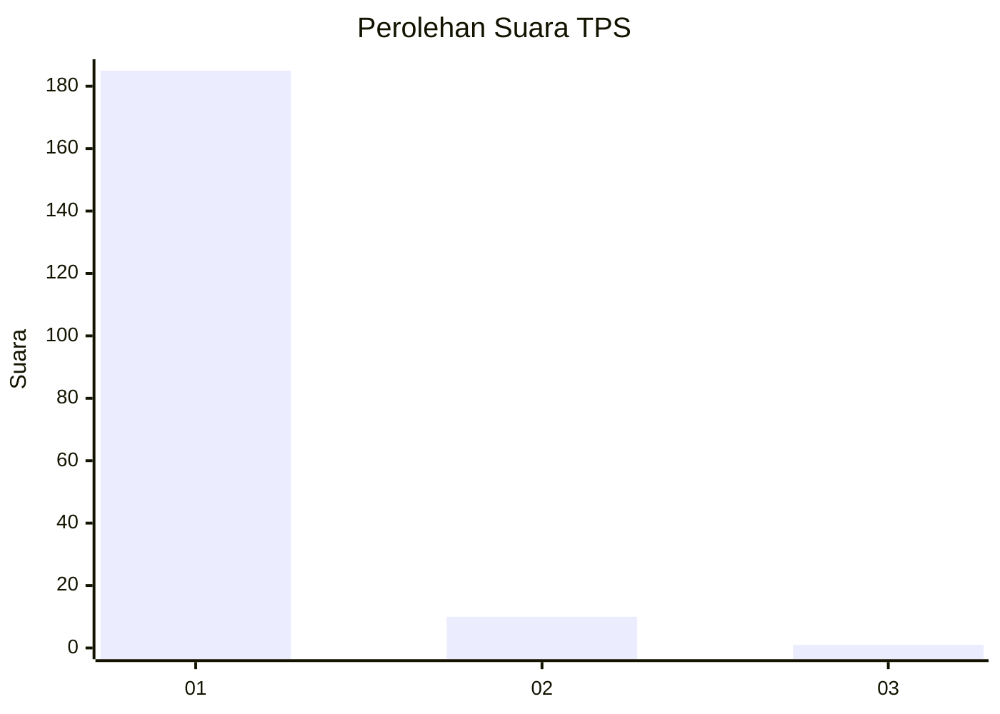
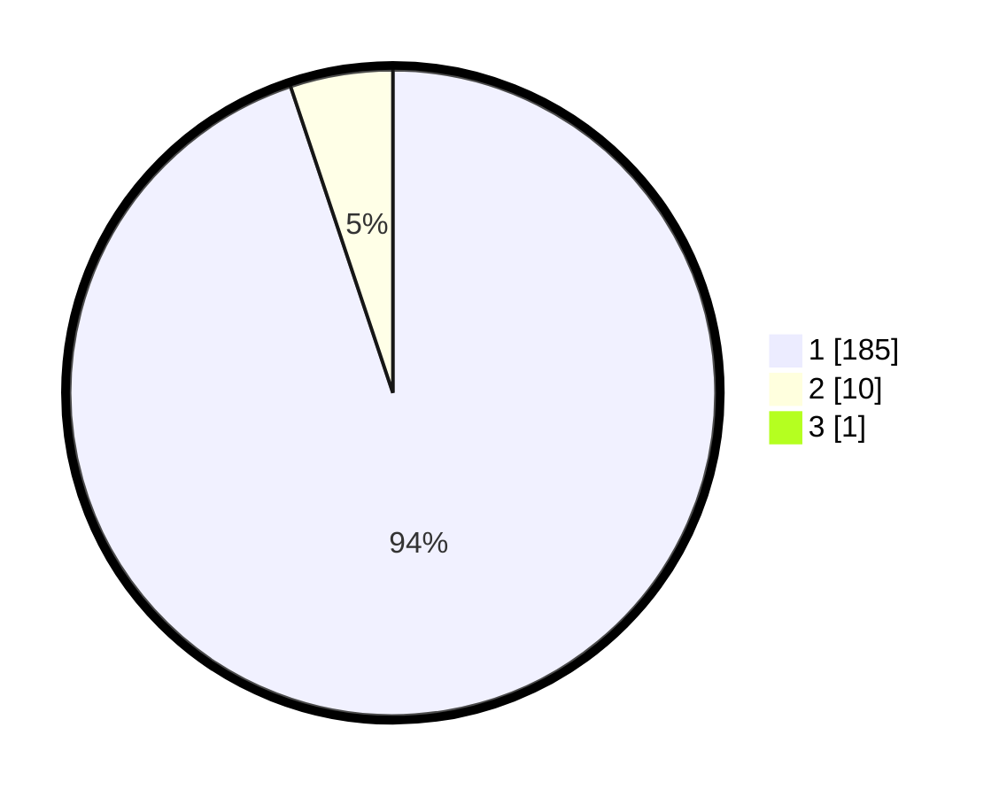

# Hasil

## Grafik

## Tabel

| No. | Nama Paslon    | Suara | Suara (raw) | Persentase |
|:--- |:-------------- | -----:| -----------:| ----------:|
| 1   | ANIES MUHAIMIN | 185   | [185][p-1]  | 94,39      |
| 2   | PRABOWO GIBRAN | 10    | [10][p-2]   | 5,10       |
| 3   | GANJAR MAHFUD  | 1     | [1][p-3]    | 0,51       |

[p-1]: https://github.com/gigit-pemilu/pemilu-2024-11-aceh/blob/main/pilpres/hitung-suara/sub/11-aceh/sub/03-aceh-timur/sub/03-idi-rayeuk/sub/2051-buket-jok/sub/001-tps/sub/paslon-1.txt
[p-2]: https://github.com/gigit-pemilu/pemilu-2024-11-aceh/blob/main/pilpres/hitung-suara/sub/11-aceh/sub/03-aceh-timur/sub/03-idi-rayeuk/sub/2051-buket-jok/sub/001-tps/sub/paslon-2.txt
[p-3]: https://github.com/gigit-pemilu/pemilu-2024-11-aceh/blob/main/pilpres/hitung-suara/sub/11-aceh/sub/03-aceh-timur/sub/03-idi-rayeuk/sub/2051-buket-jok/sub/001-tps/sub/paslon-3.txt

## Foto C Plano

https://sirekap-obj-formc.kpu.go.id/ad26/pemilu/ppwp/11/03/03/20/51/1103032051001-20240215-010023--46fceda5-9e8d-450c-adf8-3593eb325482.jpg

https://sirekap-obj-formc.kpu.go.id/ad26/pemilu/ppwp/11/03/03/20/51/1103032051001-20240215-010257--2f0ab327-1b56-4f53-8776-b6e98fb02ab4.jpg

https://sirekap-obj-formc.kpu.go.id/ad26/pemilu/ppwp/11/03/03/20/51/1103032051001-20240215-010234--ceb2be38-cc4d-407a-b63b-6dddc5dc62ee.jpg

## Metadata

| Key        | Value               |
| ---------- | ------------------- |
| Time Stamp | 2024-02-24 22:31:28 |

