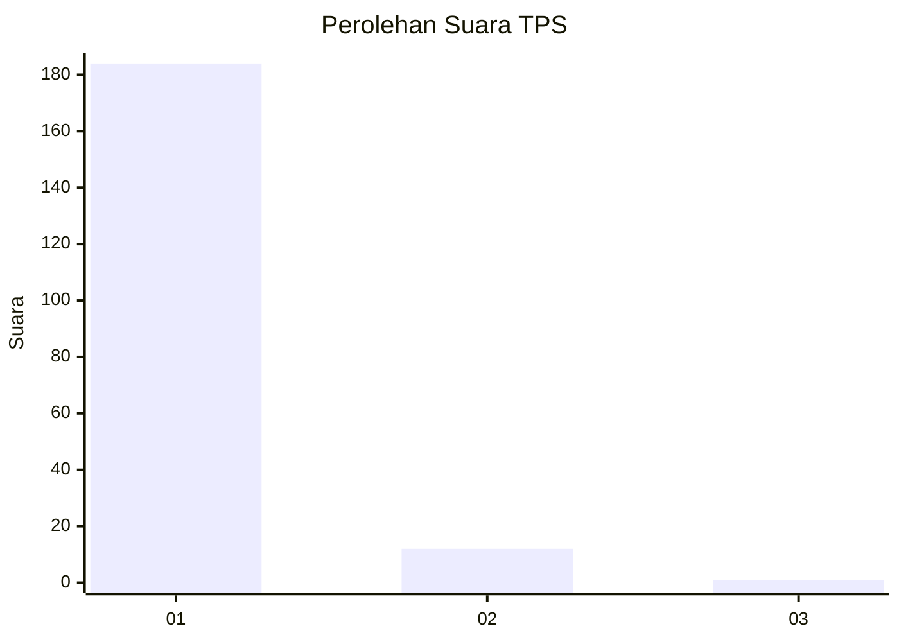
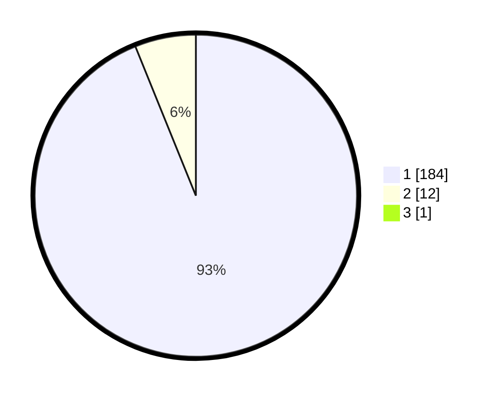

# Hasil

## Grafik

## Tabel

| No. | Nama Paslon    | Suara | Suara (raw) | Persentase |
|:--- |:-------------- | -----:| -----------:| ----------:|
| 1   | ANIES MUHAIMIN | 184   | [184][p-1]  | 93,40      |
| 2   | PRABOWO GIBRAN | 12    | [12][p-2]   | 6,09       |
| 3   | GANJAR MAHFUD  | 1     | [1][p-3]    | 0,51       |

[p-1]: https://github.com/gigit-pemilu/pemilu-2024-11-aceh/blob/main/pilpres/hitung-suara/sub/11-aceh/sub/03-aceh-timur/sub/03-idi-rayeuk/sub/2053-gampong-jalan/sub/002-tps/sub/paslon-1.txt
[p-2]: https://github.com/gigit-pemilu/pemilu-2024-11-aceh/blob/main/pilpres/hitung-suara/sub/11-aceh/sub/03-aceh-timur/sub/03-idi-rayeuk/sub/2053-gampong-jalan/sub/002-tps/sub/paslon-2.txt
[p-3]: https://github.com/gigit-pemilu/pemilu-2024-11-aceh/blob/main/pilpres/hitung-suara/sub/11-aceh/sub/03-aceh-timur/sub/03-idi-rayeuk/sub/2053-gampong-jalan/sub/002-tps/sub/paslon-3.txt

## Foto C Plano

https://sirekap-obj-formc.kpu.go.id/f136/pemilu/ppwp/11/03/03/20/53/1103032053002-20240223-112301--6e4058bc-1241-4fb5-8983-63cb627fe009.jpg

https://sirekap-obj-formc.kpu.go.id/f136/pemilu/ppwp/11/03/03/20/53/1103032053002-20240223-124730--04a9f28a-f6d8-4dc1-85b2-214088ce9ab2.jpg

https://sirekap-obj-formc.kpu.go.id/f136/pemilu/ppwp/11/03/03/20/53/1103032053002-20240223-110525--2cdea8f4-a69c-4354-8ef7-0e03a078e2e7.jpg

## Metadata

| Key        | Value               |
| ---------- | ------------------- |
| Time Stamp | 2024-02-24 22:31:28 |

