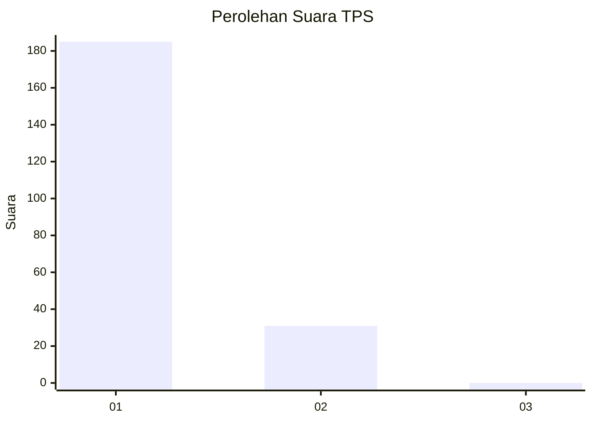
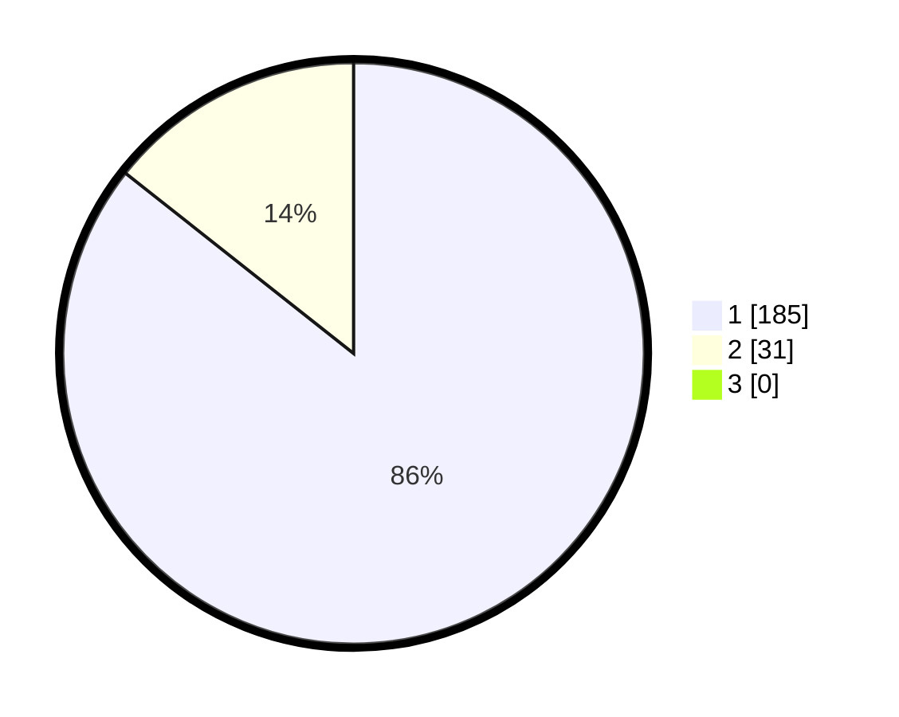

# Hasil

## Grafik

## Tabel

| No. | Nama Paslon    | Suara | Suara (raw) | Persentase |
|:--- |:-------------- | -----:| -----------:| ----------:|
| 1   | ANIES MUHAIMIN | 185   | [185][p-1]  | 85,65      |
| 2   | PRABOWO GIBRAN | 31    | [31][p-2]   | 14,35      |
| 3   | GANJAR MAHFUD  | 0     | [0][p-3]    | 0,00       |

[p-1]: https://github.com/gigit-pemilu/pemilu-2024-11-aceh/blob/main/pilpres/hitung-suara/sub/11-aceh/sub/03-aceh-timur/sub/03-idi-rayeuk/sub/2053-gampong-jalan/sub/005-tps/sub/paslon-1.txt
[p-2]: https://github.com/gigit-pemilu/pemilu-2024-11-aceh/blob/main/pilpres/hitung-suara/sub/11-aceh/sub/03-aceh-timur/sub/03-idi-rayeuk/sub/2053-gampong-jalan/sub/005-tps/sub/paslon-2.txt
[p-3]: https://github.com/gigit-pemilu/pemilu-2024-11-aceh/blob/main/pilpres/hitung-suara/sub/11-aceh/sub/03-aceh-timur/sub/03-idi-rayeuk/sub/2053-gampong-jalan/sub/005-tps/sub/paslon-3.txt

## Foto C Plano

https://sirekap-obj-formc.kpu.go.id/184c/pemilu/ppwp/11/03/03/20/53/1103032053005-20240223-143547--df931815-291c-4574-98cb-947c4aecad61.jpg

https://sirekap-obj-formc.kpu.go.id/184c/pemilu/ppwp/11/03/03/20/53/1103032053005-20240215-075259--f80f969a-5e75-4cc6-a15e-659e23e4fa70.jpg

https://sirekap-obj-formc.kpu.go.id/184c/pemilu/ppwp/11/03/03/20/53/1103032053005-20240215-075431--08a4b4a6-9d87-49f2-9e12-2a6d49fc84a8.jpg

## Metadata

| Key        | Value               |
| ---------- | ------------------- |
| Time Stamp | 2024-02-24 22:31:28 |

