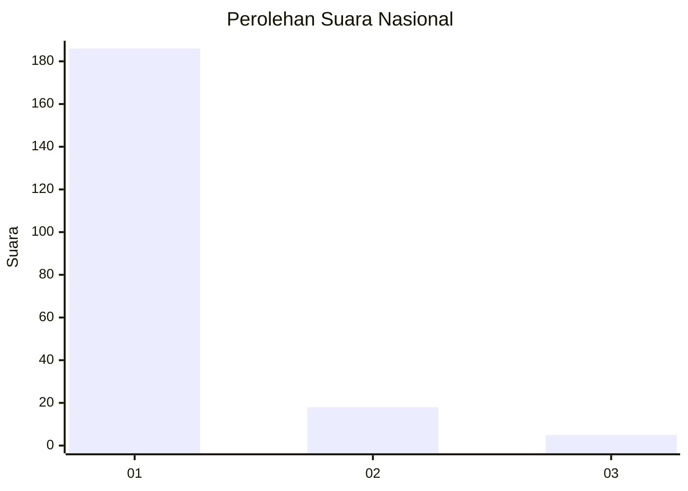
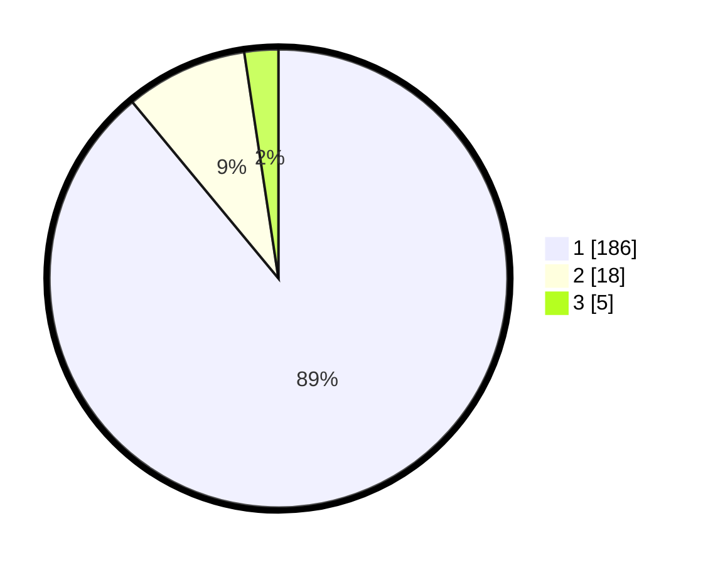

# Hasil

## Grafik

## Tabel

| No. | Nama Paslon    | Suara | Suara (raw) | Persentase |
|:--- |:-------------- | -----:| -----------:| ----------:|
| 1   | ANIES MUHAIMIN | 186   | [186][p-1]  | 89,00      |
| 2   | PRABOWO GIBRAN | 18    | [18][p-2]   | 8,61       |
| 3   | GANJAR MAHFUD  | 5     | [5][p-3]    | 2,39       |

[p-1]: https://github.com/gigit-pemilu/pemilu-2024/blob/main/pilpres/hitung-suara/sub/11-aceh/sub/03-aceh-timur/sub/03-idi-rayeuk/sub/2053-gampong-jalan/sub/006-tps/sub/paslon-1.txt
[p-2]: https://github.com/gigit-pemilu/pemilu-2024/blob/main/pilpres/hitung-suara/sub/11-aceh/sub/03-aceh-timur/sub/03-idi-rayeuk/sub/2053-gampong-jalan/sub/006-tps/sub/paslon-2.txt
[p-3]: https://github.com/gigit-pemilu/pemilu-2024/blob/main/pilpres/hitung-suara/sub/11-aceh/sub/03-aceh-timur/sub/03-idi-rayeuk/sub/2053-gampong-jalan/sub/006-tps/sub/paslon-3.txt

## Foto C Plano

https://sirekap-obj-formc.kpu.go.id/cf17/pemilu/ppwp/11/03/03/20/53/1103032053006-20240215-062408--3a8f521f-38ea-49e8-9513-2e0ca5795e71.jpg

https://sirekap-obj-formc.kpu.go.id/cf17/pemilu/ppwp/11/03/03/20/53/1103032053006-20240215-062907--1dc73025-02a8-4a79-86ff-96f9def19322.jpg

https://sirekap-obj-formc.kpu.go.id/cf17/pemilu/ppwp/11/03/03/20/53/1103032053006-20240215-063051--57b7c656-7a14-48bf-93c7-b8b028cf3f0e.jpg

## Metadata

| Key        | Value               |
| ---------- | ------------------- |
| Time Stamp | 2024-02-24 22:31:28 |

