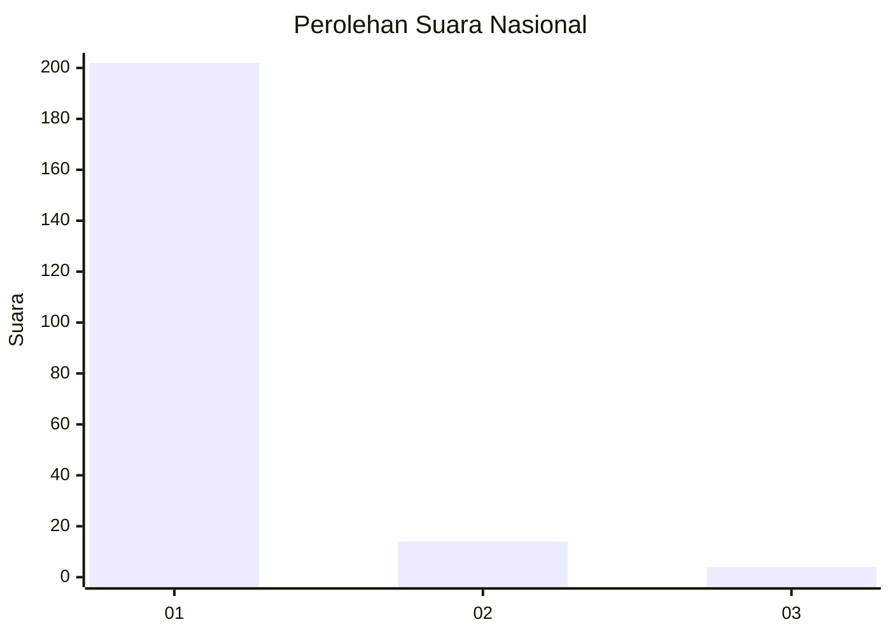
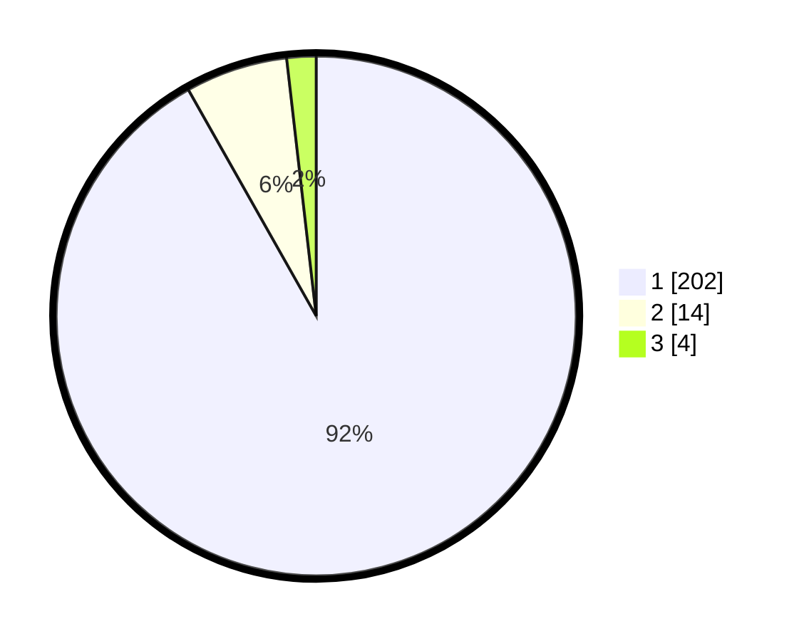

# Hasil

## Grafik

## Tabel

| No. | Nama Paslon    | Suara | Suara (raw) | Persentase |
|:--- |:-------------- | -----:| -----------:| ----------:|
| 1   | ANIES MUHAIMIN | 202   | [202][p-1]  | 91,82      |
| 2   | PRABOWO GIBRAN | 14    | [14][p-2]   | 6,36       |
| 3   | GANJAR MAHFUD  | 4     | [4][p-3]    | 1,82       |

[p-1]: https://github.com/gigit-pemilu/pemilu-2024/blob/main/pilpres/hitung-suara/sub/11-aceh/sub/03-aceh-timur/sub/03-idi-rayeuk/sub/2053-gampong-jalan/sub/901-tps/sub/paslon-1.txt
[p-2]: https://github.com/gigit-pemilu/pemilu-2024/blob/main/pilpres/hitung-suara/sub/11-aceh/sub/03-aceh-timur/sub/03-idi-rayeuk/sub/2053-gampong-jalan/sub/901-tps/sub/paslon-2.txt
[p-3]: https://github.com/gigit-pemilu/pemilu-2024/blob/main/pilpres/hitung-suara/sub/11-aceh/sub/03-aceh-timur/sub/03-idi-rayeuk/sub/2053-gampong-jalan/sub/901-tps/sub/paslon-3.txt

## Foto C Plano

https://sirekap-obj-formc.kpu.go.id/95fa/pemilu/ppwp/11/03/03/20/53/1103032053901-20240223-163222--aca91daf-6d30-43f2-bd15-4b6f05de0561.jpg

https://sirekap-obj-formc.kpu.go.id/95fa/pemilu/ppwp/11/03/03/20/53/1103032053901-20240223-163324--176c3926-960a-47b2-a2c5-c7c11877e136.jpg

https://sirekap-obj-formc.kpu.go.id/95fa/pemilu/ppwp/11/03/03/20/53/1103032053901-20240223-163417--5c678b60-6114-4bb2-b2f1-5fcb59d6203a.jpg

## Metadata

| Key        | Value               |
| ---------- | ------------------- |
| Time Stamp | 2024-02-24 22:31:28 |

