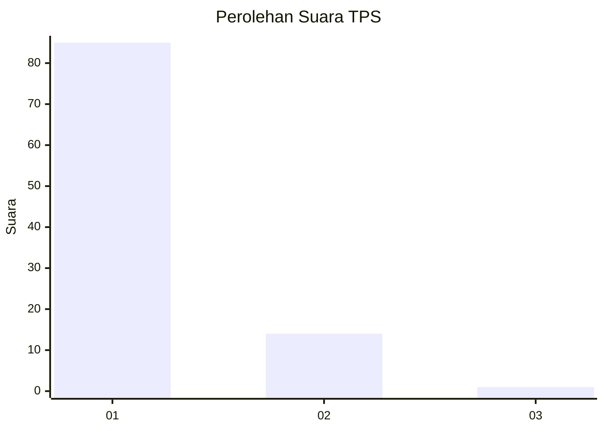
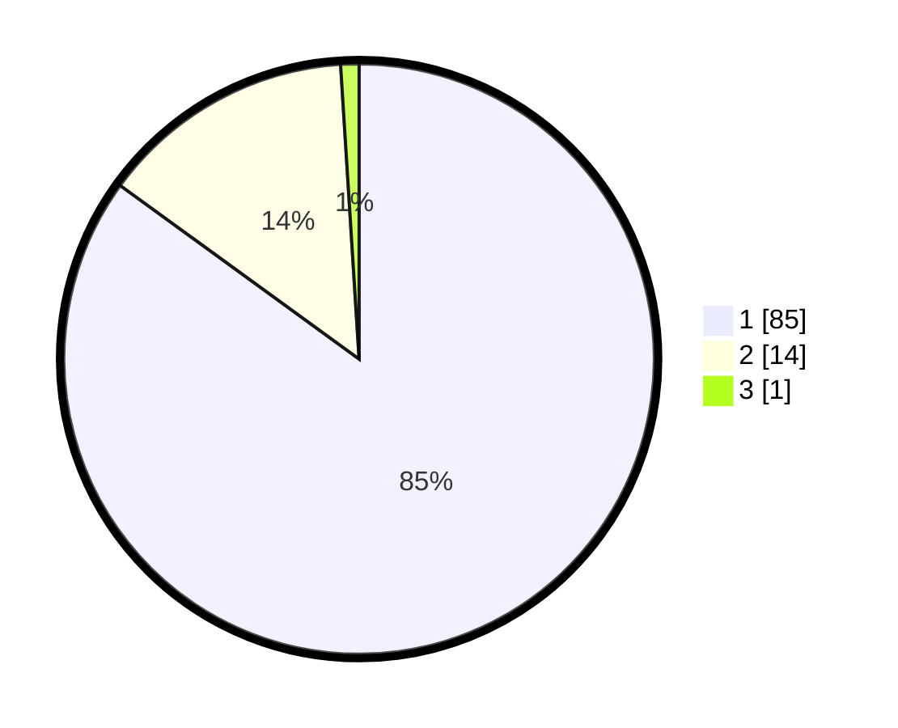

# Hasil

## Grafik

## Tabel

| No. | Nama Paslon    | Suara | Suara (raw) | Persentase |
|:--- |:-------------- | -----:| -----------:| ----------:|
| 1   | ANIES MUHAIMIN | 85    | [85][p-1]   | 85,00      |
| 2   | PRABOWO GIBRAN | 14    | [14][p-2]   | 14,00      |
| 3   | GANJAR MAHFUD  | 1     | [1][p-3]    | 1,00       |

[p-1]: https://github.com/gigit-pemilu/pemilu-2024-11-aceh/blob/main/pilpres/hitung-suara/sub/11-aceh/sub/03-aceh-timur/sub/03-idi-rayeuk/sub/2053-gampong-jalan/sub/902-tps/sub/paslon-1.txt
[p-2]: https://github.com/gigit-pemilu/pemilu-2024-11-aceh/blob/main/pilpres/hitung-suara/sub/11-aceh/sub/03-aceh-timur/sub/03-idi-rayeuk/sub/2053-gampong-jalan/sub/902-tps/sub/paslon-2.txt
[p-3]: https://github.com/gigit-pemilu/pemilu-2024-11-aceh/blob/main/pilpres/hitung-suara/sub/11-aceh/sub/03-aceh-timur/sub/03-idi-rayeuk/sub/2053-gampong-jalan/sub/902-tps/sub/paslon-3.txt

## Foto C Plano

https://sirekap-obj-formc.kpu.go.id/1350/pemilu/ppwp/11/03/03/20/53/1103032053902-20240215-061018--31659e1b-6b47-4417-bff7-996ab56fd7bb.jpg

https://sirekap-obj-formc.kpu.go.id/1350/pemilu/ppwp/11/03/03/20/53/1103032053902-20240215-061215--803f4795-c18f-4d32-bf69-06e59717b29a.jpg

https://sirekap-obj-formc.kpu.go.id/1350/pemilu/ppwp/11/03/03/20/53/1103032053902-20240215-061342--9402d067-5f70-46ca-9446-bb6a80d66366.jpg

## Metadata

| Key        | Value               |
| ---------- | ------------------- |
| Time Stamp | 2024-02-24 22:31:28 |

