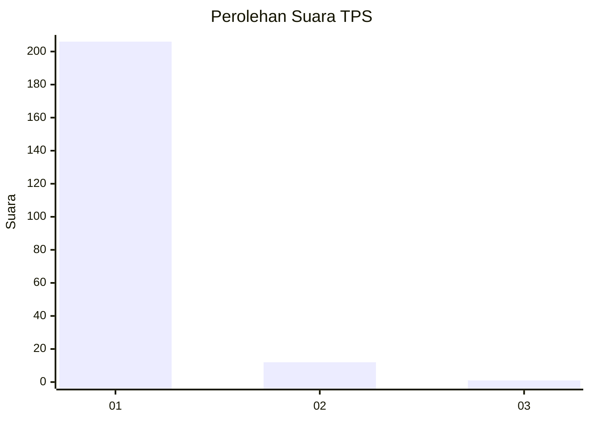
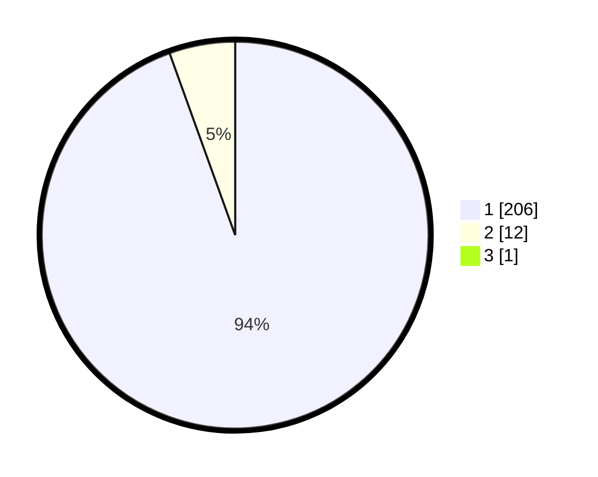

# Hasil

## Grafik

## Tabel

| No. | Nama Paslon    | Suara | Suara (raw) | Persentase |
|:--- |:-------------- | -----:| -----------:| ----------:|
| 1   | ANIES MUHAIMIN | 206   | [206][p-1]  | 94,06      |
| 2   | PRABOWO GIBRAN | 12    | [12][p-2]   | 5,48       |
| 3   | GANJAR MAHFUD  | 1     | [1][p-3]    | 0,46       |

[p-1]: https://github.com/gigit-pemilu/pemilu-2024-11-aceh/blob/main/pilpres/hitung-suara/sub/11-aceh/sub/03-aceh-timur/sub/03-idi-rayeuk/sub/2054-teupin-batee/sub/001-tps/sub/paslon-1.txt
[p-2]: https://github.com/gigit-pemilu/pemilu-2024-11-aceh/blob/main/pilpres/hitung-suara/sub/11-aceh/sub/03-aceh-timur/sub/03-idi-rayeuk/sub/2054-teupin-batee/sub/001-tps/sub/paslon-2.txt
[p-3]: https://github.com/gigit-pemilu/pemilu-2024-11-aceh/blob/main/pilpres/hitung-suara/sub/11-aceh/sub/03-aceh-timur/sub/03-idi-rayeuk/sub/2054-teupin-batee/sub/001-tps/sub/paslon-3.txt

## Foto C Plano

https://sirekap-obj-formc.kpu.go.id/9d87/pemilu/ppwp/11/03/03/20/54/1103032054001-20240215-052338--d67bf163-17a6-4e97-bc6c-b7bf9fe6a0f4.jpg

https://sirekap-obj-formc.kpu.go.id/9d87/pemilu/ppwp/11/03/03/20/54/1103032054001-20240215-052503--d36d60cb-bb92-45c4-8df8-194347316f60.jpg

https://sirekap-obj-formc.kpu.go.id/9d87/pemilu/ppwp/11/03/03/20/54/1103032054001-20240215-052658--6020bcd0-a76e-428b-aee1-74c10b9daed4.jpg

## Metadata

| Key        | Value               |
| ---------- | ------------------- |
| Time Stamp | 2024-02-24 22:31:28 |

