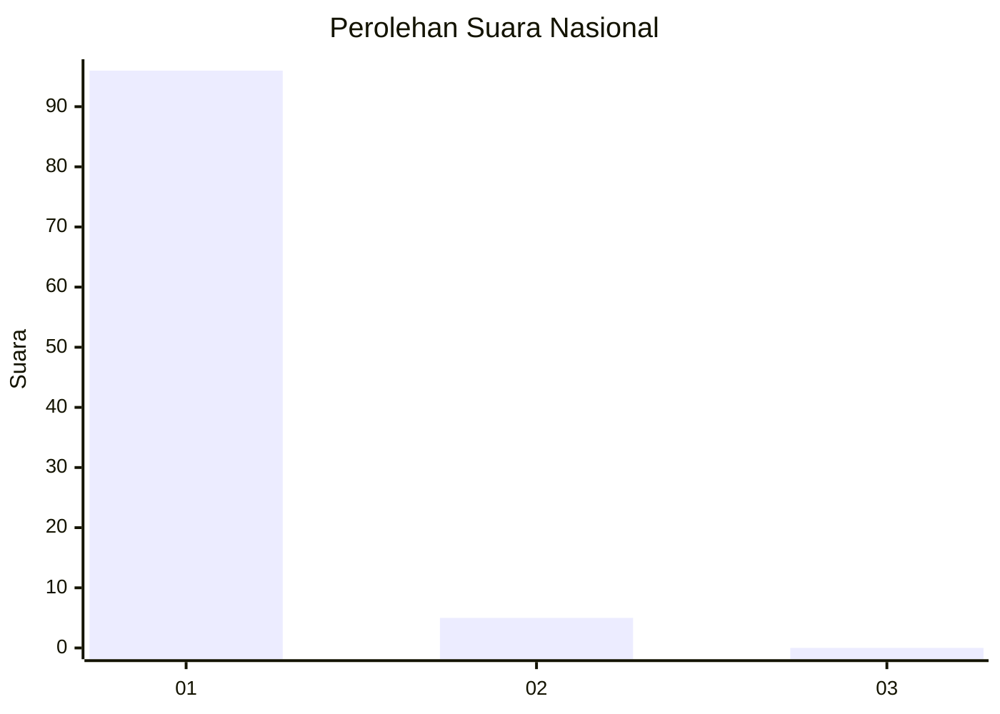
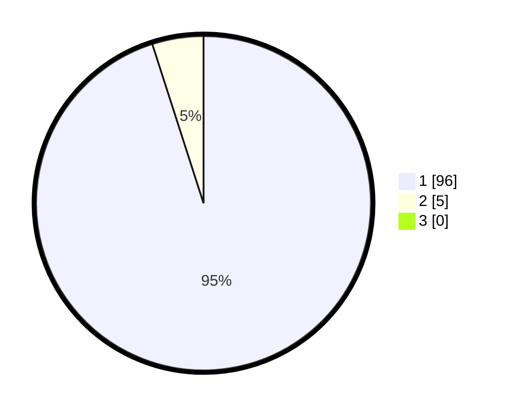

# Hasil

## Grafik

## Tabel

| No. | Nama Paslon    | Suara | Suara (raw) | Persentase |
|:--- |:-------------- | -----:| -----------:| ----------:|
| 1   | ANIES MUHAIMIN | 96    | [96][p-1]   | 95,05      |
| 2   | PRABOWO GIBRAN | 5     | [5][p-2]    | 4,95       |
| 3   | GANJAR MAHFUD  | 0     | [0][p-3]    | 0,00       |

[p-1]: https://github.com/gigit-pemilu/pemilu-2024/blob/main/pilpres/hitung-suara/sub/11-aceh/sub/03-aceh-timur/sub/03-idi-rayeuk/sub/2055-buket-langa/sub/001-tps/sub/paslon-1.txt
[p-2]: https://github.com/gigit-pemilu/pemilu-2024/blob/main/pilpres/hitung-suara/sub/11-aceh/sub/03-aceh-timur/sub/03-idi-rayeuk/sub/2055-buket-langa/sub/001-tps/sub/paslon-2.txt
[p-3]: https://github.com/gigit-pemilu/pemilu-2024/blob/main/pilpres/hitung-suara/sub/11-aceh/sub/03-aceh-timur/sub/03-idi-rayeuk/sub/2055-buket-langa/sub/001-tps/sub/paslon-3.txt

## Foto C Plano

https://sirekap-obj-formc.kpu.go.id/0022/pemilu/ppwp/11/03/03/20/55/1103032055001-20240215-010536--08d1b935-9a90-49d8-a1a0-c79b51c7a117.jpg

https://sirekap-obj-formc.kpu.go.id/0022/pemilu/ppwp/11/03/03/20/55/1103032055001-20240215-010729--ba8d523d-1db8-4d51-975e-72bbb796fb52.jpg

https://sirekap-obj-formc.kpu.go.id/0022/pemilu/ppwp/11/03/03/20/55/1103032055001-20240215-010909--b40dee27-5f6c-41c0-86cd-9cf9ebe06045.jpg

## Metadata

| Key        | Value               |
| ---------- | ------------------- |
| Time Stamp | 2024-02-24 22:31:28 |

