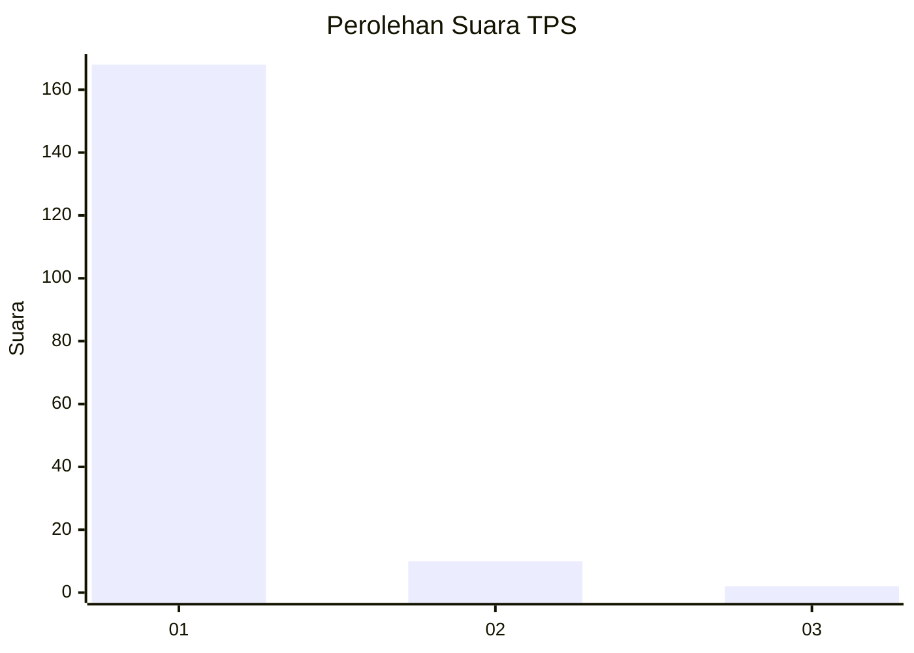
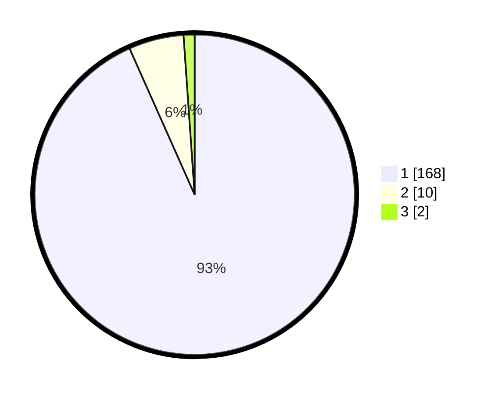

# Hasil

## Grafik

## Tabel

| No. | Nama Paslon    | Suara | Suara (raw) | Persentase |
|:--- |:-------------- | -----:| -----------:| ----------:|
| 1   | ANIES MUHAIMIN | 168   | [168][p-1]  | 93,33      |
| 2   | PRABOWO GIBRAN | 10    | [10][p-2]   | 5,56       |
| 3   | GANJAR MAHFUD  | 2     | [2][p-3]    | 1,11       |

[p-1]: https://github.com/gigit-pemilu/pemilu-2024-11-aceh/blob/main/pilpres/hitung-suara/sub/11-aceh/sub/03-aceh-timur/sub/03-idi-rayeuk/sub/2056-buket-pala/sub/001-tps/sub/paslon-1.txt
[p-2]: https://github.com/gigit-pemilu/pemilu-2024-11-aceh/blob/main/pilpres/hitung-suara/sub/11-aceh/sub/03-aceh-timur/sub/03-idi-rayeuk/sub/2056-buket-pala/sub/001-tps/sub/paslon-2.txt
[p-3]: https://github.com/gigit-pemilu/pemilu-2024-11-aceh/blob/main/pilpres/hitung-suara/sub/11-aceh/sub/03-aceh-timur/sub/03-idi-rayeuk/sub/2056-buket-pala/sub/001-tps/sub/paslon-3.txt

## Foto C Plano

https://sirekap-obj-formc.kpu.go.id/38d3/pemilu/ppwp/11/03/03/20/56/1103032056001-20240215-093507--354d9829-2cf1-4586-a21c-f1da061cbed9.jpg

https://sirekap-obj-formc.kpu.go.id/38d3/pemilu/ppwp/11/03/03/20/56/1103032056001-20240215-135942--be75d7a1-472f-4853-97b9-98624217b481.jpg

https://sirekap-obj-formc.kpu.go.id/38d3/pemilu/ppwp/11/03/03/20/56/1103032056001-20240215-135818--47222ee9-2061-4c63-a60d-17c00046c3dd.jpg

## Metadata

| Key        | Value               |
| ---------- | ------------------- |
| Time Stamp | 2024-02-24 22:31:28 |

