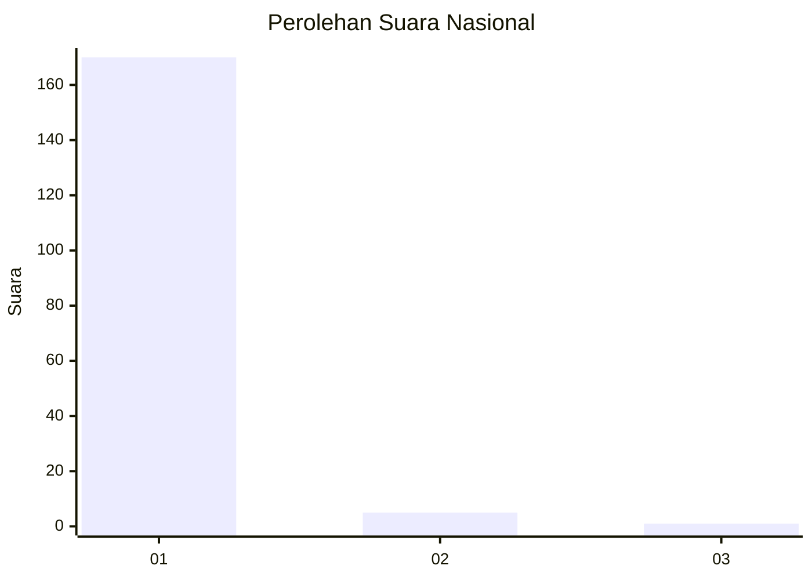
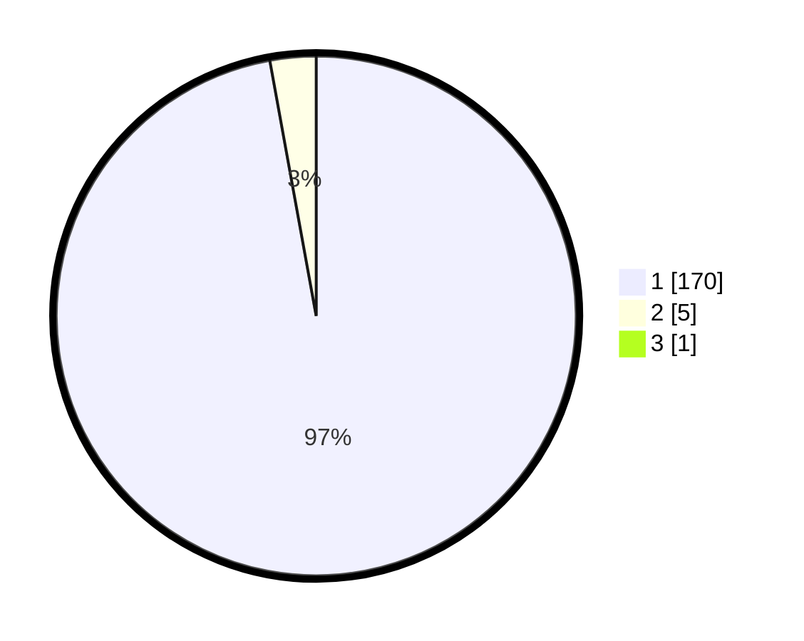

# Hasil

## Grafik

## Tabel

| No. | Nama Paslon    | Suara | Suara (raw) | Persentase |
|:--- |:-------------- | -----:| -----------:| ----------:|
| 1   | ANIES MUHAIMIN | 170   | [170][p-1]  | 96,59      |
| 2   | PRABOWO GIBRAN | 5     | [5][p-2]    | 2,84       |
| 3   | GANJAR MAHFUD  | 1     | [1][p-3]    | 0,57       |

[p-1]: https://github.com/gigit-pemilu/pemilu-2024/blob/main/pilpres/hitung-suara/sub/11-aceh/sub/03-aceh-timur/sub/03-idi-rayeuk/sub/2056-buket-pala/sub/002-tps/sub/paslon-1.txt
[p-2]: https://github.com/gigit-pemilu/pemilu-2024/blob/main/pilpres/hitung-suara/sub/11-aceh/sub/03-aceh-timur/sub/03-idi-rayeuk/sub/2056-buket-pala/sub/002-tps/sub/paslon-2.txt
[p-3]: https://github.com/gigit-pemilu/pemilu-2024/blob/main/pilpres/hitung-suara/sub/11-aceh/sub/03-aceh-timur/sub/03-idi-rayeuk/sub/2056-buket-pala/sub/002-tps/sub/paslon-3.txt

## Foto C Plano

https://sirekap-obj-formc.kpu.go.id/3c72/pemilu/ppwp/11/03/03/20/56/1103032056002-20240220-152140--cc33297c-5881-4502-88e2-53eefb5a12ed.jpg

https://sirekap-obj-formc.kpu.go.id/3c72/pemilu/ppwp/11/03/03/20/56/1103032056002-20240220-152222--54cdd1e5-8c7f-482b-b00e-303a49b5eda8.jpg

https://sirekap-obj-formc.kpu.go.id/3c72/pemilu/ppwp/11/03/03/20/56/1103032056002-20240220-152314--0b09f770-c835-4411-89a8-9dbc09a737e3.jpg

## Metadata

| Key        | Value               |
| ---------- | ------------------- |
| Time Stamp | 2024-02-24 22:31:28 |

